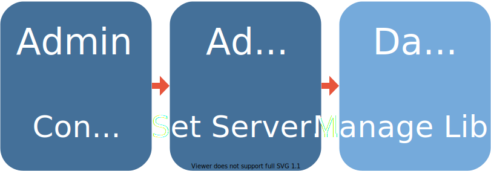
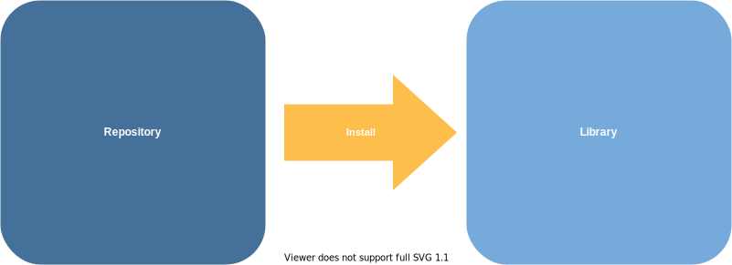

Photo by <a href="https://unsplash.com/@sxoxm?utm_source=unsplash&utm_medium=referral&utm_content=creditCopyText">Sven Mieke</a> on <a href="https://unsplash.com/s/photos/plan?utm_source=unsplash&utm_medium=referral&utm_content=creditCopyText">Unsplash</a>

*This is the final post in a short series of blogs on package management.* 

*The <a href="https://blog.rstudio.com/2021/02/05/pkg-mgmt-prime-directive/" target = "_blank">first post</a> explained the role of repositories and libraries.* 

*The <a href="https://blog.rstudio.com/2021/02/11/pkg-mgmt-pain/" target = "_blank">second post</a> explored package management pain shows up in different organizations.*

As a Solutions Engineer at RStudio, I spend a lot of time helping data science teams figure out their package management needs.

I often meet with IT/Admins frustrated with trying to provide data scientists with the packages they need while also maintaining stability and security. I also speak with data scientists discouraged and annoyed at how hard it is to gets the open source R and Python packages they need.

The resulting cat-and-mouse games often end in *creative* detentes -- idiosyncratic package management strategies that *kinda* work for everyone involved. On the other hand, organizations with secure, low-friction package management strategies seem to follow just a few patterns.

> "Happy ~~families~~ package management processes are all alike; every unhappy ~~family~~ package management process is unhappy in its own way."
>
> -Leo Tolstoy, Anna Karenina (sorta)

In this post, I'll share the common components I see at organizations where IT/Admins and data scientists both contribute to a package environment that is secure, reproducible, and easy to use.

## Divvying Up Responsibility

While the details of package management differ widely from one organization to another, organizations with secure, low-friction package management processes usually exhibit a **three-part framework**, with clear ownership of each part.

One way this pattern can go awry is that admins, trying to be helpful, decide to take control of the package libraries themselves. We <a href="https://blog.rstudio.com/2021/02/05/pkg-mgmt-prime-directive/" target="_blank">previously explored</a> why admins controlling *repositories* and data scientists controlling *libraries* tends to be a much lower-friction way to manage package environments.

### Part I: Add packages to repositories

In most organizations with good package management processes, admins decide whether a private package repository is needed and, if so, what packages are in the organization's shared package repositories.[^1] Many organizations decide that a public package repository like CRAN, PyPI, or <a href="https://packagemanager.rstudio.com" target="_blank">public RStudio Package Manager</a> is sufficient.

[^1]: Sometimes this package admin is a member of the IT or DevOps organization, and sometimes they're a data scientist.

In other organizations, there may not be open access to the internet, packages might need to be validated before they can be used, or there might be heavy usage of internally-developed packages. In these cases, organizations configure an internal CRAN or PyPI mirror. <a href="https://www.rstudio.com/products/package-manager/" target="_blank">RStudio Package Manager</a> is RStudio's professional product for this purpose.

Data scientists and admins trying to choose the right configuration for their organization might want to consider the pain points explored in <a href="https://blog.rstudio.com/2021/02/11/pkg-mgmt-pain/" target="_blank">the previous post in this series</a> as well as the decision tree on the <a href="https://solutions.rstudio.com/data-science-admin/packages/" target="_blank">RStudio solutions site</a>.

### Part II: Set defaults so things "just work"

Once security concerns are satisfied, admins spend a lot of time making sure that data scientists can get to work as soon as they enter their data science environment. Admins want to ensure data scientists have all the packages they need.

It often works well for admins to set default settings for users so package installs just work. Admins generally set appropriate default repositories and install required system libraries. Some admins additionally choose to install a "starter" package set for all users.

More details on how to do all those things are on the <a href="https://solutions.rstudio.com/data-science-admin/packages/#2-set-rstudio-server-pro-defaults" target="_blank">RStudio Solutions site</a>.

Many organizations choose to centralize all of their data scientists on <a href="https://www.rstudio.com/products/rstudio-server-pro/" target="_blank">RStudio Server Pro</a> to simplify the administration.

### Part III: Use and capture reproducible project environments

The last step of the process is data scientists doing their work! If admins have successfully configured a repository and package defaults, this should be an extremely low-friction process for data scientists, even if they're inside an air-gapped or validated environment.

In the best case, data scientists use <a href="https://solutions.rstudio.com/data-science-admin/packages/#3-manage-libraries" target="_blank">project-level isolation</a> of packages using tools like renv and virtualenv to ensure project package libraries are isolated, reproducible, and shareable.

## Great Process Leads to Great Outcomes

A three-part package management plan allows admins to be confident that their network is secure and that data scientists aren't blocked trying to acquire the packages they need. Data scientists are also able to access and use the packages they need to do their work.

Within the three-part structure, organizations' package needs are as varied as the organizations themselves, and an <a href="https://blog.rstudio.com/2021/02/11/pkg-mgmt-pain/" target="_blank">an earlier blog post</a> explored why teams make different choices within this framework.

If you think your organization could benefit from more information on package management, contact our <a href="https://rstudio.chilipiper.com/book/rst-demo" target="_blank">sales team</a> to learn more about how RStudio Package Manager and RStudio Server Pro work together to make it easy for admins to create safe, low-friction environment for data scientists to be productive.

> *For more on this topic, please see the recording of our free webinar on <a href="https://www.rstudio.com/resources/webinars/managing-packages-for-open-source-data-science/" target="_blank">Managing Packages for Open-Source Data Science</a>.*
