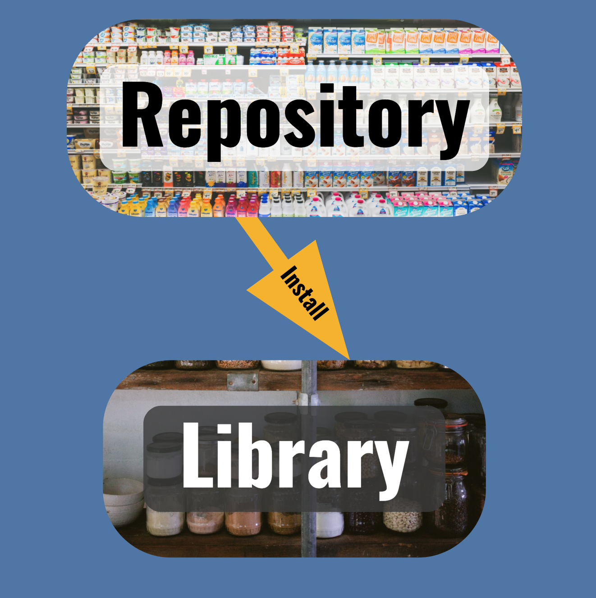

Photo by <a href="https://unsplash.com/@nate_dumlao?utm_source=unsplash&amp;utm_medium=referral&amp;utm_content=creditCopyText">Nathan Dumlao</a> on <a href="https://unsplash.com/?utm_source=unsplash&amp;utm_medium=referral&amp;utm_content=creditCopyText">Unsplash</a>

> *This is the first in a short series of blogs on package management.*
>
> *Registration for our webinar on [Managing Packages for Open-Source Data Science](https://rstudio.com/registration/managing-packages-for-open-source-data-science/) on February 17 is now open.*

Absolutely essential, easy to forget if they're there when you need them, and utterly debilitating when they're not there, open source packages in R and Python are the pantry items in the metaphorical kitchen turning out [serious data science](https://blog.rstudio.com/2020/05/19/driving-real-lasting-value-with-serious-data-science/). These bundles of code and instructions, hosted in public repositories like CRAN and PyPI, are key ingredients in data science work.

Just as in cooking, serious data science depends on having suitable ingredients available where and when you need them. Not having the right packages available for your analysis is a common cause of frustration and time lost for data scientists and engineers.

You can make package management a solved problem for your organization, but it takes a little planning. Following the Package Management Prime Directive, which I'll share below, can help you avoid problems before they start. But before that, you'll need a little background.

## Grocery Store and the Pantry

Packages live in one of two places: **repositories** and **libraries**. Understanding each of these environments, especially their differences, is the first step to avoiding package management headaches.

> Think of your data science workbench as a kitchen:
>
> -   The **repository** is the grocery store, a central place where everyone gets their packages.
> -   The **library** is the pantry, where you keep your own private set of packages.
> -   **Installation** is the shopping trip to stock your library with packages from the repository.

Photos by [NeONBRAND](https://unsplash.com/@neonbrand?utm_source=unsplash&utm_medium=referral&utm_content=creditCopyText) and [Luisa Brimble](https://unsplash.com/@luisabrimble?utm_source=unsplash&utm_medium=referral&utm_content=creditCopyText) on [Unsplash](https://unsplash.com/?utm_source=unsplash&utm_medium=referral&utm_content=creditCopyText).

Like the grocery store, the package repository includes more packages -- inert and boxed up -- than any one person needs. Common repositories include CRAN, BioConductor, PyPI, [private RStudio Package Manager](https://rstudio.com/products/package-manager/), and [public RStudio Package Manager](https://packagemanager.rstudio.com/client/#/).

And like the pantry in your home, which holds shelf-stable ingredients until they're needed in the kitchen, the library holds packages specific to your work, ready for you to combine with other raw ingredients for your analysis.

Libraries are needed wherever there's a running R or Python process, like within the [RStudio IDE](https://rstudio.com/products/rstudio/) and Jupyter Notebooks, or alongside apps and reports running on platforms like [RStudio Connect](https://rstudio.com/products/connect/).

Unlike your ability to choose among various colors or flavors of the same item in your pantry, R and Python find packages in the library by name alone, so the library that corresponds to your code must include:

-   exactly one version of each package needed and
-   only package versions that are consistent, so package interdependencies work.

Now that you have a general idea of what repositories and libraries are, it's time for a general rule for how to think about managing packages.

## The Package Management Prime Directive

A grocery store or repository aims to meet the needs of as many people as possible.

Your pantry or library, on the other hand, requires all the ingredients for your creations, but no more. These constraints lead directly to the Package Management Prime Directive:

> Repositories should be as broad possible.
>
> Libraries should be as specific as possible.

Most organizations administer only one or a few central repositories to keep management simple. Many organizations decide to just use a public repository and skip repository management altogether.

In contrast, most organizations empower data scientists and engineers to manage their own libraries. Increasingly, many are using libraries that correspond to individual projects to make them even more specific. Luckily, this is easier than it sounds, as there's [great tooling for library management](https://environments.rstudio.com) in both R and Python, which we'll explore in future posts in this series.

Now, armed with the Package Management Prime Directive and an understanding of why it's important, you've got all the conceptual understanding to solve most package management issues.

In future posts, we'll cover frequent sources of package management pain for both data scientists and platform administrators, and how they can work together to create a Package Management Plan to prevent even the most pernicious of package problems.
