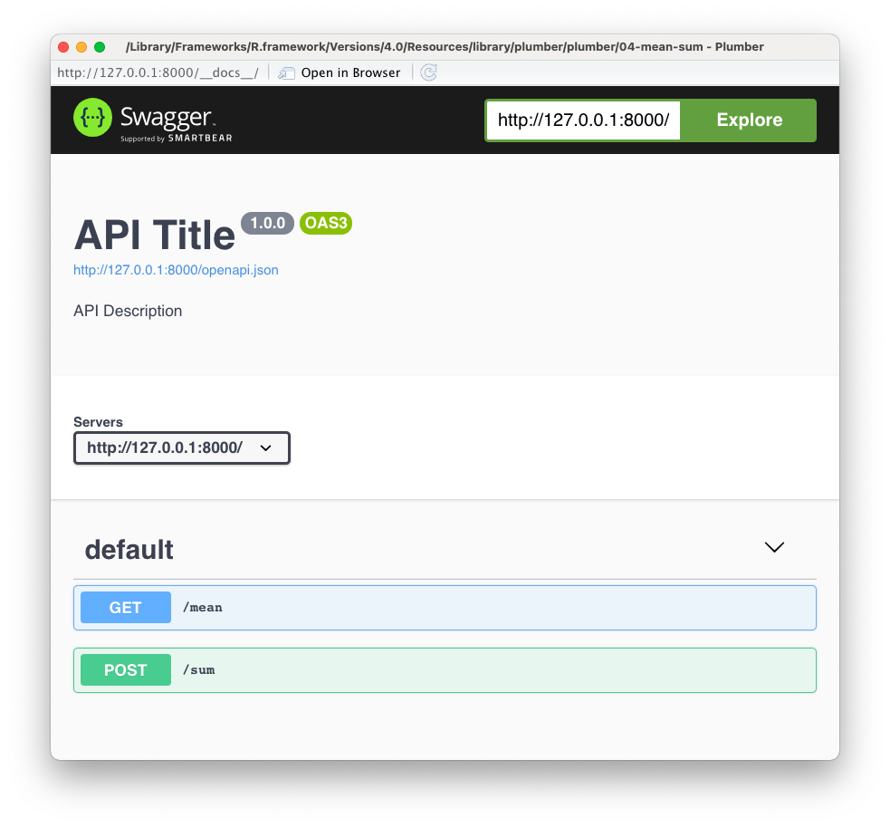

I am happy to announce that `{plumber}` v1.1.0 is now on CRAN! Install it with:

```
install.packages("plumber")
```

By the way, `{plumber}` v1.0.0 was released about 6 months ago, but we didn't make a full announcement, so here we'll highlight features and improvements in both v1.0.0 and v1.1.0. At a high level, this includes:

* [parallel endpoint execution](#parallel-exec),
* a [_tidy_ interface](#tidy-interface) for programmatic development, 
* [request body parsing](#body-parsing),
* redirect requests to [include trailing slash](#trailing-slash), and
* the ability to [extend plumber](#custom) by adding additional request body parsers, response serializers, and visual documentation representations.

In addition to the new features, `{plumber}` now has an official [RStudio cheat sheet](https://rstudio.com/resources/cheatsheets), a new [hex logo](https://swag.rstudio.com/product/plumber-sticker/15), and uses [`{pkgdown}`](https://pkgdown.r-lib.org/) to construct its website [https://www.rplumber.io/](https://www.rplumber.io/).

<a href="https://github.com/rstudio/cheatsheets/blob/master/plumber.pdf"></a>

# New features and improvements {#new-features}

## Parallel execution {#parallel-exec}

`{plumber}` now has the ability to execute endpoints asynchronously via the `{promises}` and `{future}` packages. By wrapping slow endpoint code in `promises::future_promise()`, the main R session is able to execute multiple concurrent requests much more efficiently (compared to regular execution). For example, suppose we have the plumber API with endpoints:

```r
#* @get /slow/<k>
function() {
  promises::future_promise({
    slow_calc()
  })
}

#* @get /fast/<k>
function() {
  fast_calc()
}
```

Now let's imagine a scenario where 6 `/slow/<k>` requests are received before a `/fast/<k>` request. Since the `slow_calc()` has been wrapped in `promises::future_promise()`, the `fast_calc()` is able to execute immediately, even when limited `{future}` workers are available. The figure below depicts a timeline of what happens in this scenario when 2 `{future}` workers are available. Note that without async execution, the `/fast/<k>` would take 60 seconds to complete, but with `promises::future_promise()` it completes almost immediately! 🎉 


[

](https://rstudio.github.io/promises/articles/future_promise.html)

See the article on [`promises::future_promise()`](https://rstudio.github.io/promises/articles/future_promise.html) to learn more.

## Tidy interface {#tidy-interface}

A brand new [tidy interface](https://www.rplumber.io/reference/index.html?q=pr_) to create plumber API's with a more natural, pipe-able, functional programming approach:

```r
# Initialize
pr() %>%
  # Add a route
  pr_get("/echo", function(msg = "(not provided)") {
    list(msg = msg)
  }) %>%
  # Run the API
  pr_run(port = 8000)
```

## `#* @plumber` tag

When `plumb()`ing a file, there are only a limited set of tags that `{plumber}` knows how to handle. To avoid having to create an `./endpoint.R` file, you can access your `{plumber}` API when `plumb()`ing your file by using the `@plumber` tag.

The `@plumber` tag will immediately execute the function definition right after the tag.  

In the example below, we show how you can mount another API using the `@plumber` tag in addition to defining a regular `GET` route to `/echo`. Mounting a router (and many other API alterations) is not possible when `plumb()`ing a file unless you use the `#* @plumber` tag.

```r
#* @get /echo
function(msg = "(not provided)") {
  list(msg = msg)
}

#* @plumber
function(pr) {
  mnt <- plumb("plumber_mount.R")
  pr %>%
    pr_mount("/mount_path/", mnt)
}
```

<details>
  <summary> Tidy API </summary>
  
```r
pr() %>%
  pr_get("/echo", function(msg = "(not provided)") {
    list(msg = msg)
  }) %>%
  pr_mount("/mount_path/", plumb("plumber_mount.R"))
```
  
</details>

## Request body parsing {#body-parsing}

Prior to `{plumber}` v1.0.0, `{plumber}` had a very limited set of body parsers (JSON and form), but we've added numerous parsers including: text, octet-stream, multipart forms, CSV, TSV, RDS, YAML, Feather, and [more](https://www.rplumber.io/reference/parsers.html).

No additional effort is required to use the JSON, form, text, octet-stream, and multipart form body parsers; however, if you'd like to use any of the other parsers, you'll want to know about the new `#* @parser` tag. Be aware that when adding this tag to an endpoint, it'll overwrite the default set of body parsers. So, for example, if you _only_ want support for parsing TSV information, then do: 

```r
#* @parser tsv
#* @post /tsv_to_json
function(req, res) {
  req$body
}
```

<details>
  <summary> Tidy API </summary>
  
```r
pr() %>%
  pr_post(
    "/tsv_to_json", 
    function(req, res) { req$body },
    parsers = "tsv"
  )
```
  
</details>


## New response serializers

Like the request body parsers, a whole new set of [response serializers](https://www.rplumber.io/reference/serializers.html) have been added. These include CSV, TSV, RDS, Feather, YAML, `format()` output, `print()` output, `cat()` output. To change the default serializer from JSON, add a _single_ `#* @serializer` tag to your route definition since unlike body parsers, an endpoint can only have one serializer. 

In the example below, the CSV serialize is used and the extra arguments are passed along using the `list(na = "")`

```r
#* @get /mtcars.csv
#* @serializer csv list(na = "")
function() {
  mtcars
}
```

<details>
  <summary> Tidy API </summary>
  
```r
pr() %>%
  pr_get(
  "/data", 
  function() {
    as_attachment(mtcars, "custom.csv")
  },
  serializer = plumber::serializer_csv(na = "")
)
```
  
</details>


## Respond with an attachment

If a user visited the endpoint in the previous section (`/mtcars.csv`) using their web browser, their browser would download `mtcars.csv`. In order to customize the downloaded filename, use the new `as_attachment()`. This allows you to decouple the named of the endpoint (e.g., `/data`) with the downloaded filename (`custom.csv`).

```r
# Download the response as a file named `custom.csv`
#' @get /data
#' @serializer csv
function() {
  as_attachment(mtcars, "custom.csv")
}
```

<details>
  <summary> Tidy API </summary>
  
```r
pr() %>%
  pr_get(
  "/data", 
  function() {
    as_attachment(mtcars, "custom.csv")
  },
  serializer = plumber::serializer_csv()
)
```
  
</details>

## OpenAPI v3

With `{plumber}` v1.0.0, we upgraded the API specification to follow OpenAPI v3. Upgraded the visual documentation to be based on OpenAPI v3.   Before v1.0.0, `{plumber}` used Swagger 2.0 specification. Since then, [Swagger 2.0 spec was rebranded to OpenAPI Specification v2 and has upgraded to v3](https://www.openapis.org/faq). 

When running a `{plumber}` API interactively, you will see visual documentation similar to the screenshot below:

```r
plumb_api("plumber", "04-mean-sum") %>% pr_run(port = 8000)
```


### Redirect requests to include trailing slash {#trailing-slash}

We've implemented a highly requested behavior where requests that do not end in a slash will redirect to the route with a final slash. 

For example, let's pretend that the route `GET` `/example` does not exist on our API, but `GET` `/example/` does exist. If the API receives any request for `GET` `/example?a=1`, `{plumber}` will respond with a redirect to `GET` `/example/?a=1`.  

The implementation details may change in a later release (such as internally redirecting to avoid a second request), but the intent of eventually executing the *slashed* route will remain.

To opt into this behavior, set the option `options_plumber(trailingSlash = TRUE)`. The current default behavior is `options_plumber(trailingSlash = FALSE)`. This default behavior will most likely change to `TRUE` with the next major release of `{plumber}`.

## Advanced customization {#custom}

For advanced `{plumber}` developers, `{plumber}` provides tools to register your own request body parser ([`register_parser()`](https://www.rplumber.io/reference/register_parser.html)), response serializer ([`register_serializer()`](https://www.rplumber.io/reference/register_serializer.html)), and custom visual documentation of the `{plumber}` API. Visual documentation can be customized in two ways: [`register_docs()`](https://www.rplumber.io/reference/register_docs.html) which allows you to easily get different UI styling (via packages such as [{rapidoc}](https://cran.r-project.org/package=rapidoc)) and [`pr_set_api_spec()`](https://www.rplumber.io/reference/pr_set_api_spec.html) which allow customization of the OpenAPI specification. To do the latter, provide either YAML or JSON (that conforms to the [OAS](http://spec.openapis.org/oas/v3.0.3)) to `pr_set_api_spec()`.

# Community Questions

If you ever want to pose a general question or have a question about your `{plumber}` setup, post a question on [  ](https://community.rstudio.com/tag/plumber) using the `{plumber}` tag. 

Many new features of `{plumber}` have come from community questions. Please keep them coming!

# Learn more

For more details on `{plumber}`'s recent releases (including bug fixes and other enhancements), please see the full [Changelog](https://www.rplumber.io/news/index.html).

Happy `plumb()`ing!
