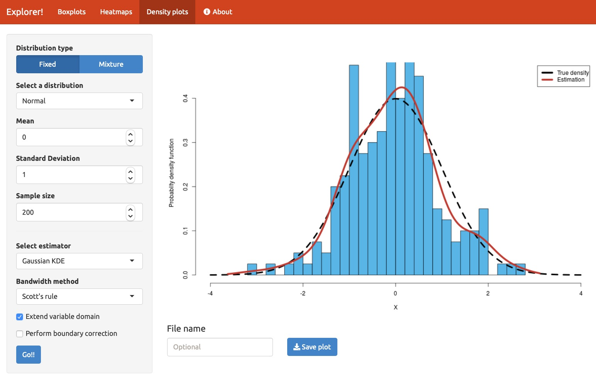
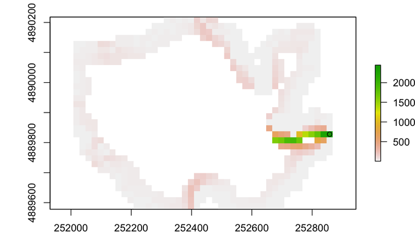
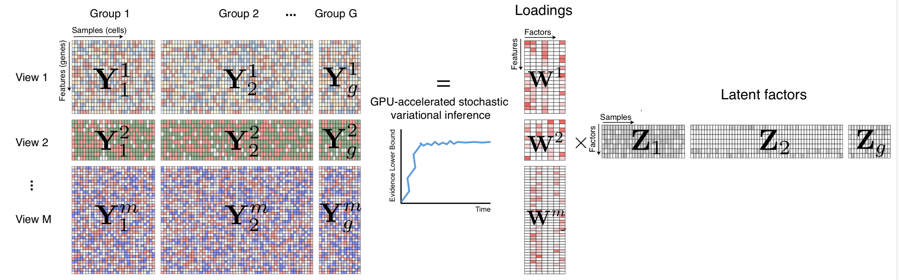
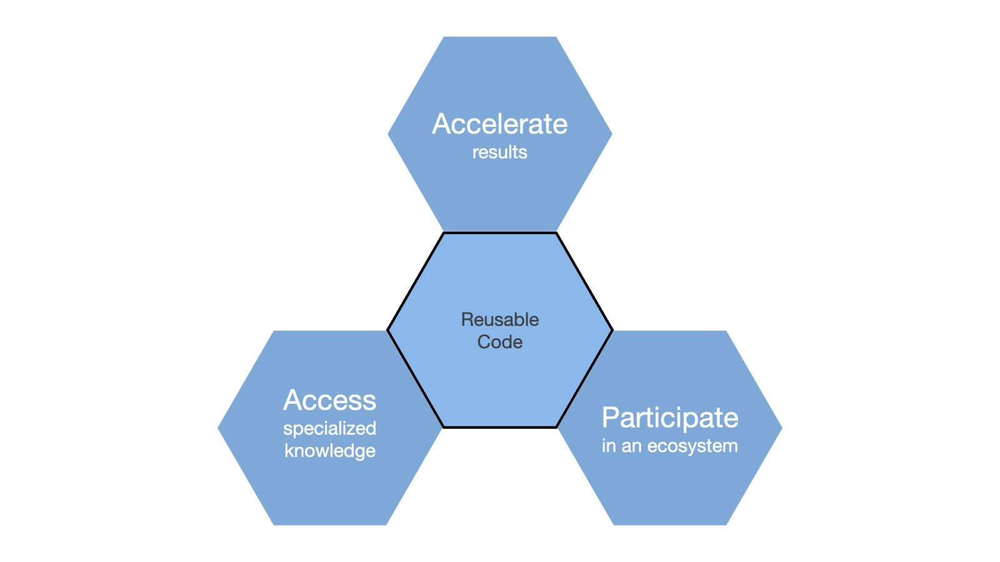

A colleague recently asked me an intriguing question:

"Do you know of any good examples of R and Python interoperability being used to solve real-world problems instead of just toy examples?"

I had to admit that I hadn't gone looking for such examples but that I'd see if I could find any. So I put the following query out on Twitter:

> Does anyone have a cool mixed R and Python app (probably in R Markdown but not required) that they'd like to share? 
> Ideally it would be one that shows both languages to their best advantage.

I received several responses to my plea, so I thought I'd share them here to illustrate some of the characteristics of R interoperability "in the wild." At the end, I'll use these examples to discuss three broad motivations for interoperability that readers may find useful.

 

### Example 1: Wrapping a User Interface Around A Simulation

<figure>
<a href="https://tomicapretto.shinyapps.io/simulation-app" target="_blank" rel="noopener noreferrer">

</a>
<figcaption>Figure 1: A Shiny App that estimates densities using Python
</figure>

The first example I'd like to share is a simulation built by Tomas Capretto (@CaprettoTomas), who described it as follows:

<blockquote>
I have an application built on Shiny that uses functions to estimate densities 
written in Python. It works both in http://shinyapps.io and locally. 
Online app: <a href="https://tomicapretto.shinyapps.io/simulation-app" target="_blank" rel="noopener noreferrer"> https://tomicapretto.shinyapps.io/simulation-app/</a> 
More info: <a href="https://github.com/tomicapretto/density_estimation" target="_blank" rel="noopener noreferrer">https://github.com/tomicapretto/density_estimation</a> 
</blockquote>

As I'll discuss in the next section, this application shows a common division of labor in interoperable applications: it uses an interactive user interface based on Shiny that then calls a collection of Python routines that do the primary computation.

By the way, another of my respondents, Nikolay Dudaev (@nikdudaev), built his application to work the other way around from this first one:

> There is something I cannot share but I do all the analysis, tidying, transformations etc in R and then display the results in the app written in 
> Python and Dash.

 

### Example 2: Processing Lake Catchment Data Using a GIS

<figure>
<a href="https://fishandwhistle.net/post/2020/calling-qgis-from-r/" target="_blank" rel="noopener noreferrer">

</a>
<figcaption>Figure 2: A lake watershed computed with the help of SAGA and GRASS GIS algorithms.</figcaption>
</figure>

Another common interoperability use case is using another language to gain access to a unique code base. In this case, Dewey Dunnington (@paleolimbot ) needed a Geographic Information System (GIS) installer called QGIS, which gives him access to SAGA and GRASS GIS systems. 

<blockquote>Not sure if this totally fits the bill, but it's Python + R working together in the same blog post! 
<a href="https://fishandwhistle.net/post/2020/calling-qgis-from-r/" target="_blank" rel="noopener noreferrer">https://fishandwhistle.net/post/2020/calling-qgis-from-r/</a>
</blockquote>

While Dewey notes that he could have done this using R libraries that access the SAGA and GRASS systems, he ultimately decided that it was easier just to call the Python versions which already had QGIS installed.

 

### Example 3: Multi-Omics Factor Analysis

<figure>
<a href="https://github.com/bioFAM/MOFA2" target="_blank" rel="noopener noreferrer">

</a>
<figcaption>Figure 3: MOFA infers an interpretable low-dimensional representation in terms of a few latent factors.</figcaption>
</figure>

OK, I admit it: I only have the vaguest idea of what this program does. Fortunately the repository pointed to by Ryan Thompson's (@DarwinAwdWinner) tweet provides a pretty good description, provided you know about multi-omic data sets.

<blockquote>
MOFA is written partly in Python and partly in R:   
<a href="https://github.com/bioFAM/MOFA2" target="_blank" rel="noopener noreferrer">https://github.com/bioFAM/MOFA2</a>
</blockquote>

See Ryan's Github repo for more details. Interoperability takes place during the processing workflow as follows:
1. The user loads the source data and trains the model using either a Python notebook or R code (which calls Python code using the `reticulate` package). Both versions process the training data and output a model.
2. The model data is then processed downstream for viewing and interactive exploration using Shiny. At present, the downstream process only runs in R.

 

## Interoperability Helps Data Scientists Avoid Reinventing the Wheel

<figure>

<figcaption>Figure 4: Three motivations for writing interoperable code.</figcaption>
</figure>

> "If I have seen further, it is by standing on the shoulders of giants."
>            -- Isaac Newton, 1675

When faced with a difficult challenge in their jobs, few data scientists say to themselves, "I think I'll include new languages in my analysis just for fun." Instead, data scientists typically write interoperable code to solve problems and to build on the work of others, just as Isaac Newton said 345 years ago.

Our examples above illustrate three motivations that underlie many interoperable applications. These motivations frequently overlap and in some situations, all three might apply. Nonetheless, many interoperable applications come about because data scientists want to:

- **Accelerate results.** Tomas Capretto, the author of our first example, wrapped some existing Python simulation code in a Shiny application to allow interactive exploration of the simulation results. While he could have achieved the same goal by rewriting his interactive simulation entirely in R, he instead used existing code to create a shorter path to the result he was trying to achieve. This approach meant his users could interact with his simulation right away instead of waiting for him to rewrite the simulator (our June blog post "<a href="https://blog.rstudio.com/2020/06/09/is-your-data-science-team-agile/" target="_blank" rel="noopener noreferrer">Is Your Data Science Team Agile?</a>" provides more details of why this type of agility is important). 
- **Access specialized knowledge.** Dewey Dunnington needed access to SAGA and GRASS GIS systems because those geographical information systems contain algorithms that represent the gold standard for GIS work. While R and Python boast tens of thousands of libraries and modules, we shouldn't expect them each to contain every key algorithm for every field of research, especially as fields of study have become increasingly more specialized. Interoperable code allows us to build on that prior work that's been done, regardless of what language it was written in.
- **Participate in an ecosystem.** Ryan Thompson's application demonstrates another type of mixed R and Python workflow. His front-end R and Python notebooks allow data scientists to collect data using whichever tool they are more comfortable with, and the model created by those front-end notebooks then drives an R-only downstream processing step. His MOFA model is one of many used in the the open source <a href="https://bioconductor.org" target="_blank" rel="noopener noreferrer">*bioconductor.org*</a> community, which includes hundreds of developers writing primarily in R. Similar large communities have built up around Python-based machine learning packages such as <a href = "https://tensorflow.rstudio.com" target="_blank" rel="noopener noreferrer">*tensorflow*</a> and <a href = "https://keras.rstudio.com" target="_blank" rel="noopener noreferrer">*keras</a>*, and around cluster-based computing via the <a href = "https://spark.rstudio.com" target="_blank" rel="noopener noreferrer">*sparklyr*</a> package for R.  Writing interoperable code allows data scientists to both participate in and contribute to those communities, even if they aren't fluent in the native programming language of each group. Better yet, these cross-language projects expand the population of the communities and encourage the sustainability of their code bases for the greater world.

The examples I've given here are only a small subset of many interoperability efforts taking place in the R and Python communities. If you have other interoperability examples you'd like to showcase, please send me an email at <a href="mailto::carl@rstudio.com" target="_blank" rel="noopener noreferrer">carl@rstudio.com</a> or tag me on Twitter at @cdhowe. I'm particularly interested in how you arrived at your interoperability approach and what benefits you gained from interoperability.

