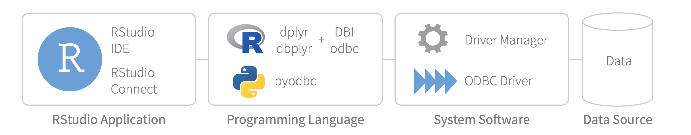

Access to data is crucial for data science. Unfortunately, servers that run RStudio are often disconnected from databases, especially in organizations that are new to R. In order to help data scientists access their databases, RStudio offers ODBC data connectors that are supported, easy to install, and designed to work everywhere you use RStudio professional products. The 1.6.0 release of [RStudio Professional Drivers](https://rstudio.com/products/drivers/) includes a few important updates.

## New data sources

The 1.6.0 release includes new drivers for the following data sources:

* Amazon Athena
* Google BigQuery
* Apache Cassandra
* MongoDB
* MySQL
* IBM Netezza

These six new drivers complement the eight existing drivers from the prior release: Amazon Redshift, Apache Hive, Apache Impala, Oracle, PostgreSQL, Microsoft SQL Server, Teradata, and Salesforce. The existing drivers have also been updated with new features and improvements in the 1.6.0 release. For example, the SQL Server driver now supports the NTLM security protocol. For a full list of changes, refer to the [RStudio Professional Drivers 1.6.0 release notes](https://docs.rstudio.com/drivers/1.6/release-notes/).

## New packaging (`.rpm` / `.deb`)

Installations of drivers from the prior release of RStudio Professional Drivers relied on an installer script. In this release, the installer script has been eliminated and instead the drivers use standard Linux package management tools -- `.rpm` and `.deb` packages -- that we provide for RHEL/CentOS 6&#47;7, Debian/Ubuntu, and SUSE 12&#47;15. Standardized packaging makes installations and upgrades easier for administrators. Those needing custom installations (e.g. installations into a non-standard directory), can still download the `.tar` file. For step-by-step instructions see [Installing RStudio Professional Drivers](https://docs.rstudio.com/pro-drivers/installation/).

* **Breaking change**. Installing 1.6.0 drivers on top of existing drivers could cause issues. Administrators should uninstall existing drivers and remove driver entries in `odbcinst.ini` before installing version 1.6.0. See [Installing RStudio Professional Drivers](https://docs.rstudio.com/pro-drivers/installation/).
* **Breaking change**. Installing 1.6.0 drivers no longer updates `odbcinst.ini`. Administrators should manually add entries to `odbcinst.ini` based on `odbcinst.ini.sample` which is included in driver packaging. See [Installing RStudio Professional Drivers](https://docs.rstudio.com/pro-drivers/installation/).

## Using with Python

RStudio Professional Drivers can be used with both R and Python. You can use the drivers with Jupyter Notebooks and JupyterLab sessions that launch from [RStudio Server Pro 1.2.5](https://blog.rstudio.com/2019/09/19/rstudio-1-2-5-release/). You can also use the drivers with Jupyter Notebooks that are published to [RStudio Connect 1.7.0](https://blog.rstudio.com/2019/01/17/announcing-rstudio-connect-1-7-0/)+.

## A note about write-backs

RStudio Professional Drivers are just one part of a complex ODBC connection chain designed for doing data science. Typical data science tasks involve querying and extracting subsets of data into R. It can be tempting to use the ODBC connection chain for data engineering tasks such as bulk loads, high speed transactions, and general purpose ETL. However, heavy-duty data engineering tasks are better done with specialized third-party tools. We recommend using the ODBC connection chain primarily for querying and analyzing data.

While doing data science, it is often handy to write data from R into databases. ODBC write-backs can be challenging when creating tables or inserting records. Standards vary wildly across data sources, and matching data types to data sources can be exacting. Compared to specialized third-party tools, ODBC write-backs tend to be slow. We recommend ODBC write-backs from R only when appropriate and only for small tables.

