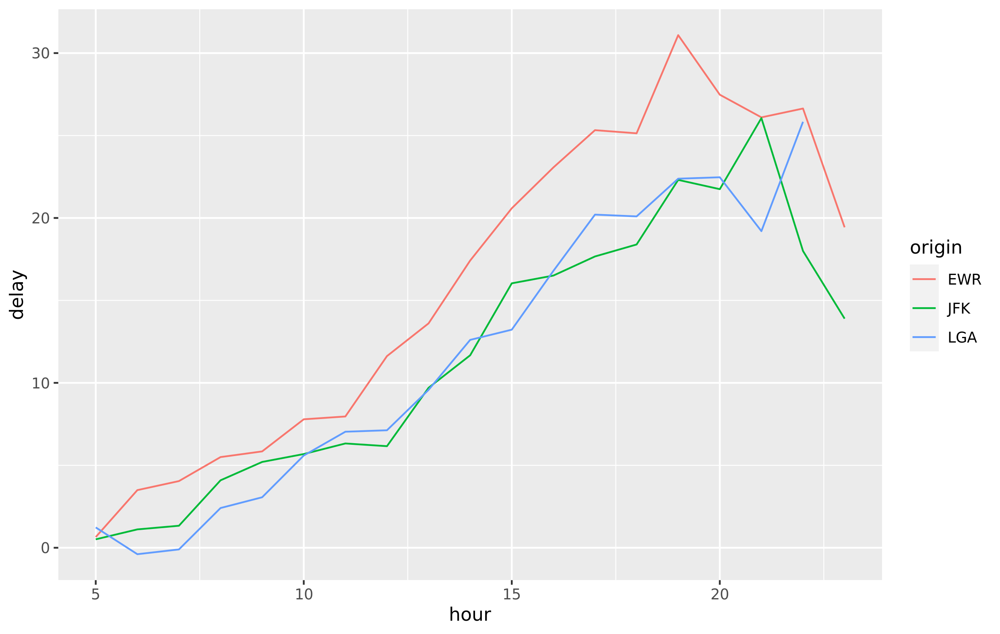

## Announcing full support for the Snowflake driver

In the [previous release](https://blog.rstudio.com/2021/03/10/pro-drivers-1-7-0-release/) we included a preview of the Snowflake driver. This new release provides full ODBC, `dbplyr`, and Python support for Snowflake, as well as corrects some issues that occurred on new installations.

This release makes working with the Snowflake data cloud as easy as working with other [supported data sources](https://docs.rstudio.com/pro-drivers/). For example, the same [`dplyr`](https://dplyr.tidyverse.org/) syntax used with data in R will also work with data in Snowflake. In the code below, data from the [`nycflights13`](https://cran.r-project.org/web/packages/nycflights13/index.html) package were pre-loaded into a Snowflake data warehouse and then queried from R using the Snowflake ODBC driver. Notice that the same `dplyr` syntax used here will also work on an R data frame. The results from the query were then collected into R and visualized with [`ggplot2`](https://ggplot2.tidyverse.org/). For more information on using databases with R, see [db.rstudio.com](https://db.rstudio.com/).


```
library(DBI)
library(dplyr)
library(ggplot2)

con <- dbConnect(odbc::odbc(), "Snowflake")

tbl(con, "FLIGHTS") %>%
  filter(distance > 75) %>%
  group_by(origin, hour) %>%
  summarise(delay = mean(dep_delay, na.rm = TRUE)) %>%
  collect() %>%
  ggplot(aes(hour, delay, color = origin)) + geom_line()
```



## Enhancements for Microsoft SQL Server and NTLM authentication

This release of the drivers includes an updated version of the SQL Server driver that supports environments using exclusively NTLM v2 authentication. Please refer to the [documentation](https://docs.rstudio.com/pro-drivers/documentation/#version-180) for the SQL Server driver in this release for additional details.

## Fixed issues with MySQL commands

The previous release of the drivers introduced a regression for certain MySQL commands such as `USE <database>` and `LOAD DATA INFILE`. This new release restores that functionality.

## Updating the RStudio Pro Drivers

*We strongly encourage all customers to upgrade to the 1.8.0 release of the RStudio Professional Drivers*. This release contains important updates that will help keep your data connections secure and easy to manage. [Upgrading drivers](https://docs.rstudio.com/pro-drivers/upgrade/) literally takes minutes and can help prevent future security and administrative issues. For a full list of changes in this release refer to the [release notes](https://docs.rstudio.com/drivers/1.8.0/release-notes/). 

## About the RStudio Pro Drivers

RStudio offers ODBC database drivers to all current customers using our professional products at no additional charge, so that data scientists and organizations can take full advantage of their data. The drivers are an important part of our effort to promote [interoperability](https://blog.rstudio.com/2020/07/15/interoperability-maximize-analytic-investments/) between systems and data science languages like R and Python. The [RStudio Pro Drivers](https://rstudio.com/products/drivers/) are commercially licensed and covered by our [support program](https://www.rstudio.com/about/support-agreement/).
