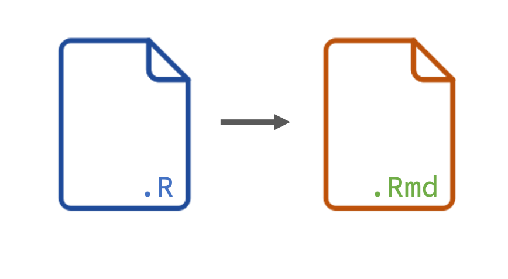
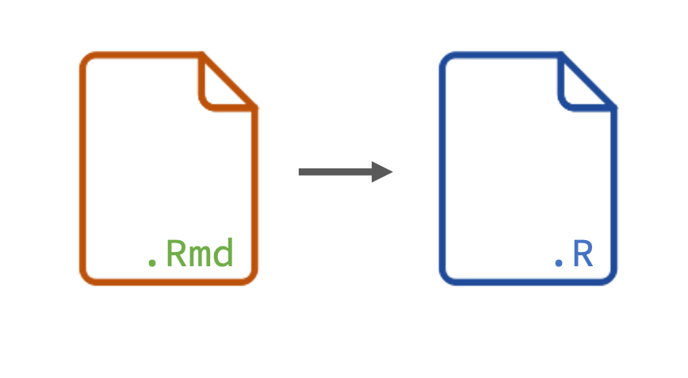

<sup>Photo by <a href="https://unsplash.com/@jeremybezanger?utm_source=unsplash&utm_medium=referral&utm_content=creditCopyText">Jeremy Bezanger</a> on <a href="https://unsplash.com/s/photos/knit?utm_source=unsplash&utm_medium=referral&utm_content=creditCopyText">Unsplash</a></sup>

The R Markdown file format combines R programming and the markdown language to create dynamic, reproducible documents. Authors use R Markdown for reports, slide shows, blogs, books — even <a href="https://bookdown.org/yihui/rmarkdown/shiny-start.html" target = "_blank">Shiny apps</a>! Since users can do so much with R Markdown, it's important to be efficient with time and resources.

We asked our Twitter friends <a href="https://twitter.com/_bcullen/status/1333878752741191680" target = "_blank">the tips and tricks that they have picked up</a> along their R Markdown journey. There was a flurry of insightful responses ranging from organizing files to working with YAML, and we wanted to highlight some of the responses so that you can apply them to your work, as well.

This is the third of a four-part series to help you on your path to R Markdown success, where we discuss **features and functions that save you time and help you troubleshoot**. You can find many of these tips and tricks in the <a href="https://bookdown.org/yihui/rmarkdown-cookbook/" target = "_blank">R Markdown Cookbook</a>. We've included the link to the relevant chapter (and other resources) in each section.

**1. Convert an R script into an R Markdown document with `knitr::spin()`**

Have you ever wished you could transform an R script into an R Markdown document without having to copy and paste your code? The function `knitr::spin()` lets you do just that. Pass your R script to `spin()` and watch the transformation happen.

<center>

</center>

You can quickly move from coding your analysis to writing your reports. In addition, you can keep your workflow reproducible by including `knitr::spin()` at the end of your R script. Rerun it any time you update your analysis so that your source code and R Markdown report are synced.

* R Markdown Cookbook chapter: <a href="https://bookdown.org/yihui/rmarkdown-cookbook/spin.html" target = "_blank">Render an R script to a report</a>.
* You can also transform an R script into a report using `#'` comments. The <a href="https://happygitwithr.com/r-test-drive.html#write-a-render-ready-r-script" target = "_blank">Render an R script</a> chapter of Happy Git and GitHub for the useR chapter walks through how to create a render-ready R script.

**2. Convert an R Markdown document into an R script with `knitr::purl()`**

Now let's flip it around! What if you want to extract only the R code from your R Markdown report? For this, use the function `knitr::purl()`.

<center>

</center>

The output from `purl()` can show no text, all text, or just the chunk options from your `.Rmd` file depending on the `documentation` argument.

```{{r}}
# Extracts only pure R code
knitr::purl("script.R", documentation = 0L)

# Extracts R code and chunk options
knitr::purl("script.R", documentation = 1L)

# Extracts all text
knitr::purl("script.R", documentation = 2L)
```

If you do not want certain code chunks to be extracted,
you can set the chunk option `purl = FALSE`.

````
```{{r ignored}}
#| purl = FALSE

x = rnorm(1000)
```
````

* R Markdown Cookbook chapter: <a href="https://bookdown.org/yihui/rmarkdown-cookbook/purl.html" target = "_blank">Convert R Markdown to R script</a>.

**3. Reuse code chunks throughout your document**

The knitr package provides several options to avoid copying and pasting your code. One way is to use reference labels with the chunk option `ref.label`. 
Let's use the example from the R Markdown Cookbook. Say you have these two chunks:

````
```{{r chunk-b}}
# this is the chunk b
1 + 1
```
````

````
```{{r chunk-c}}
# this is the chunk c
2 + 2
```
````

You can write a chunk that combines `chunk-c` and `chunk-b`:

````
```{{r chunk-a}}
#| ref.label = c("chunk-c", "chunk-b")
```
````

Your `chunk-a` will render like this:

```{{r}}
# this is the chunk c
2 + 2
```
```
## [1] 4
```

```{{r}}
# this is the chunk b
1 + 1
```
```
## [1] 2
```

Please note that any code inside of `chunk-a` will *not* be evaluated. 

One application of `ref.label` puts all of your code in an appendix. The code output will show up in the document's main body, and the code chunks will appear only at the end.

````
# Appendix

```{{r}}
#| ref.label=knitr::all_labels(),
#| echo = TRUE,
#| eval = FALSE
```
`````

* R Markdown Cookbook chapters: <a href="https://bookdown.org/yihui/rmarkdown-cookbook/reuse-chunks.html" target = "_blank">Reuse code chunks</a> and <a href="https://bookdown.org/yihui/rmarkdown-cookbook/code-appendix.html" target = "_blank">Put together all code in the appendix</a>.
* Another application of `ref.label` allows you to show code in one place and then display the output somewhere else. Garrick Aden-Buie walks through an example of how to do this in xaringan slides in his blog post, <a href="https://www.garrickadenbuie.com/blog/decouple-code-and-output-in-xaringan-slides/" target = "_blank">Decouple Code and Output in xaringan slides</a>.

**4. Cache your chunks (with dependencies)**

If there is a chunk in your R Markdown file that takes a while to run, you can set `cache = TRUE` to pre-save the results for the future. The next time you knit the document, the code will call the cached object rather than rerun (provided that nothing in the cached chunk has changed). This can save a lot of time when loading big files or running intensive processes.

````
```{{r load-data}}
#| cache = TRUE

dat <- read.csv("HUGE_FILE_THAT_TAKES_FOREVER_TO_LOAD.csv")
```
````

If one of your later chunks depends on the output from a cached chunk, include the `dependson` option. The chunk will rerun if something has changed in the cached chunk.

For example, say you run a function in one chunk and use the result in another chunk:

````
```{{r cached-chunk}}
#| cache = TRUE

x <- 500
x
```
````
````
```{{r dependent-chunk}}
#| cache = TRUE,
#| dependson = "cached-chunk"

x + 5
```
````

This will result in `505`.

Now, you edit the cached chunk:

````
```{{r cached-chunk}}
#| cache = TRUE

x <- 600
x
```
````

With the `dependson` option, your dependent chunk will update when you edit your cached chunk. In this case, your dependent chunk will now output `605`.

Without the `dependson` option, your dependent chunk will use the previously cached result and output `505`, even though the cached chunk now says `x <- 600`.

Too much caching going on? You can reset all your caches by using a global chunk option in the first code chunk of your document, e.g., `knitr::opts_chunk$set(cache.extra = 1)`. This chunk option name can be arbitrary but we recommend that you do not use an existing option name in `knitr::opts_chunk$get()` (e.g., `cache.extra` is not a built-in option). If you want to reset the caches again, you can set the option to a different value.

* R Markdown Cookbook chapter: <a href="https://bookdown.org/yihui/rmarkdown-cookbook/cache.html" target = "_blank">Cache time-consuming code chunks</a>.
* R for Data Science chapter: <a href="https://r4ds.had.co.nz/r-markdown.html#caching" target = "_blank">R Markdown - Caching</a>

**5. Save the content of a chunk elsewhere with the `cat` engine**

You may want to write the content of a code chunk to an external file to use later in the document. The `cat` engine makes this possible.  The files do not just have to be `.R` files either --- they can be `.txt.`, `.sql`, etc.

````
```{{cat}}
#| engine.opts = list(file = "example.txt")

This text will be saved as "example.txt" in your project directory.
```
````

One application is to use the `cat` engine to save a `.sql` file, then execute that file in a code chunk later in the document.

Create this SQL script in a chunk and save it in a file:

````
```{{cat}}
#| engine.opts = list(file = "tbl.sql", lang = "sql")

SELECT episode, title
FROM "database/elements"."elements"
LIMIT 3
```
````

Read it in your `.Rmd` file:

````
```{{sql}}
#| connection = con,
#| code = readLines("tbl.sql")
```
````

The `cat` engine is helpful when you want to create a <a href="https://reprex.tidyverse.org/index.html" target = "_blank">reprex</a> for your R Markdown documents. You contain everything within your document rather than having to attach external files so others can reproduce your work.

* R Markdown Cookbook chapter: <a href="https://bookdown.org/yihui/rmarkdown-cookbook/eng-cat.html" target = "_blank">Write the chunk content to a file via the `cat` engine</a>.

**6. Include parameters to easily change values**

Include parameters to set values throughout your report. When you need to rerun the report with new values, you will not have to manually change them throughout your document. For example, if you want to display data for a particular class of cars, set the parameter `my_class`:

````
---
title: "Daily Report"
output: "html_document"
params:
  my_class: "fuel economy"
---
````

In the document, reference the parameter with `params$`:

````
```{{r setup}}
#| include = FALSE

library(dplyr)
library(ggplot2)

mtcars_df <-
  mtcars %>%
  mutate(class = case_when(mpg > 15 ~ "fuel economy",
                           TRUE ~ "not fuel economy"))

class <- 
  mtcars_df %>% 
  filter(class == params$my_class)
```

# Wt vs mpg for `r params$my_class` cars

```{{r}}
ggplot(class, aes(wt, mpg)) + 
  geom_point() + 
  geom_smooth(se = FALSE)
```
````

To create a report that uses the new set of parameter values, you can use the `rmarkdown::render()` function. Add the `params` argument to `render()` with your updated value:

```
rmarkdown::render("paramDoc.Rmd", params = list(my_class = "not fuel economy"))
```

The report will now output the values for 'not fuel economy' cars.

* R Markdown Cookbook chapter: <a href="https://bookdown.org/yihui/rmarkdown-cookbook/parameterized-reports.html#parameterized-reports" target = "_blank">Parameterized reports</a>.
* R for Data Science chapter: <a href="https://r4ds.had.co.nz/r-markdown.html#parameters" target = "_blank">R Markdown - Parameters</a>

**7. Create templates with `knit_expand()`**

With `knitr::knit_expand()`, you can replace expressions in `{{}}` with their values.

For example,

````
```{{r}}
knit_expand(text = 'The value of pi is {{pi}}.')
```
````

````
```
[1] "The value of pi is 3.14159265358979."
```
````

You can also create templates for your R Markdown files with `knit_expand()`. Create a file with the tabs or headings that you would like. Create a second file that loops through the data you would like to output.

Take this example from the R Markdown Cookbook. Create a `template.Rmd` file:

````
# Regression on {{i}}

```{{r lm-{{i}}}}
lm(mpg ~ {{i}}, data = mtcars)
```
````

Then create another file that loops through each of the variables in `mtcars` except `mpg`:

````
```{{r}}
#| echo = FALSE,
#| results = "asis"

src = lapply(setdiff(names(mtcars), 'mpg'), function(i) {
  knitr::knit_expand('template.Rmd')
})

res = knitr::knit_child(text = unlist(src), quiet = TRUE)
cat(res, sep = '\n')
```
````

Knit this file to create a report that applies the template the non-`mpg`  variables:

<script src="https://fast.wistia.com/embed/medias/wmhllooxbv.jsonp" async></script><script src="https://fast.wistia.com/assets/external/E-v1.js" async></script><div class="wistia_responsive_padding" style="padding:60.42% 0 0 0;position:relative;"><div class="wistia_responsive_wrapper" style="height:100%;left:0;position:absolute;top:0;width:100%;"><div class="wistia_embed wistia_async_wmhllooxbv videoFoam=true" style="height:100%;position:relative;width:100%">&nbsp;</div></div></div>

In our original Twitter thread, Felipe Mattioni Maturana shows us an example from his work:

<center>
<blockquote class="twitter-tweet"><p lang="en" dir="ltr">sure! that is basically what I described here: <a href="https://t.co/y4EMVTfb9y">https://t.co/y4EMVTfb9y</a> if you go to <a href="https://t.co/7CZPBEJwoD">https://t.co/7CZPBEJwoD</a> you can see the two templates used, and this is the result: <a href="https://t.co/aRo0EdJJUT">pic.twitter.com/aRo0EdJJUT</a></p>&mdash; Felipe Mattioni Maturana (@felipe_mattioni) <a href="https://twitter.com/felipe_mattioni/status/1334204239695011841?ref_src=twsrc%5Etfw">December 2, 2020</a></blockquote> <script async src="https://platform.twitter.com/widgets.js" charset="utf-8"></script> 
</center>

* R Markdown Cookbook chapter: <a href="https://bookdown.org/yihui/rmarkdown-cookbook/knit-expand.html" target = "_blank">Use `knitr::knit_expand()` to generate Rmd source</a>.

**8. Exit knitting early with `knit_exit()`**

Exit the knitting process before the end of the document with `knit_exit()`. Knitr will write out the results up to that point and ignore the remainder of the document.

You can use `knit_exit()` either inline or in a code chunk.

````
```{{r chunk-one}}
x <- 100
```

`r knitr::knit_exit()`

```{{r chunk-two}}
y
```
````

The rendered document will only show `chunk-one`. This is helpful if you run into errors and want to find where they are by splitting up your document.

* R Markdown Cookbook chapter: <a href="https://bookdown.org/yihui/rmarkdown-cookbook/knit-exit.html" target = "_blank">Exit knitting early</a>.
* Other `.Rmd` troubleshooting tips can be found in the <a href="https://happygitwithr.com/rmd-test-drive.html?q=knit_exit#rmd-troubleshooting" target = "_blank">Test Drive R Markdown</a> chapter of Happy Git and GitHub for the useR.

## Continue the Journey

We hope that these tips & tricks help you save time and troubleshoot in R Markdown. Thank you to everybody who shared advice, workflows, and features!

Stay tuned for the last post in this four-part series: **Looks better, works better.**

## Resources

* Peruse the <a href="https://bookdown.org/yihui/rmarkdown-cookbook/" target = "_blank">R Markdown Cookbook</a> for more tips and tricks.
* <a href="https://www.rstudio.com/products/connect/" target = "_blank">RStudio Connect</a> is an enterprise-level product from RStudio to publish and schedule reports, enable self-service customization, and distribute beautiful emails.
