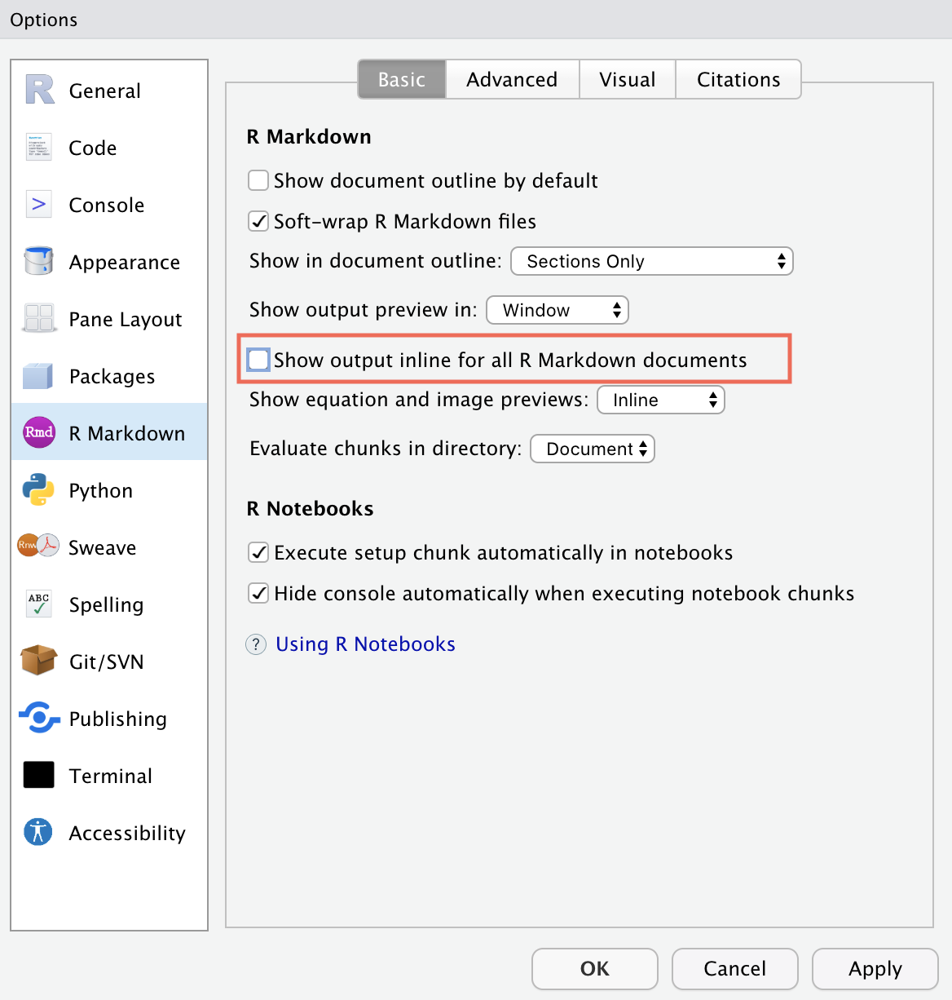
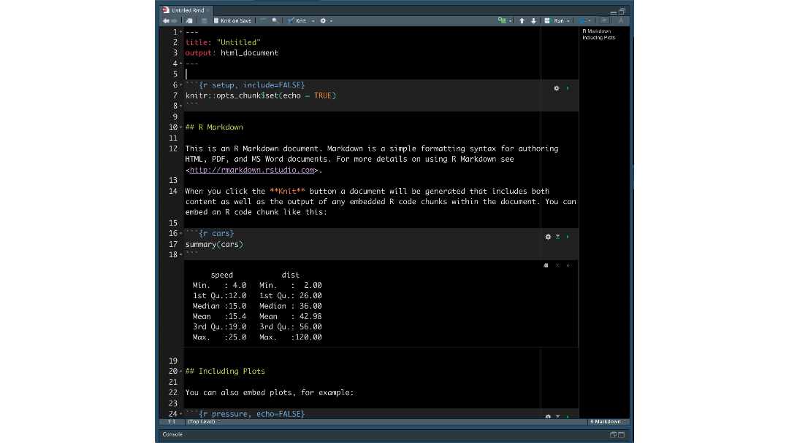

Photo by <a href="https://unsplash.com/@kumoknits?utm_source=unsplash&utm_medium=referral&utm_content=creditCopyText">Karina L</a> on <a href="https://unsplash.com/?utm_source=unsplash&utm_medium=referral&utm_content=creditCopyText">Unsplash</a>

The R Markdown file format combines R programming and the markdown language to create dynamic, reproducible documents. R Markdown can be used for reports, slide shows, blogs, books --- even <a href="https://bookdown.org/yihui/rmarkdown/shiny-start.html" target = "_blank">Shiny apps</a>! With so many possibilities, authors learn how to use their tools in effective ways.

We asked our Twitter friends <a href="https://twitter.com/_bcullen/status/1333878752741191680" target = "_blank">the tips and tricks that they have picked up</a> along their R Markdown journey. There was a flurry of insightful replies, ranging from organizing files to working with YAML. We wanted to highlight some of the responses so that you can also use them when creating R Markdown documents.

This is the first of a four-part series to help you on your path to R Markdown success, starting with **working with R Markdown documents in the RStudio IDE.**

**1. Create new chunks with shortcuts**

We understand the pain of typing out all those backticks to create a new chunk, and <a href="https://yihui.org/en/2021/10/unbalanced-delimiters/" target = "_blank">it is also error-prone</a>. Instead, insert an R code chunk by clicking the Insert button on the document toolbar.

 
You can also type the keyboard shortcut <kbd>Ctrl</kbd> + <kbd>Alt</kbd> + <kbd>I</kbd> (<kbd>Cmd</kbd> + <kbd>Option</kbd> + <kbd>I</kbd> on macOS). Use the shortcut inside a chunk to split it into two:

**2. Run all (or some) chunks**

Within RStudio, the Run button on the right-hand side of the document toolbar opens a drop-down menu. The menu contains handy shortcuts for running code chunks.

 

For example, you don't have to run chunks individually. Run all chunks below your cursor by clicking **Run All Chunks Below**.

**3. Show plots in the Viewer pane**

By default, code chunks display R Markdown plots "inline", or directly underneath the code chunk. If you would rather see the plot in the Viewer pane, go to **RStudio** \> **Preferences** \> **R Markdown** and unselect "Show output inline for all R Markdown documents".

Voilà! Next time you run the document, the plot will show in the Viewer pane as opposed to inline.

*Before...*

*After...*

**4. Drag and drop formulas from Wikipedia into your R Markdown document**

You can include LaTeX formulas in your R Markdown files. Enclose them between dollar signs (`$`) to see the rendered formula.

Since Wikipedia uses LaTeX HTML formatting on its website, this means you can highlight formulas and drag them into your R Markdown document.

&nbsp;

**5. Use the visual markdown editor**

<a href="https://www.rstudio.com/products/rstudio/download/" target = "_blank">RStudio v1.4</a> has a visual markdown editing mode. This lets you see what your R Markdown document will look like without knitting. You can edit your document in this mode, as well.

Click the compass button on the far-right end of the document toolbar to switch into visual markdown editing mode.

 

Alternatively, you can use the <kbd>⇧</kbd>+<kbd>⌘</kbd>+<kbd>F4</kbd> keyboard shortcut.

Typing <kbd>⌘/</kbd> finds and inserts what you need into the document:

&nbsp;

These are only a few of the many features available in the visual markdown editor. Read more in <a href="https://rstudio.github.io/visual-markdown-editing/" target = "_blank">the RStudio Visual Markdown Editing documentation</a>.

## Continue the Journey

We hope that these tips & tricks help you when you are working with R Markdown documents in the RStudio IDE. Thank you to everybody who shared advice, workflows, and features!

Stay tuned for the second post in this four-part series: **Cleaning up your code.**

## Resources

- For more information on R Markdown and the RStudio IDE, see <a href="https://rmarkdown.rstudio.com/articles_integration.html" target = "_blank">R Markdown Integration in the IDE</a>.
- Read more about Visual R Markdown in the <a href="https://rstudio.github.io/visual-markdown-editing/" target = "_blank">documentation</a> and the <a href="https://blog.rstudio.com/2020/09/30/rstudio-v1-4-preview-visual-markdown-editing/" target = "_blank">accompanying blog post</a>.
- To learn about RStudio Connect, a platform on which you can schedule and deploy for R Markdown documents so they are accessible to all the relevant stakeholders in your organization, check out the <a href="https://www.rstudio.com/products/connect/" target = "_blank">RStudio Connect product page</a>.
