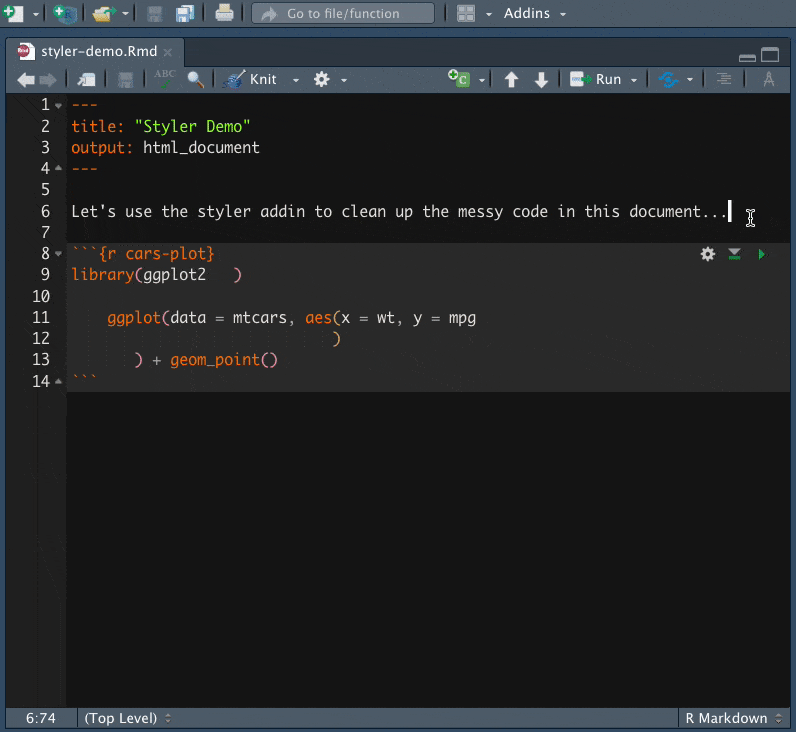

The R Markdown file format combines R programming and the markdown language to create dynamic, reproducible documents. Authors use R Markdown for reports, slide shows, blogs, books --- even <a href="https://bookdown.org/yihui/rmarkdown/shiny-start.html" target = "_blank">Shiny apps</a>! But, how can users ensure that their R Markdown documents are easy to write, read, and maintain?

We asked our Twitter friends <a href="https://twitter.com/_bcullen/status/1333878752741191680" target = "_blank">the tips and tricks that they have picked up</a> along their R Markdown journey. There was a flurry of insightful responses ranging from organizing files to working with YAML, and we wanted to highlight some of the responses so that you can apply them to your work, as well.

This is the second of a four-part series to help you on your path to R Markdown success, where we discuss **cleaning up your code using R Markdown features.**

**1\. Set up your document**

Set yourself up for success! At the top of your document, create a code chunk that lists all the packages that you will use. This makes sure you’re ready for the rest of your workflow.

````
```{{r}}
library(ggplot2)
library(flexdashboard)
library(tensorflow)
```
````

**2\. Name code chunks for easier navigation**

Label code chunks to remember what each chunk is for. For example, you could call the chunk with your packages `setup`:

````
```{{r setup}}
library(ggplot2)
library(flexdashboard)
library(tensorflow)
```
````

In the RStudio IDE, you can navigate to specific chunks. Open the code chunk navigation window, located in the bottom left-hand side of the Source pane:

<center>

</center>

**WARNING!** You can label code chunks with hyphens but we don't recommend using underscores or spaces. Think "kebabs, not snakes".


<center>
<caption>
Artwork by @allison_horst, <a href="https://www.allisonhorst.com/" target = "_blank">https://www.allisonhorst.com/</a>
</caption>
</center>

For help with naming code chunks, check out the <a href="https://itsalocke.com/namer/articles/namer" target = "_blank">namer package</a>.

**3\. Add chunk options to customize your code chunks**

When you knit your file, you may want your code chunks to look a certain way. You can add <a href="https://yihui.org/knitr/options/" target = "_blank">chunk options</a> to customize the components of your code chunks.

For example, if you want the code to show up in your knitted file without any messages or warnings, you can write `message = FALSE` and `warning = FALSE` in the chunk header:

````
```{{r setup, message = FALSE, warning = FALSE}}
library(car)
```
````

If you do not want to see the code, the messages, or the warnings, but still want the code evaluated, you can use `include = FALSE`:

````
```{{r setup, include = FALSE}}
source("my-setup.R", local = knitr::knit_global())
```
````

There are many useful chunk options. For a full list, see the <a href="https://yihui.org/knitr/options/" target = "_blank">knitr package documentation</a>.

**4\. Use global options for your chunks**

Did you know that you can use the same settings across all the code chunks in your R Markdown document? Set your global R options with `options()` and your knitr global chunk options with `knitr::opts_chunk$set()`.

For example, if you know that you want all your numbers to have three digits and all your figures to have a width of 8, use the code below:

````
```{{r setup, include = FALSE}}
# set up global R options
options(digits = 3)

# set up knitr global chunk options
knitr::opts_chunk$set(fig.width = 8)
```
````

**5\. Control where figures are saved with `fig.path`**

By default, your R Markdown document's figures are saved to a `_files` folder, but they are deleted after the output document is generated. R Markdown offers <a href="https://bookdown.org/yihui/rmarkdown-cookbook/keep-files.html" target = "_blank">a few options</a> for keeping your plot files.

However, you may want to save your figures in a specific spot rather than writing `ggplot2::ggsave(path = path/to/folder)` after each one. To do so, use `fig.path` to designate the folder. Conveniently, knitr will create the `fig.path` folder for you if it does not already exist in your working directory. Make sure to include the trailing slash!

````
```{{r cars-plot, fig.path = "figures/"}}
ggplot(data = mtcars, aes(x = wt, y = mpg)) +
  geom_point()
```
````

If you want to save all your figures in the same folder, specify your `fig.path` in the global options mentioned above. With `fig.path`, you can also add a prefix to your plot file names.

````
```{{r setup}}
knitr::opts_chunk$set(
  fig.width = 8
  fig.path = "figures/prefix-"
)
```
````

**6\. Write chunk options inside code chunks with `#|`**

We've seen a number of useful chunk options so far, but that only scratches the surface of <a href="https://yihui.org/knitr/options/#chunk-options" target = "_blank">what knitr provides</a>. If you have many chunk options to specify, your code can quickly become difficult to read.

````
```{{r cars-plot, echo = FALSE, message = FALSE, fig.width = 6, fig.height = 6, fig.path = "figures/", fig.cap = "This is a long caption that fits better inside of a code chunk.", fig.alt = "This is a long description that conveys the meaning of the visual."}}
ggplot(data = mtcars, aes(x = wt, y = mpg)) +
  geom_point()
```
````

As of <a href="https://github.com/yihui/knitr/releases/tag/v1.35" target = "_blank">knitr v1.35</a>, you can now write chunk options *inside* of a code chunk using a special comment symbol, `#|`. You can write your chunk options over as many lines as you like.

Notice how much easier these chunk options are to read: 

````
```{{r cars-plot}}
#| echo = FALSE,
#| message = FALSE,
#| fig.width = 6, fig.height = 6,
#| fig.path = "figures/",
#| fig.caption = "This is a long caption that fits better inside of a code chunk"
#| fig.alt = "This is a long description that conveys the meaning of the visual."

ggplot(data = mtcars, aes(x = wt, y = mpg)) +
  geom_point()
```
````

**7\. Split up your code into child documents**

Feel that your document is getting too long? To make your code more modular, you can split your code into multiple documents and knit them together to create a single output. Provide paths to one or more "child" documents using the chunk option `child`:

````
```{{r, child = c("first_file.Rmd", "second_file.Rmd")}}
```
````

You can also use child documents conditionally. Say you wanted to publish one report if Brazil wins the World Cup and another if Germany wins. Create a variable for the winner:

````
```{{r, include = FALSE}}
winner <- "brazil"
```
````

Once you know the game result, change `winner` and the correct report will knit:

````
```{{r, child = if (winner == 'brazil') 'brazil.Rmd' else 'germany.Rmd'}}

```
````

**8\. Clean up messy code with the styler addin**

When it comes to writing code, keeping consistent style and formatting is important so that others (your future self included) are better able to read and understand your code. But it's easy to let this slip, especially after working on the same code for many hours. You can use the <a href="https://styler.r-lib.org/" target = "_blank">styler</a> addin to easily re-format messy code in a snap:



With styler, you have the option to re-format a specific section of code, an entire .Rmd document, or even a whole directory of .R and/or .Rmd files. You can also build this directly into your knitting process using the chunk option `tidy`:

````
```{{r setup}}
knitr::opts_chunk$set(tidy = "styler")
```
````

This ensures that every time you knit, any code that is shown in the rendered document will be properly formatted.

## Continue the Journey

We hope that these tips & tricks help you clean up your code in R Markdown. Thank you to everybody who shared advice, workflows, and features!

Stay tuned for the third post in this four-part series: **Time-savers & trouble-shooters.**

## Resources

* For more on R Markdown in data science, read <a href="https://r4ds.had.co.nz/r-markdown.html" target = "_blank">R for Data Science</a> and the <a href="https://bookdown.org/yihui/rmarkdown-cookbook/" target = "_blank">R Markdown Cookbook</a>.
* Check out the <a href="https://raw.githubusercontent.com/rstudio/cheatsheets/main/rmarkdown.pdf" target = "_blank">Dynamic documents with rmarkdown cheatsheet </a> for quick reference on chunk options and more.
* Need R Markdown in production? Publish and schedule reports, enable self-service customization, and distribute beautiful emails using <a href="https://www.rstudio.com/products/connect/" target = "_blank">RStudio Connect</a>. 
