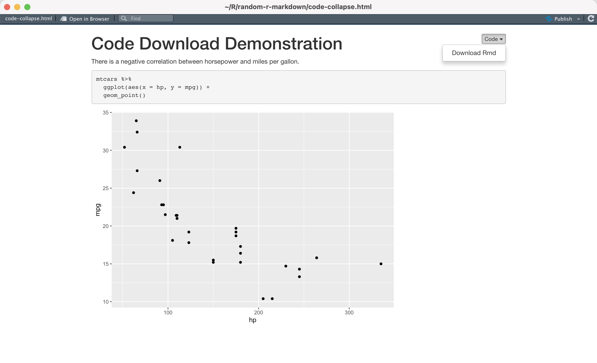
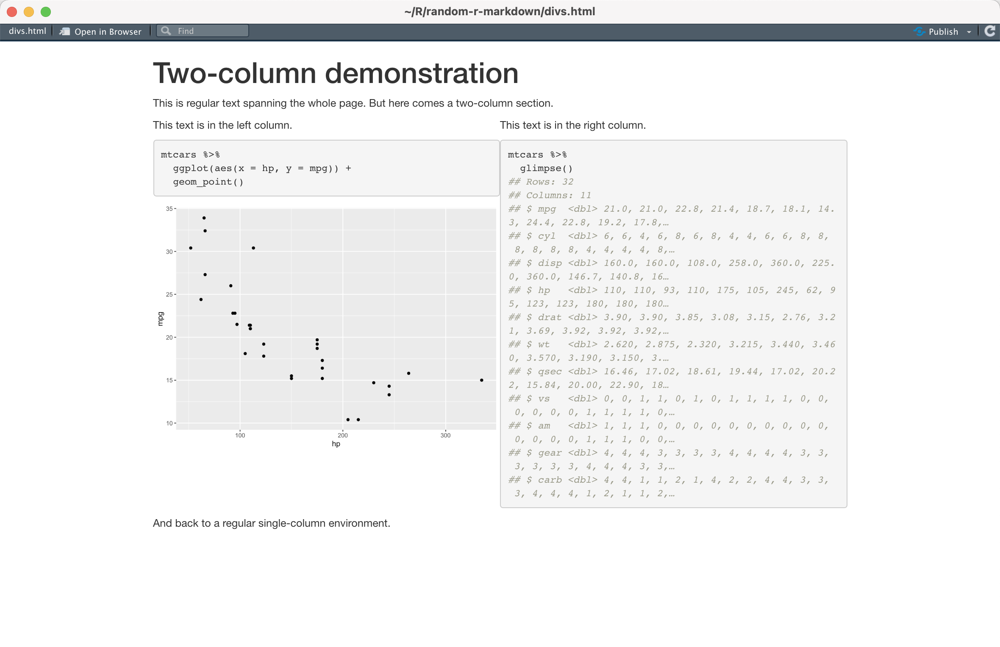
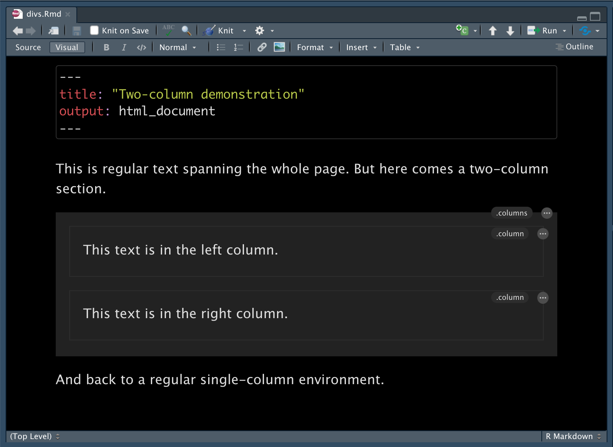
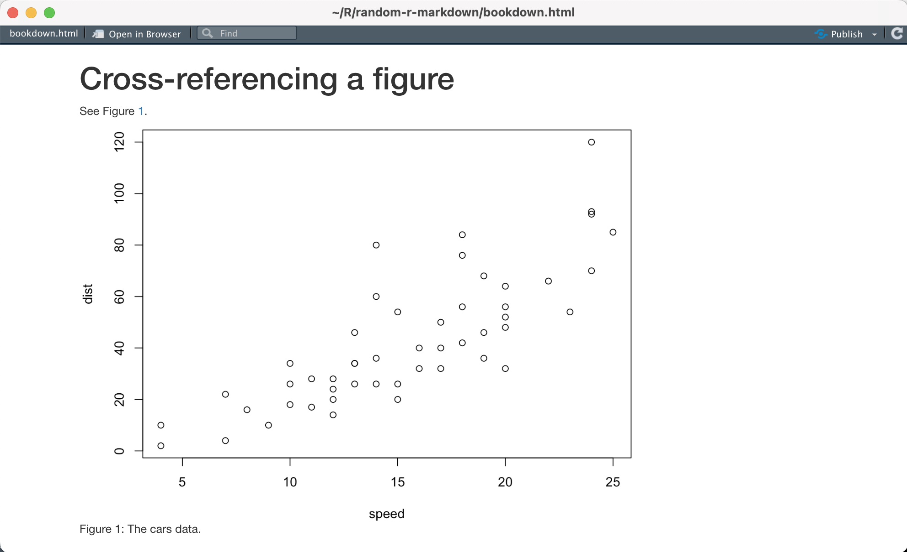

<sup>Photo by <a href="https://unsplash.com/@rocknwool?utm_source=unsplash&utm_medium=referral&utm_content=creditCopyText">rocknwool</a> on <a href="https://unsplash.com/">Unsplash</a></sup>

The R Markdown file format combines R programming and the markdown language to create dynamic, reproducible documents. Authors use R Markdown for reports, slide shows, blogs, books — even <a href="https://bookdown.org/yihui/rmarkdown/shiny-start.html" target = "_blank">Shiny apps</a>! Since users can do so much with R Markdown, it's important to create high-quality documents that take advantage of available features.

We asked our Twitter friends <a href="https://twitter.com/_bcullen/status/1333878752741191680" target = "_blank">the tips and tricks that they have picked up</a> along their R Markdown journey. There was a flurry of insightful responses ranging from organizing files to working with YAML, and we wanted to highlight some of the responses so that you can apply them to your work, as well.

This is the final post of a four-part series to help you on your path to R Markdown success, where we discuss **how to make your document look and work better**.

**1. Fold code chunks by default in rendered documents**

It can be distracting to show code in an R Markdown document if that is not your primary focus. Add `code_folding: hide` to the YAML header to hide code chunks after rendering the document:

````
---
title: "Code Collapse Demonstration"
output:
  html_document:
    code_folding: hide
---

```{{r}}
#| include = FALSE
library(dplyr)
library(ggplot2)
```

There is a negative correlation between horsepower and miles per gallon.

```{{r}}
mtcars %>% 
  ggplot(aes(x = hp, y = mpg)) +
  geom_point()
```
````

When knitted, readers can choose to unfold a code chunk by clicking the "Code" button:

<script src="https://fast.wistia.com/embed/medias/2fbo671md7.jsonp" async></script><script src="https://fast.wistia.com/assets/external/E-v1.js" async></script><div class="wistia_responsive_padding" style="padding:60.83% 0 0 0;position:relative;"><div class="wistia_responsive_wrapper" style="height:100%;left:0;position:absolute;top:0;width:100%;"><div class="wistia_embed wistia_async_2fbo671md7 videoFoam=true" style="height:100%;position:relative;width:100%">&nbsp;</div></div></div>

Say that you want to hide both the code and output using a single "Code" button. The `collapse` chunk option collapses the source and output blocks from one code chunk into a single block. Set it to `TRUE` to fold this single block:

````
---
title: "Code Collapse Demonstration"
output:
  html_document:
    code_folding: hide
---

There is a negative correlation between horsepower and miles per gallon.

```{{r}}
#| include = FALSE
library(dplyr)
library(ggplot2)
```

```{{r}}
#| collapse = TRUE
mtcars %>% 
  glimpse()
```
````

<script src="https://fast.wistia.com/embed/medias/qgv2sqjf6r.jsonp" async></script><script src="https://fast.wistia.com/assets/external/E-v1.js" async></script><div class="wistia_responsive_padding" style="padding:60.83% 0 0 0;position:relative;"><div class="wistia_responsive_wrapper" style="height:100%;left:0;position:absolute;top:0;width:100%;"><div class="wistia_embed wistia_async_qgv2sqjf6r videoFoam=true" style="height:100%;position:relative;width:100%">&nbsp;</div></div></div>

Find out more in the R Markdown Cookbook chapter, <a href="https://bookdown.org/yihui/rmarkdown-cookbook/fold-show.html" target = "_blank">Fold all code blocks but show some initially</a>.

**2. Add the option to download a document's source code**

In addition to folding code chunks, you can embed a "code download" button in an R Markdown document. Readers can download the source code from the rendered HTML version.

Add the following to your YAML:

````
output:
  html_document:
    code_download: true
````



Interested in checking out the full list of options for `html_document`? You can run `?rmarkdown::html_document` in your Console or refer to the <a href="https://rmarkdown.rstudio.com/docs/reference/html_document.html" target = "_blank">help page in the rmarkdown documentation</a> to see a complete list.

**3. Turn sections into tabs**

Tabsets allow you to organize information into tabs. Add `.tabset` to section headings to convert the lower-level headings into tabs:

````
---
title: "Tabset Demonstration"
output: html_document
---

```{{r}}
#| include = FALSE
library(dplyr)
library(ggplot2)
```

There is a negative correlation between horsepower and miles per gallon.

## Tab {.tabset}

### Plot

```{{r}}
mtcars %>% 
  ggplot(aes(x = hp, y = mpg)) +
  geom_point()
```

### Table

```{{r}}
#| collapse = TRUE
mtcars %>% 
  glimpse()
```
````

Readers can click between the different tabs in the tabset:

<script src="https://fast.wistia.com/embed/medias/mpkxq0uuy5.jsonp" async></script><script src="https://fast.wistia.com/assets/external/E-v1.js" async></script><div class="wistia_responsive_padding" style="padding:64.58% 0 0 0;position:relative;"><div class="wistia_responsive_wrapper" style="height:100%;left:0;position:absolute;top:0;width:100%;"><div class="wistia_embed wistia_async_mpkxq0uuy5 videoFoam=true" style="height:100%;position:relative;width:100%"><div class="wistia_swatch" style="height:100%;left:0;opacity:0;overflow:hidden;position:absolute;top:0;transition:opacity 200ms;width:100%;"></div></div></div></div>

The <a href="https://pkg.garrickadenbuie.com/xaringanExtra/#/panelset?id=use-in-r-markdown" target = "_blank">xaringanExtra package</a> allows you to create tabsets in a wider range of document types, such as blogdown blogs, xaringan slides, and other HTML reports.

**4. Insert page breaks**

Add a page break to your HTML, Word, and ODT documents with `\newpage`:

````
---
title: "Insert Page Break Demonstration"
output:
  word_document: default
---

# The first section

\newpage

# The second section
```
````

Note that page breaks in HTML documents will only appear when you print the page.

**5. Create a multi-column page**

To create a page with multiple columns, you can use <a href="https://pandoc.org/MANUAL.html#divs-and-spans" target = "_blank">pandoc's fenced `Div` blocks</a>.

````
---
title: "Two-column demonstration"
output: html_document
---

```{{r}}
#| include = FALSE
library(dplyr)
library(ggplot2)
```

This is regular text spanning the whole page. But here comes a two-column section.

::: columns
::: column
This text is in the left column.

```{{r}}
mtcars %>%
  ggplot(aes(x = hp, y = mpg)) +
  geom_point()
```

:::

::: column
This text is in the right column.
```{{r}}
#| collapse = TRUE
mtcars %>%
  glimpse()
```
:::
:::

And back to a regular single-column environment.
````

This results in a document that looks like this:



Find out more in the R Markdown Cookbook chapter, <a href="https://bookdown.org/yihui/rmarkdown-cookbook/multi-column.html" target = "_blank">Multi-column layout</a>.

**On Pandoc fenced `Div` blocks**

Pandoc's fenced `Div` blocks are very flexible, and you can use them to customize your document in many ways. [RStudio's Visual Editor](https://rstudio.github.io/visual-markdown-editing/) makes them easy to write. Insert a fenced `Div` block using the Insert shortcut, <kbd>⌘</kbd> + <kbd>/</kbd>, and typing 'div'. An edit button will appear at the top right when your cursor is in the block.


<br>

Read more about fenced `Div` blocks in the R Markdown Cookbook chapter, <a href="https://bookdown.org/yihui/rmarkdown-cookbook/custom-blocks.html" target = "_blank">Custom blocks</a>.
 
**6. Add internal links to different sections in your document**

To link to another section of the same document, use the heading identifier:

````
---
title: "Internal Link Demonstration"
output: html_document
---

* Go to [table](#table)
* Go to [plot](#custom-id)

```{{r}}
#| include = FALSE
library(dplyr)
library(ggplot2)
```

### Plot {#custom-id}

```{{r plot-caption}}
mtcars %>% 
  ggplot(aes(x = hp, y = mpg)) +
  geom_point()
```

### Table

```{{r}}
mtcars %>% 
  glimpse()
```
````

Clicking on "table" will direct the reader to the `### Table` heading.

<script src="https://fast.wistia.com/embed/medias/sqju0o14ei.jsonp" async></script><script src="https://fast.wistia.com/assets/external/E-v1.js" async></script><div class="wistia_responsive_padding" style="padding:68.12% 0 0 0;position:relative;"><div class="wistia_responsive_wrapper" style="height:100%;left:0;position:absolute;top:0;width:100%;"><div class="wistia_embed wistia_async_sqju0o14ei videoFoam=true" style="height:100%;position:relative;width:100%"><div class="wistia_swatch" style="height:100%;left:0;opacity:0;overflow:hidden;position:absolute;top:0;transition:opacity 200ms;width:100%;"></div></div></div></div>

The <a href="https://pandoc.org/MANUAL.html#extension-auto_identifiers" target = "_blank">pandoc documentation lists the specifications for writing internal links</a>. Or, you can use a custom id like `[plot](#custom-id)` above.

Cross-referencing is not provided within the base rmarkdown package but it is provided as an extension in <a href="https://pkgs.rstudio.com/bookdown/" target = "_blank">bookdown</a>. This requires a caption and a labeled code chunk and uses the syntax `\@ref(type:label)`:

````
---
title: Cross-referencing a figure
output:
  bookdown::html_document2: default
---

See Figure \@ref(fig:cars-plot).

```{{r cars-plot, fig.cap="The cars data.", echo=FALSE}}
#| label = cars-plot
par(mar = c(4, 4, .2, .1))
plot(cars)  # a scatterplot
```
````

This results in a document that looks like this:



Find out more in the R Markdown Cookbook chapter, <a href="https://bookdown.org/yihui/rmarkdown-cookbook/cross-ref.html" target = "_blank">Cross-referencing within documents</a>.

**7. Create a list of words from an R-generated vector with `knitr::combine_words()`**

For two words, `knitr::combine_words()` will return 'a and b':

```{{r}}
letters[1:2] %>%
  knitr::combine_words()
```
```
a and b
```

For more than two words, `knitr::combine_words()` will return the list of words, including the Oxford comma by default:

```{{r}}
letters[1:10] %>%
  knitr::combine_words()
```
```
a, b, c, d, e, f, g, h, i, and j
```

The <a href="https://glue.tidyverse.org/" target = "_blank">glue package</a> provides <a href="https://glue.tidyverse.org/articles/engines.html" target = "_blank">custom language engines for knitr</a> for using glue directly in knitr chunks. Alternatively, use the <a href="https://pkg.garrickadenbuie.com/epoxy/" target = "_blank">epoxy package</a> for easy templating in R Markdown documents and Shiny apps.

**8. Optimize PNG plots without losing image quality**

Install the <a href="http://optipng.sourceforge.net" target = "_blank">OptiPNG program</a> and include `knitr::hook_optipng()` in a code chunk to optimize PNG plots. The images will be recompressed to a smaller size without losing image quality.

Use the chunk option `optipng = ""` to <a href="https://bookdown.org/yihui/rmarkdown-cookbook/optipng.html" target = "_blank">enable the hook</a>:

````
```{{r}}
knitr::knit_hooks$set(optipng = knitr::hook_optipng)
```
````

If you do not mind sacrificing a tiny bit quality that is barely noticeable, you may also consider <a href="https://tinypng.com" target = "_blank">TinyPNG</a>, which can optimize PNG, JPEG, and WebP images. The R function `xfun::tinify()` allows you to call the TinyPNG API from R to optimize images. If you want to both optimize and shrink images (which can be helpful for projects like <a href="https://bookdown.org/yihui/blogdown/useful-resources.html#file-optimization" target = "_blank">blogdown</a>, you may try `xfun::shrink_images()`.

## Continue the Journey

We hope that these tips & tricks help you create documents that look and work better. Thank you to everybody who shared advice, workflows, and features! It's been amazing hearing about how others in the community use open-source tools and processes. We hope that you learned a lot (we know we did!). Check out the previous posts here:

* <a href="https://www.rstudio.com/blog/r-markdown-tips-tricks-1-rstudio-ide/" target = "_blank">R Markdown Lesser-Known Tips & Tricks #1: Working in the RStudio IDE</a>
* <a href="https://www.rstudio.com/blog/r-markdown-tips-tricks-2-cleaning-up-your-code/" target = "_blank">R Markdown Lesser-Known Tips & Tricks #2: Cleaning Up Your Code </a>
* <a href="https://www.rstudio.com/blog/r-markdown-tips-and-tricks-3-time-savers/" target = "_blank">R Markdown Lesser-Known Tips & Tricks #3: Time-Savers & Trouble-Shooters</a>

Even though the tips & tricks series is over, there is always more to pick up on the R Markdown journey.

* Read the <a href="https://bookdown.org/yihui/rmarkdown-cookbook/" target = "_blank">R Markdown Cookbook</a> for more practical examples of the interesting and useful features of R Markdown.
* Watch Tom Mock's webinar, <a href="https://www.youtube.com/watch?v=WkF7nqEYF1E" target = "_blank">R Markdown Advanced Tips to Become a Better Data Scientist & RStudio Connect</a>, to see how to use R Markdown, the RStudio IDE, and <a href="https://www.rstudio.com/products/connect/" target = "_blank">RStudio Connect</a> to schedule reports, send out emails, and more.
