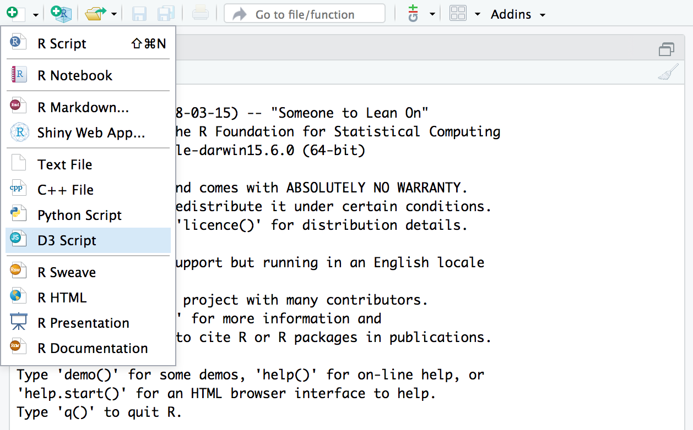
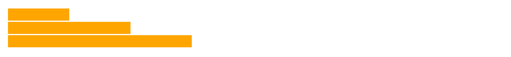

<blockquote>
<p class="body-md-regular body-sm-regular">
Please note that the information presented in this post reflects the package as it stood when initially released, and may now be outdated. For the most up-to-date information, kindly refer to <https://rstudio.github.io/r2d3/>.
</p>
</blockquote> 


As part our series on new features in the [RStudio v1.2 Preview Release](https://www.rstudio.com/products/rstudio/download/preview/), we're pleased to announce the [r2d3 package](https://rstudio.github.io/r2d3/), a suite of tools for using custom [D3 visualizations](https://d3js.org/) with R.

RStudio v1.2 includes several features to help optimize your development experience with **r2d3**. We'll describe these features below, but first a bit more about the package. Features of **r2d3** include:

  - Translating R objects into D3 friendly data structures

  - Publishing D3 visualizations to the web

  - Incorporating D3 scripts into [R
    Markdown](https://rmarkdown.rstudio.com/) reports, presentations,
    and dashboards

  - Creating interacive D3 applications with
    [Shiny](https://shiny.rstudio.com/)

  - Distributing D3 based [htmlwidgets](http://www.htmlwidgets.org) in R
    packages

<div style="clear: both">

</div>

<br/>

With **r2d3**, you can bind data from R to D3 visualizations like the
ones found on <https://github.com/d3/d3/wiki/Gallery>,
<https://bl.ocks.org/>, and
<https://vida.io/explore>:

<div style="margin-top: 20px; margin-bottom: 10px;">

<a href="https://rstudio.github.io/r2d3/articles/gallery/chord/"></a>  <a href="https://rstudio.github.io/r2d3/articles/gallery/bubbles/"></a>  <a href="https://rstudio.github.io/r2d3/articles/gallery/cartogram/"></a>

</div>

D3 visualizations created with **r2d3** work just like R plots within
RStudio, R Markdown documents, and Shiny applications.

You can install the **r2d3** package from CRAN as follows:

```{{r}}
install.packages("r2d3")
```


## D3 Scripts

To use **r2d3**, write a D3 script and then pass R data to it using the
`r2d3()` function. For example, here’s a simple D3 script that draws a
bar chart (“barchart.js”):

``` js
// !preview r2d3 data=c(0.3, 0.6, 0.8, 0.95, 0.40, 0.20)

var barHeight = Math.floor(height / data.length);

svg.selectAll('rect')
  .data(data)
  .enter().append('rect')
    .attr('width', function(d) { return d * width; })
    .attr('height', barHeight)
    .attr('y', function(d, i) { return i * barHeight; })
    .attr('fill', 'steelblue');
```

To render the script within R you call the `r2d3()` function:

```
library(r2d3)
r2d3(data=c(0.3, 0.6, 0.8, 0.95, 0.40, 0.20), script = "barchart.js")
```

Which results in the following visualization:


### D3 Variables

Note that data is provided to the script using the `data` argument to
the `r2d3()` function. This data is then automatically made available to
the D3 script. There are a number of other special variables available
within D3 scripts, including:

  - `data` — The R data converted to JavaScript.
  - `svg` — The svg container for the visualization
  - `width` — The current width of the container
  - `height` — The current height of the container
  - `options` — Additional options provided by the user
  - `theme` — Colors for the current theme

When you are learning D3 or translating D3 examples for use with R it’s
important to keep in mind that D3 examples will generally include code
to load data, create an SVG or other root element, and establish a width
and height for the visualization.

On the other hand with **r2d3**, these variables are *provided
automatically* so do not need to be created. The reasons these variables
are provided automatically are:

1)  So that you can dynamically bind data from R to visualizations; and

2)  So that **r2d3** can automatically handle dynamic resizing for your
    visualization. Most D3 examples have a static size. This is fine for
    an example but not very robust for including the visualization
    within a report, dashboard, or application.

## RStudio v1.2 and r2d3

The [RStudio v1.2 preview
release](https://www.rstudio.com/rstudio/download/preview/)
includes support for previewing D3 scripts as you write them. To try this out, install the preview release
then create a D3 script using the new file menu:



A simple template for a D3 script (the barchart.js example shown above)
is provided by default. You can use the **Preview** command
(Ctrl+Shift+Center) to render the
visualization:


You might wonder where the data comes from for the preview. Note that
there is a special comment at the top of the D3 script:

``` js
// !preview r2d3 data=c(0.3, 0.6, 0.8, 0.95, 0.40, 0.20)
```

This comment enables you to specify the data (along with any other
arguments to the `r2d3()` function) to use for the preview.

## R Markdown

RStudio v1.2 also includes support for rendering **r2d3** visualizations within R Markdown documents and R Notebooks. There is a new `d3` R Markdown engine which works like this:

<pre><code>&#96``{r setup}
library(r2d3)
bars &lt;- c(10, 20, 30)
&#96``

&#96``{d3 data=bars, options=list(color = 'orange')}
svg.selectAll('rect')
  .data(data)
  .enter()
    .append('rect')
      .attr('width', function(d) { return d * 10; })
      .attr('height', '20px')
      .attr('y', function(d, i) { return i * 22; })
      .attr('fill', options.color);
&#96``</code></pre>



Note that in order to use the `d3` engine you need to add
`library(r2d3)` to the setup chunk (as illustrated above).

You can also of course call the `r2d3()` function from within
an R code chunk:

<pre><code>---
output: html_document
---

&#96``{r}
library(r2d3)
r2d3(data=c(0.3, 0.6, 0.8, 0.95, 0.40, 0.20), script = "barchart.js")
&#96``</code></pre>


## Shiny

The `renderD3()` and `d3Output()` functions enable you to include D3
visualizations within Shiny applications:

```
library(shiny)
library(r2d3)

ui <- fluidPage(
  inputPanel(
    sliderInput("bar_max", label = "Max:",
                min = 0.1, max = 1.0, value = 0.2, step = 0.1)
  ),
  d3Output("d3")
)

server <- function(input, output) {
  output$d3 <- renderD3({
    r2d3(
      runif(5, 0, input$bar_max),
      script = system.file("examples/baranims.js", package = "r2d3")
    )
  })
}

shinyApp(ui = ui, server = server)
```


See the article on [Using r2d3 with
Shiny](https://rstudio.github.io/r2d3/articles/shiny.html) to learn more
(including how to create custom Shiny inputs that respond to user
interaction with D3 visualizations).

## Try It Out

To try out **r2d3**, start by installing the package from CRAN:

```{{r}}
install.packages("r2d3")
```

Then, download the [RStudio v1.2 Preview Release](https://www.rstudio.com/products/rstudio/download/preview/) and head over to https://rstudio.github.io/r2d3/ for complete documentation on using the package.


If you aren't familliar with D3, check out these links to learn the basics and see some examples that might inspire your
own work:

  - [Learning
    D3](https://rstudio.github.io/r2d3/articles/learning_d3.html) —
    Suggested resources for learning how to create D3 visualizations.

  - [Gallery of
    Examples](https://rstudio.github.io/r2d3/articles/gallery.html) —
    Learn from a wide variety of example D3 visualizations.
    
We hope that the **r2d3** package opens up many new horizons for creating custom interactive visualizations with R!

<style type="text/css">
.screenshot, .illustration {
  margin-bottom: 10px;
  margin-top: 10px;
  border: solid 1px #cccccc;
}
</style>
   


