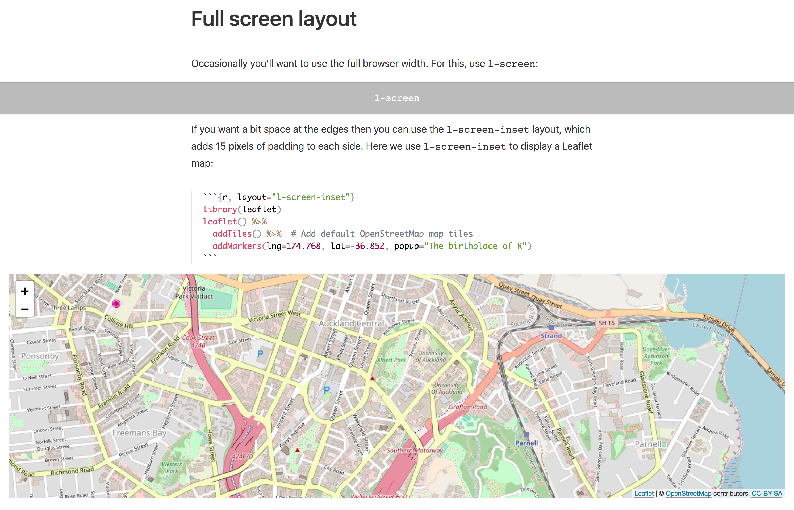
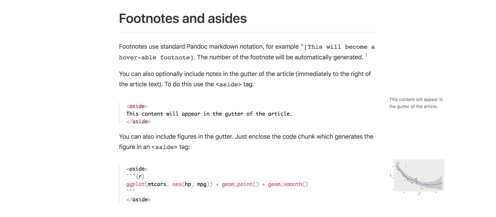

Today we're excited to announce [Radix](https://rstudio.github.io/radix/), a new R Markdown format optimized for scientific and technical communication. Features of Radix include:

- Reader-friendly typography that adapts well to mobile devices.

- Flexible [figure layout](https://rstudio.github.io/radix/figures.html) options (e.g. displaying figures at a larger width than the article text).

- Tools for making articles [easily citeable](https://rstudio.github.io/radix/citations.html), as well as for generating [Google Scholar](https://rstudio.github.io/radix/citations.html#google-scholar) compatible citation metadata.

- The ability to incorporate JavaScript and D3-based [interactive visualizations](https://rstudio.github.io/radix/interactivity.html).

- A variety of ways to [publish articles](https://rstudio.github.io/radix/publish_article.html), including support for publishing sets of articles as a [Radix website](https://rstudio.github.io/radix/website.html).

- The ability to [create a blog](https://rstudio.github.io/radix/blog.html) composed of a collection of Radix articles.

Radix is based on the [Distill web framework](https://github.com/distillpub/template), which was originally created for use in the Distill Machine Learning Journal. Radix combines the technical authoring features of Distill with [R Markdown](https://rmarkdown.rstudio.com/).

Below we'll demonstrate some of the key features of Radix. To learn more about installing and using Radix, check out the [Radix for R Markdown](https://rstudio.github.io/radix/) website. 

## Figure layout

Radix provides many flexible options for laying out figures. While the main text column in Radix articles is relatively narrow (optimized for comfortable reading), figures can occupy a larger region. For example:

<figure>

</figure>

For figures you want to emphasize or that require lots of visual space, you can also create layouts that occupy the entire width of the screen:

<figure>

</figure>

Of course, some figures and notes are only ancillary and are therefore better placed in the margin:

<figure>

</figure>


## Citations and metadata

Radix articles support including citations and a corresponding bibliography using standard R Markdown citation syntax. 

In addition, when you provide a `citation_url` metadata field for your article, a citation appendix that makes it easy for others to cite your article is automatically generated:

<figure>

</figure>

Radix also automatically includes standard [Open Graph](http://ogp.me/) and [Twitter Card](https://developer.twitter.com/en/docs/tweets/optimize-with-cards/overview/abouts-cards) metadata. This makes links to your article display rich metadata when shared in various places:

<figure>

</figure>

## Creating a blog

You can publish a series of Radix articles as either a website or a blog. For example, the [TensorFlow for R](https://blogs.rstudio.com/tensorflow/) blog is implemented using Radix:

<figure>

</figure>

To learn more, see the article on [creating a blog with Radix](https://rstudio.github.io/radix/blog.html).

## Getting started

To create an [R Markdown](https://rmarkdown.rstudio.com) document that uses the Radix format, first install the **radix** R package:

```r
devtools::install_github("rstudio/radix")
```

Using Radix requires Pandoc v2.0 or higher. If you are using RStudio then you should use RStudio v1.2.718 or higher (which comes bundled with Pandoc v2.0). You can download the preview release of RStudio v1.2 at <https://www.rstudio.com/products/rstudio/download/preview/>.

Next, use the **New R Markdown** dialog within RStudio to create a new Radix article:

<figure>

</figure>

This will give you a minimal new Radix document. 

Then, check out the [Radix for R Markdown](https://rstudio.github.io/radix/) website to learn more about what's possible. Happy authoring!


<style type="text/css">
.screenshot {
  border: 1px solid rgba(0, 0, 0, 0.2);
}
</style>

