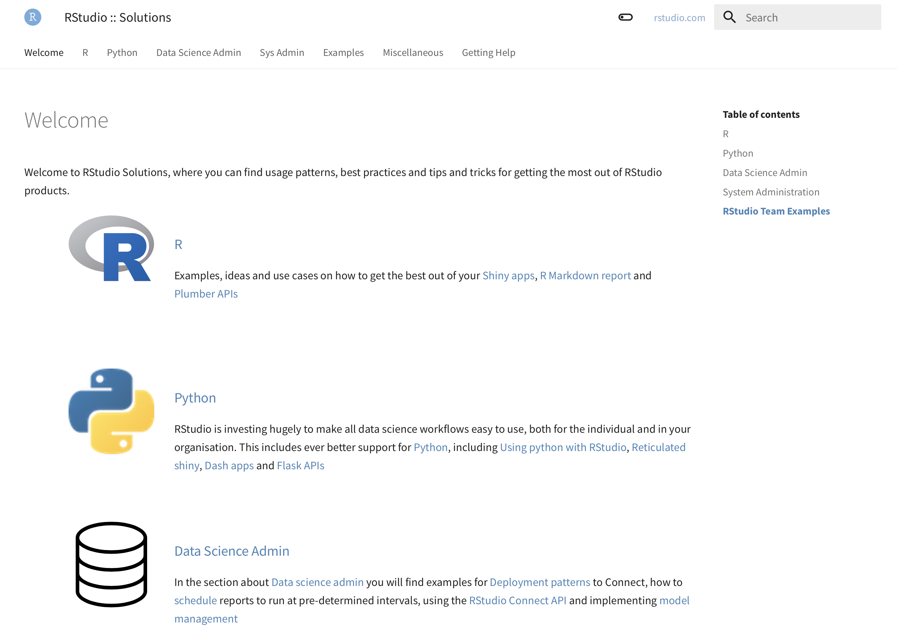
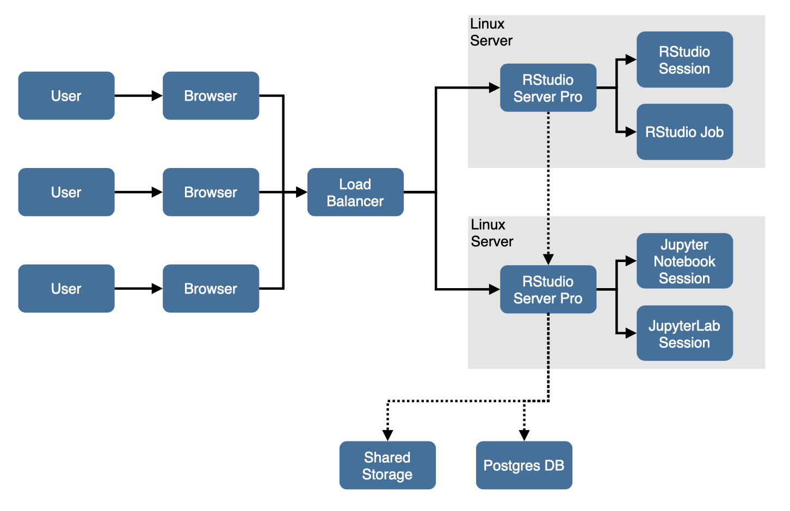
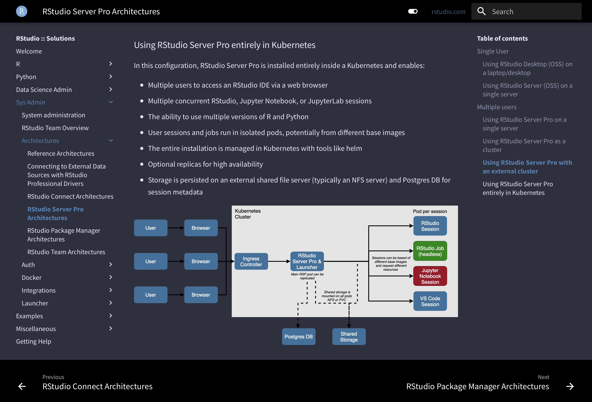

 on [Unsplash](https://unsplash.com/s/photos/solutions?utm_source=unsplash&utm_medium=referral&utm_content=creditCopyText)._]

At RStudio, we pride ourselves on the quality of our documentation. Our documentation website, [docs.rstudio.com](https://docs.rstudio.com){target="_blank"}, provides detailed information on the installation and configuration of our products.

The documentation for each product is owned by the relevant product team, but we all contribute where necessary. One of the teams that spends the most time in the documentation is our Solutions Engineering team. It’s our SEs job to help our customers get the most from the products they’ve purchased. Oftentimes this help needs to go beyond configuration options and authentication mechanisms and for that, we have the solutions website, [solutions.rstudio.com](https://solutions.rstudio.com){target="_blank"}.

The solutions site is home to things like [reference architecture patterns](https://solutions.rstudio.com/sys-admin/architectures/){target="_blank"}, information on other ways to run our software, such as [in Docker containers](https://solutions.rstudio.com/sys-admin/docker/docker_deployment/){target="_blank"}, and great tips on [model management](https://solutions.rstudio.com/data-science-admin/model-management/){target="_blank"}, as well as lots more information besides!

The Solutions site has been around for a long time and has already been through several design revisions. Recently though, we decided to bring it into line with our main documentation site, both visually, as well as functionally.

That new design went live a few weeks ago and we’re already hearing great reports from colleagues and customers alike about how much easier it is to use. This new version of the site has a much improved search functionality as well as a simplified layout that makes finding the things that are of interest to you much simpler.

In the background, the site is also easier to maintain, which lightens the burden for the Solutions Engineering team and makes publishing new articles and updates so much more straightforward. We hope you like the new design and that you find the information useful.

## Solutions site highlights

Here are some highlights of the content on [solutions.rstudio.com](https://solutions.rstudio.com){target="_blank"}:

* [Reference architectures](https://solutions.rstudio.com/sys-admin/architectures/){target="_blank"} - Reference architectures fully diagrammed and explained, showing each product in all of it’s main configurations.
* [Using Python with RStudio](https://solutions.rstudio.com/python/){target="_blank"} - A breakdown of all the different ways you can use our products with Python as well as R.
* [Programmatic deployment to Connect](https://solutions.rstudio.com/data-science-admin/deploy/apis/){target="_blank"} - Using RStudio Connect’s APIs to publish content.
* [Building a slackbot with R and plumber](https://solutions.rstudio.com/r/rest-apis/plumber-slack/){target="_blank"} - Integrate a plumber API with your organisation’s Slack instance to harness the power of R from directly within Slack.
* [Calling plumber APIs from other languages](https://solutions.rstudio.com/r/rest-apis/clients/){target="_blank"} - Example code in a variety of languages for interacting with a plumber API.
* [Scheduling data science tasks](https://solutions.rstudio.com/data-science-admin/scheduling/){target="_blank"} - Advice and tips on scheduling using both Linux cron and RStudio Connect.
* [Running Dash applications on Connect](https://solutions.rstudio.com/python/dash/){target="_blank"} - Sample Dash content running on RStudio Connect as well as links to example code.

## And finally…

For those of you who spend far too much time staring at your computer, we’ve introduced a “dark mode” via the little toggle on the nav bar at the top.

