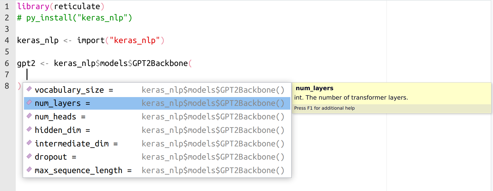

We are pleased to announce that [reticulate](https://rstudio.github.io/reticulate/) version 1.29 is now available on CRAN. This new release brings major new features that improve
ergonomics and diagnostics.

## New Ops Group Generics for Python objects

R operators `+`, `-`, `*`, `/`, `^`, `%%`, `%/%`, `&`, `|`, `!`, `%*%`.
`==`, `!=`, `<`, `<=`, `>=`, `>` all now work with *all* Python objects.
Any equivalent expression in Python now works identically in R. For
example, multiply two NumPy arrays in R with `*`:

``` r
library(reticulate)
np <- import("numpy", convert = FALSE)
x <- np$array(1:5)
y <- np$array(6:10)
x * y
```

    array([ 6, 14, 24, 36, 50])

Or concatenate two Python strings with `+`:

``` r
py_string <- r_to_py("reticulate is")
py_string + " great!"
```

    'reticulate is great!'

Or build up file paths with `/` using Python's `pathlib`:

``` r
home <- import("pathlib")$Path("/home")
home / 'is' / 'here'
```

    PosixPath('/home/is/here')

## Python Functions: Enhanced Autocomplete Support, Dynamic Dots

R functions converted from a Python callable now match the original Python
function signature. This means that converted Python functions in R now
work with all the R-native autocompletion handlers, just like regular R
functions.

{fig-align="center" fig-alt="Code showing the reticulate package's functions, with the function signature showing in RStudio."}

Converted Python functions also now take advantage of rlang's dynamic
dots, allowing for some Pythonic sugar equivalents in R, like:

-   splicing (unpacking) arguments: `fn(!!!args)` (equivalent to
    `fn(*args, **kwargs)` in Python)

-   ignoring an empty final argument in function calls (like what happens in
    Python)

## Errors and Exceptions

There are major enhancements to error and exception handling.

Working with reticulate does not just mean calling into Python from R.
It means building complete solutions that freely pick from the runtime
and language that is best for that particular task, potentially
switching between languages multiple times within a single expression.
In practice, that means we have evaluation stacks with interleaving R and Python frames: R calling into a Python function, which calls back into R, which calls back into Python, etc.

When an R error is signaled, or a Python exception is raised, reticulate
now presents a full accounting of both Python *and* R tracebacks. This accounting comes complete with a new print method for `py_last_error()` that presents source-code file locations for each frame. These are displayed as clickable links in the RStudio IDE that quickly lead you to the exact line where the error occurred.

This is best illustrated with a [non-toy
example](https://blogs.rstudio.com/ai/posts/2023-05-25-llama-tensorflow-keras/).
Imagine you are working on a large language model using TensorFlow/Keras
in R (via reticulate), and, deep in the Transformer architecture, in the `call()` method of
an `Attention` layer, you accidentally add a stray comma in an
expression like `x[,i,]`, resulting in a tensor shape mismatch. Tracking
down an error like this in a complicated project without a detailed
traceback can be difficult---it involves a stack with countless
interleaving of R and Python evaluation frames. Complicating matters,
some frames intercept, modify, or even completely replace the
Exception/Error object (e.g., a function that was autographed and
compiled by TensorFlow). Despite all this, with reticulate 1.29, this is
what you might now see:

<center><script src="https://fast.wistia.com/embed/medias/x9c6s8gcx7.jsonp" async></script><script src="https://fast.wistia.com/assets/external/E-v1.js" async></script><div class="wistia_responsive_padding" style="padding:87.5% 0 0 0;position:relative;"><div class="wistia_responsive_wrapper" style="height:100%;left:0;position:absolute;top:0;width:100%;"><div class="wistia_embed wistia_async_x9c6s8gcx7 videoFoam=true" style="height:100%;position:relative;width:100%"><div class="wistia_swatch" style="height:100%;left:0;opacity:0;overflow:hidden;position:absolute;top:0;transition:opacity 200ms;width:100%;"></div></div></div></div></center>

Under the hood, this new feature is powered by a new `r_to_py()` and
`py_to_r()` pair of routines that convert between R errors and Python
Exceptions. An R error, propagating and unwinding the call stack,
upon encountering a Python frame, enters the
Python runtime as a bonafide Python Exception containing attributes
with full R traceback information, and vice versa. The same
error/exception object traverses the stack, plugging in directly to the
language native idioms and constructs for them, like: invoking handlers
established with `on.exit()`, `tryCatch()` and `withCallingHandlers()`
in R or `try: ...; except: ...; finally: ...` blocks in Python.

This means that you can use R signal handling routines to catch Python
exceptions:

``` r
tryCatch(py_eval("1/0"),
         python.builtin.ZeroDivisionError = function(e) {
           message("Can't divide by zero in Python")
         })
```

    Can't divide by zero in Python

Or raise a typed Python Exception with `base::stop()` in R and catch it
with `try: ... except ...` in Python:

``` python
def call_and_maybe_catch(callback):
  try: 
    return callback()
  except ZeroDivisionError:
    return "This is not the Infinity you're looking for..."
```

``` r
py$call_and_maybe_catch(\() py_eval("1/0"))
```

    [1] "This is not the Infinity you're looking for..."

``` r
py$call_and_maybe_catch(\() stop(py_eval("ZeroDivisionError()")))
```

    [1] "This is not the Infinity you're looking for..."

These are just the highlights from an overstuffed grab-bag of fixes and
enhancements in this release—check out the
[NEWS](https://github.com/rstudio/reticulate/blob/main/NEWS.md) file for
a full accounting.

Thanks for reading!