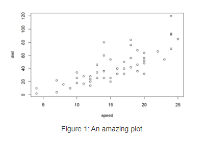
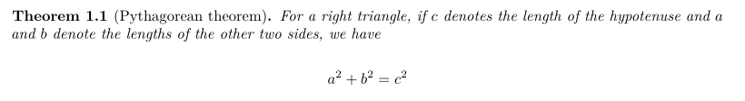

Seasons greetings from the R Markdown family! We know many folks are headed into holiday breaks, and we hope you all take time away from work to enjoy...the rest of 2020. If you are like most people, you may be having a hard time keeping up with the latest news and current events in the world. We cannot help much with that (we're in the same boat), but we are here to make your working lives easier! We wanted to take a moment to round up all the latest news from the R Markdown family of packages so that when you re-surface in 2021, you know all you need to know to take advantage of the newest features that will improve your knitting experience. Without further ado, let's get started!

## rmarkdown

|                            Last release                            |
|:------------------------------------------------------------------:|
|  |

We are happy to share that **rmarkdown** (<https://rmarkdown.rstudio.com/docs/>) version 2.6 is now on CRAN. rmarkdown is a package that helps you create dynamic documents that combine code, rendered output (such as figures), and markdown-formatted text.

You can install rmarkdown from CRAN with:

```
install.packages("rmarkdown")
```

There have been three new versions released on CRAN since this fall. Below we share some highlights, but you may want to look at the [release notes](https://rmarkdown.rstudio.com/docs/news/) for the full details.

### Anchor links

An anchor link (also known as a "page jump") can help you share the URL to a specific section of a web page. Anchor links can now easily be added to headers in `html_document()` by using `anchor_sections = TRUE` in your YAML. First introduced in **rmarkdown** v2.5 as `TRUE` by default, we reverted to `FALSE` following community feedback. In v2.6 and later, you can enable anchor links in your YAML header:

``` {{yaml}}
output:
  html_document:
    anchor_sections: TRUE # default is FALSE
```

This works for any HTML-based output format, including those from the **bookdown** package. The default symbol is a pound sign (`#`). You can customize the anchor link using CSS (see [`?html_document()`](https://rmarkdown.rstudio.com/docs/reference/html_document.html)).

### Numbered sections

Automatically numbered sections have long been available in HTML and PDF output formats, but were missing from other output formats. It is now there! Users who knit to Word (`word_document()`), PowerPoint (`powerpoint_presentation()`), and markdown document (e.g., `github_document()`) output formats can now benefit from automatic numbering of sections, too. This new feature also makes it easier for your outputted report to look the same when you knit the same report to multiple output formats.

You can enable numbered sections in your YAML header:

``` {{yaml}}
output:
  word_document:
    number_sections: TRUE # default is FALSE
```

### Publishing R Markdown websites

A new [`publish_site()`](https://rmarkdown.rstudio.com/docs/reference/publish_site.html) function is now included to easily publish your R Markdown website, as the 'One-Button' publishing experience in the RStudio IDE. It will help you setup your environment for publishing, build your website and deploy to RStudio Connect. Under the hood, it uses the [**rsconnect**](https://rstudio.github.io/rsconnect/) package.

### And more little things...

We also have made some smaller but important changes:

-   Support for Pandoc 2.11's new citation processing system. **rmarkdown** 2.5 is required if you already upgraded Pandoc. Pandoc 2.11 is an important version update and it will be shipped with next release of [Rstudio 1.4](https://blog.rstudio.com/2020/09/30/rstudio-v1-4-preview-visual-markdown-editing/). We recommend using last Pandoc (which is currently 2.11.3.1) if you are managing your Pandoc version yourself and you want to update.
-   The previous default `clean_site(preview = FALSE)` has been changed to `preview = TRUE`, which means it will now show which files and folders to delete without actually deleting them. This will now be also the default behavior of 'Clean All' button in the IDE build pane. If you want to actually delete the files, you need to call `rmarkdown::clean_site(preview = FALSE)` in the R console.
-   Lua filters are now better handled internally. For developers of output formats for R Markdown, this means that you can now pass Lua filters as part of `output_format()` using `pandoc_options(lua_filters = )`. A new function `pandoc_lua_filter_args()` has been added to help build the right commandline argument for Pandoc. If you are new to Lua filters and want to learn more, see [`vignette("lua-filters", "rmarkdown")`](https://rmarkdown.rstudio.com/docs/articles/lua-filters.html).

<p style="text-align: right;">• See the <a href="https://github.com/rstudio/rmarkdown/releases">release note</a> for full list of changes.</p>

## bookdown

|                            Last release                             |
|:-------------------------------------------------------------------:|
|  |

We are also happy to share that **bookdown** (<https://bookdown.org/yihui/bookdown/>) version 0.21 is now on CRAN. **bookdown** is a package that facilitates writing books and long-form articles/reports with R Markdown.

You can install bookdown from CRAN with:

```
install.packages("bookdown")
```

### Numbered sections and smarter figure numbering

You always had the ability to number sections in HTML and PDF books (in fact, it was the default because it was so necessary), but because of the new feature described above added to **rmarkdown**, now you get your nice numbered sections in **bookdown**'s non-HTML output formats too, like `bookdown::word_document2()` or `bookdown::powerpoint_presentation2()`.

This is especially helpful because **bookdown**'s output formats already have automatic figure numbering enabled (see: <https://bookdown.org/yihui/rmarkdown-cookbook/figure-number.html>). For example, this code chunk:

    ```{{r cars, fig.cap = "An amazing plot", echo = FALSE}}
    plot(cars)
    ```

In a **bookdown** output format is rendered as:



With the new section numbering capability, your numbered figures will be numbered by chapter even in output formats other than HTML and PDF. For example, in a `word_document2`, before the fourth figure of your document would have been labeled `Fig. 4`, even if it was really the second figure in Chapter 3. Now, the same figure will be labeled `Fig. 3.2`. If you prefer the former numbering behavior, you may deactivate this by setting `number_sections: FALSE` in the `index.Rmd` YAML or in your `_output.yaml` file.

### A new way to use theorem and proof environments

You may already know (or not) that **bookdown** has [special Markdown extensions](https://bookdown.org/yihui/bookdown/markdown-extensions-by-bookdown.html), one of which is the theorems and proofs. They offer (un)numbered and labeled environments to your book. Currently, you can add them using one of the custom knitr's engines:

    ```{{theorem, pyth, name="Pythagorean theorem"}}
    For a right triangle, if $c$ denotes the length of the hypotenuse
    and $a$ and $b$ denote the lengths of the other two sides, we have
    $$a^2 + b^2 = c^2$$
    ```



Taking advantage of Pandoc [fenced `Div`s](https://pandoc.org/MANUAL.html#divs-and-spans "Pandoc's fenced divs") to create [custom blocks](https://bookdown.org/yihui/rmarkdown-cookbook/custom-blocks.html "creating custom blocks"), now you have another way of creating such an environment:

``` {{markdown}}
::: {.theorem #pyth name="Pythagorean theorem"}
For **a right triangle**, if $c$ denotes the length of the hypotenuse
and $a$ and $b$ denote the lengths of the other two sides, we have
$$a^2 + b^2 = c^2$$
:::
```


It will produce the same type of environment that you can reference in your book. However, we gain a very important feature-‐-with this new syntax, you can use any Markdown syntax inside the custom blocks, which was not possible using the **knitr** engine. Have you spotted the bold text in the last example?

This new syntax is currently only available to PDF and HTML document output formats. To use this new syntax in your existing documents, `bookdown::fence_theorems()` can help you convert the old syntax to the new syntax.

```
# Shows the converted text
bookdown::fence_theorems("01-intro.Rmd")
# Convert the document overwriting it
bookdown::fence_theorems("01-intro.Rmd", output = "01-intro.Rmd")
```

<p style="text-align: right;">• See the <a href="https://github.com/rstudio/bookdown/blob/master/NEWS.md">release note</a> for full list of changes.</p>

## tinytex

|                            Last release                             |
|:-------------------------------------------------------------------:|
|  |

The latest version of the **tinytex** (<https://yihui.org/tinytex/>) package is also now on CRAN. **tinytex** is the companion package of the LaTeX distribution TinyTeX based on TeX Live, and the package allows R users to install and maintain their LaTeX distribution using R. You can install tinytex from CRAN with:

```
install.packages("tinytex")
```

In September, we made an important package update with three main improvements that should make the installation process for users run smoother.

1.  `tinytex::install_tinytex()` will now install pre-built binaries of TinyTeX by default, instead of installing TeX Live with its source installer. The latter is not only slower, but also could end up installing a cutting-edge version of TeX Live that happens to be broken. With the change, these problems will be gone, because the binaries have been fully tested for common R Markdown documents and projects before a new release is made, and they include a set of pre-installed TeX packages required by common R Markdown projects.
2.  You can now easily install a specific version using, for example, `tinytex::install_tinytex("2020.12")`. The TinyTeX releases live in the repo <https://github.com/yihui/tinytex-releases>, where you could find the different versions. There will be a monthly release of 3 binaries for Linux, Windows and Mac. These binaries can also be used by non-R users (see the repo README for how to install for non-R users).
3.  Lastly, `tinytex::install_tinytex()` will now detect and re-install all currently installed packages so that you don't lose anything when re-installing or upgrading TinyTeX.

<p style="text-align: right;"> • See the <a href="https://github.com/yihui/tinytex/releases">release note</a> for full list of changes. </p>

## rticles

|                            Last release                             |
|:-------------------------------------------------------------------:|
|  |

We are also happy to announce that **rticles** (<https://github.com/rstudio/rticles>) version 0.17 is now on CRAN. The **rticles** package provides a suite of custom R Markdown LaTeX formats and templates for journal articles. You can install **rticles** from CRAN with:

```
install.packages("rticles")
```

Most of the article templates are provided and maintained by the community, and anyone can contribute a new template. Since this summer, three new versions of this package have been released on CRAN with:

-   New article formats available: `bioinformatics_article()` and `arxiv_article()`

-   Improved `jss_article()` and `rjournal_article()` article templates to better follow submission guidelines.

-   A brand new [README](https://github.com/rstudio/rticles) to show all available templates with their contributor and to explain how to contribute more. The function `rticles::journals()` allows you to quickly look at all available formats.

-   A reorganization of the templates internally which led to a breaking change when using `rmarkdown::draft()`. Now, only the journal name needs to be provided (e.g., `rjournal` instead of `rjournal_article`):

    ```
    rmarkdown::draft("MyArticle.Rmd", template = "rjournal", package = "rticles")
    ```

-   Several bug fixes for existing templates and better support for Pandoc 2.11+

<p style="text-align: right;">• See the <a href="https://github.com/rstudio/rticles/blob/master/NEWS.md">release note</a> for full list of changes.</p>

## xaringan

|                            Last release                            |
|:------------------------------------------------------------------:|
|  |

In 2016, Wojciech Francuzik filed [a feature request](https://github.com/yihui/xaringan/issues/3) for self-contained **xaringan** slides. Over the years, several other users (notably, [Jared Lander](https://yihui.org/en/2019/01/rstudio-conf/#jared-lander-s-annual-feature-requests)) requested the same feature. We are happy to announce that this has finally become possible since **xaringan** 0.18! With the option `self_contained: true`, your images and plots will be embedded in the `.html` output file.

```{{yaml}}
output:
  xaringan::moon_reader:
    self_contained: true
```

We'd like to thank Susan VanderPlas for contributing the pull request to implement this feature.

<p style="text-align: right;">• See the <a href="https://github.com/yihui/xaringan/blob/master/NEWS.md">release note</a> for full list of changes.</p>

## distill

|                            Last release                            |
|:------------------------------------------------------------------:|
|  |

Finally, we are proud to announce that version 1.0 of the [**distill** package](https://pkgs.rstudio.com/distill/) is now on [CRAN](https://cran.r-project.org/package=distill). The goal of the **distill** package is to provide an R Markdown-based output format optimized for online scientific and technical communication. You can install the latest version from CRAN:

```
install.packages("distill")
```

In a post earlier this month, we shared some highlights from the [latest version of the **distill** package](https://www.rstudio.com/blog/distill/), which now includes site-wide search, a built-in themer, a syntax highlighter optimized for accessibility, and **downlit** integration, to name a few features we are excited about.

<p style="text-align: right;">• See the <a href="https://pkgs.rstudio.com/distill/news/index.html#distill-v10-cran">release note</a> for full list of changes.</p>

## Last but not least!

Let's not forget other packages in the R Markdown family that have been updated within the last 6 months:

-   [**tufte**](https://github.com/rstudio/tufte) is in version 0.9 now with mainly updates for Pandoc 2.11+ support and a new `runningheader` variable for setting it different than `title`. <small>See [Changelog](https://github.com/rstudio/tufte/blob/master/NEWS.md)</small>

-   [**knitr**](https://yihui.org/knitr/) is in version 1.30 now updated in September with, among internal and small changes, a set of new exported `knitr::hooks_*` functions. <small>See [Changelog](https://github.com/yihui/knitr/blob/master/NEWS.md)</small>

-   [**pagedown**](https://github.com/rstudio/pagedown) had 3 releases with mainly bug fixes but 2 new features. A new `loa-title` to set a title to the list of abbreviations and a news `outline` argument in `pagedown::chrome_print()` to generate a bookmarks outline in the PDF. <small>See [Changelog](https://github.com/rstudio/pagedown/blob/master/NEWS.md)</small>

-   [**blogdown**](https://github.com/rstudio/blogdown) had an important release with version 0.21 in October. It was just step one in [a larger package overhaul](https://github.com/rstudio/blogdown/blob/master/NEWS.md) that is planned for release in January 2021. Now three years old, the package is currently under heavy development to better support beginners, improve the quality of life for existing users, and offer Hugo support with a versioning system. Version 1.0 will deserve its own blog post - stay tuned! We will definitely appreciate it if you could test the development version with `remotes::install_github("rstudio/blogdown")`, and [let us know if you have any feedback](https://github.com/rstudio/blogdown/issues)! <small>See [Changelog](https://github.com/rstudio/blogdown/blob/master/NEWS.md)</small>

We hope this round-up helps you start thinking about some new possibilities for your 2021 knitting projects. A big thank you to all the contributors who helped with these releases by discussing problems, proposing features, and contributing code. Happy holidays!
