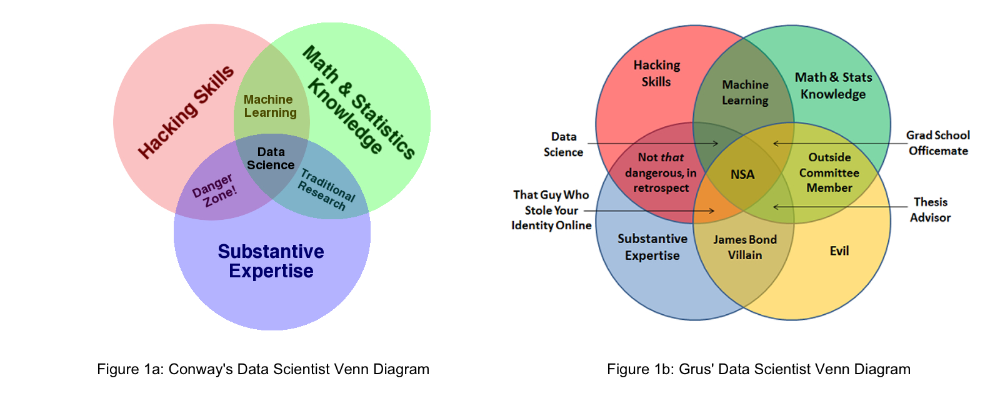

## Data Scientists Face an Existential Crisis

The term data scientist has always been a bit controversial. William Cleveland coined the term in 2001 to advocate the practical use of statistics in other technical fields and  believed that use warranted a new name. Nowadays, professionals sporting a data science title typically hold a Ph.D., possess some detailed domain knowledge, and are either computer science majors who learned statistics or statisticians who learned to program. And while most of us have seen <a href="http://drewconway.com/zia/2013/3/26/the-data-science-venn-diagram" target="_blank" rel="noopener noreferrer">Drew Conway's diagram showing that combination of skills</a>, I think Joel Grus' addition of evil intent allows us to better recognize other interesting combinations (see Figure 1 below).

However, new technologies and a difficult economic environment caused by COVID-19 restrictions have raised new questions about the data scientist role, including:

- **Will their jobs be replaced by automated tools?** A slew of vendors, from DataRobot to Oracle, are offering no-code or low-code analytic tools that promise to replace expensive data scientists with point-and-click web pages. While most buyers understand it's not that simple, those vendor promotions create fear and doubt in executive minds.
- **Will executives resort to intuition?** Most seasoned leaders were comfortable running their organizations by gut feel before data scientists arrived. When confronted with a high-risk economic environment, some may feel that "trust me" is a safer and easier-to-defend strategy than trying to explain complex models.
- **Is their career simply a hot trend that will go away?** Data scientist careers have been on a roll for the last ten years, with <a href="https://www.glassdoor.com/Salaries/data-scientist-salary-SRCH_KO0,14.htm" target="_blank" rel="noopener noreferrer">Glassdoor reporting mean starting salaries exceeding US$100,000</a>. With the economy now on a downtrend, this hot trend may now cool.

## The Reality: Organizations Need Data Scientists More Than Ever

COVID-19 crisis has created much fear, uncertainty, and doubt—commonly abbreviated as FUD—in all of our lives. However, based on what we see from organizations using our packages and products, RStudio believes that this FUD is unwarranted because:

- **Identifying and solving hard problems can't be automated.** Automated tools work well for well-understood problems, such as extraction and visualization of well-structured data. However, to compete in today's environment, organizations must attack the truly hard problems that we don't understand yet. Such problems exist in nearly every realm of human activity, ranging from mundane topics such as natural language understanding for customer service up to the Grand Challenges in Global Health. These problems can't be encapsulated into automated systems until a data scientist first solves them.
- **Data-driven decision-making has proven to create better results.**  While intuitive management may have led to success in the past, data suggests that such an approach may not be competitive in today's markets. A <a href="https://www.mckinsey.com/business-functions/marketing-and-sales/our-insights/five-facts-how-customer-analytics-boosts-corporate-performance" target="_blank" rel="noopener noreferrer">study done by management consulting firm McKinsey & Company</a> reports that data-driven companies were 23 times more likely to outperform competitors in acquiring new users and 19 times more likely to achieve above-average profitability than their non-data-driven competitors. With such case studies being taught in schools today, most leaders recognize that they need data scientists to be competitive.
- **Demand for data science tools has never been higher.** During these difficult times, many organizations are doubling down on open source tooling because they know it is the best path to reproducible, durable analytics. Downloads of open source software and demand for courses that teach using these tools have only increased in the last quarter.

## Serious Data Science Helps Data Scientists Demonstrate Their Value

From RStudio's point of view, the most convincing arguments we see for a bright data science future come from the work being done by the R and Python data science communities. We hear such stories regularly, and we've been collecting examples of this work as part of <a href="https://rstudio.com/about/customer-stories/" target="_blank" rel="noopener noreferrer">our Customer Stories program</a>. We'll add more of those stories in the months to come as we continue to talk to the tens of thousands of data scientists in our community that use our tools every day. It's their work that inspires us to build and distribute the software we create.

These stories have helped us envision what we believe to be the new role of the successful data scientist, Specifically, we believe that the role of a data scientist is to deliver what we've called <a href="https://blog.rstudio.com/2020/05/19/driving-real-lasting-value-with-serious-data-science/" target="_blank" rel="noopener noreferrer">Serious Data Science</a>. Just as was implied in Conway's Venn diagram in Figure 1a, Serious Data Science draws on some of the best practices found in software development, statistics, and domain expertise to deliver results that are:

- **Credible.** It's no longer enough for data scientists to create models that only they understand. Today's best data scientists create data products that are not only statistically correct, but that can be visualized, explained, and withstand scrutiny by a large community of peers. Credibility within a large organization demands communication and collaboration skills beyond computation.
- **Agile.** Serious data science practitioners expect that they'll have to perform many iterations on their analysis to eventually address real-world business problems. Agility demands that they not only develop apps quickly but that they also regularly share those results with stakeholders to create consensus. (see our prior post <a href="https://blog.rstudio.com/2020/04/22/getting-to-the-right-question/" target="_blank" rel="noopener noreferrer">Getting to the Right Question</a> for more details of this challenge).
- **Durable.** Today's data scientists understand that cutting-edge analysis has no value if it can't still deliver value after they have moved on. Durable results require that they use processes that can survive changes in computing environments and infrastructure into the future.

Look for a deeper discussion of the ways data scientists can enhance their role using Serious Data Science during the month of June.

## Learn More about the Data Scientist's Role and Serious Data Science

For a real-world view of how data scientists work to solve hard, complex, and valuable problems, watch Pim Bongaerts from the California Academy of Sciences speak about using data science to help save coral reefs.
  

Eduardo Ariño de la Rubia, Data Science Manager at Facebook, <a href="https://rstudio.com/resources/rstudioconf-2020/value-in-data-science-beyond-models-in-production/" target="_blank" rel="noopener noreferrer">spoke at rstudio::conf 2020 on the role of a data scientist</a>, with an emphasis on how they bring value beyond putting models in production. 

We also recommend our prior blog posts in this series:

- <a href="https://blog.rstudio.com/2020/05/19/driving-real-lasting-value-with-serious-data-science/" target="_blank" rel="noopener noreferrer">**Driving Real, Lasting Value with Serious Data Science**</a> defines the components and need for serious data science.
- <a href="https://blog.rstudio.com/2020/05/12/equipping-wfh-data-science-teams/" target="_blank" rel="noopener noreferrer">**Equipping Your Data Science Team to Work from Home**</a> outlines server infrastructure that can make work-from-home data scientists more effective.
- <a href="https://blog.rstudio.com/2020/05/05/wrangling-unruly-data/" target="_blank" rel="noopener noreferrer">**Wrangling Unruly Data: The Bane of Every Data Science Team**</a> explains why data wrangling is an integral (and unavoidably lengthy) part of data science.
- <a href="https://blog.rstudio.com/2020/04/28/avoid-irrelevancy-and-fire-drills-in-data-science-teams/" target="_blank" rel="noopener noreferrer">**Avoid Irrelevancy and Fire Drills in Data Science Teams**</a> explains how data science teams can avoid being pigeon-holed into roles of ivory tower researchers or always-on-call data firefighters.
- <a href="https://blog.rstudio.com/2020/04/22/getting-to-the-right-question/" target="_blank" rel="noopener noreferrer">**Getting to the Right Question**</a> discusses the communications gap between business people and data science and how to bridge that divide.

