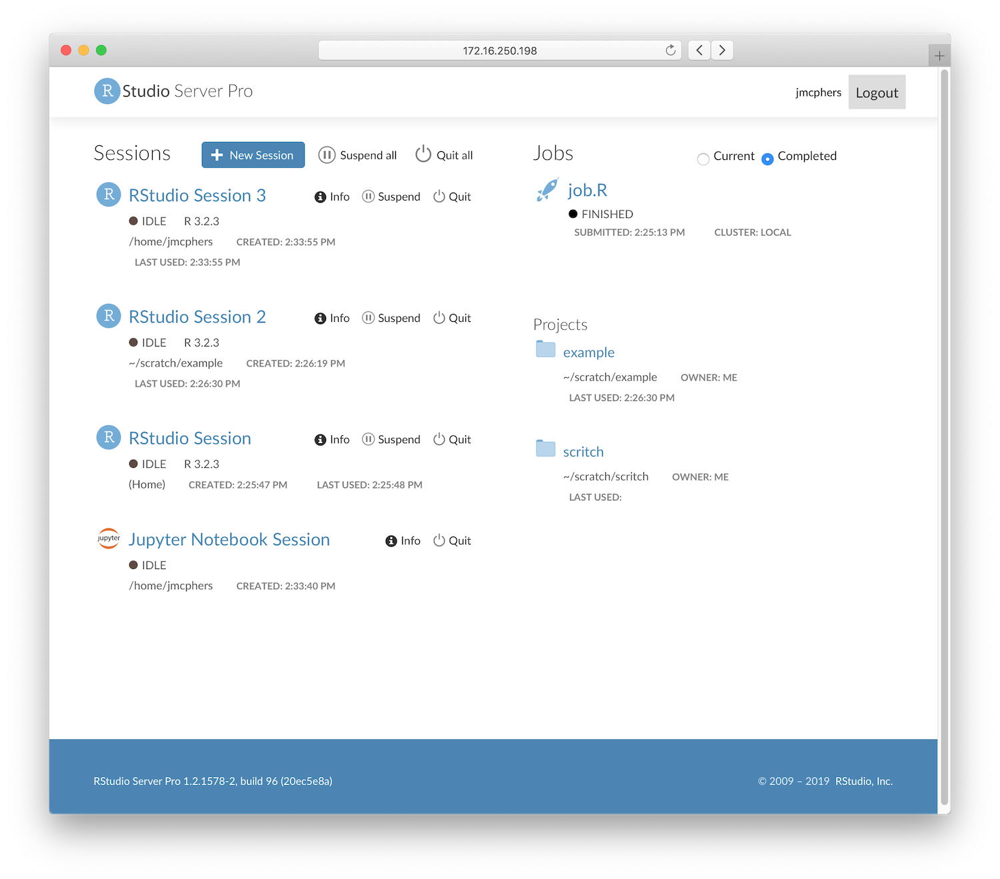

Today, we're announcing an important update to RStudio Server Pro 1.2 that introduces two new capabilities.

## Slurm Jobs

[Slurm](https://slurm.schedmd.com/) is a open-source workload management system, capable of running distributed jobs across a cluster. It's a popular tool for data science teams to run big, resource-intensive jobs on dedicated hardware. In this update, we're introducing a new Slurm back end for RStudio Server Pro's new Job Launcher (itself introduced in the initial release of RStudio Server Pro 1.2).

This means that it's possible to write R code in RStudio and submit it to a Slurm cluster for execution, using RStudio Server's new Jobs feature. Once started, Slurm jobs exist independently from R sessions and can be monitored from any R session, or from the improved user dashboard. Admins can configure many aspects of the experience, including setting different resource limits (e.g. memory and CPU) for different groups of Slurm users.

Finally, Slurm can optionally be used to run interactive R sessions as well if your R environment exists solely on your Slurm cluster.

## Jupyter Sessions

Many data science teams use [Jupyter](https://jupyter.org/) side by side with RStudio as a tool for reproducible research, and earlier this year we announced [Jupyter support for RStudio Connect](/2019/01/17/announcing-rstudio-connect-1-7-0/). In this RStudio Server Pro update, we're making it easier to use these tools together; you can now run Jupyter sessions in addition to RStudio sessions inside RStudio Server Pro, making it possible to both author and publish Jupyter notebooks inside [RStudio Team](https://www.rstudio.com/products/team/).

Just like RStudio sessions, RStudio Server Pro manages all of the authentication, supervision, and lifetime of Jupyter sessions, and gives you a convenient dashboard of running sessions. Starting a new Jupyter session is as easy as choosing Jupyter when you start a new session.

Both Jupyter Notebook and JupyterLab are supported. Note that RStudio does not bundle Jupyter (it must be installed separately) and that Jupyter is only available when RStudio Server Pro is configured with the Job Launcher. 

## Pro User Dashboard

In addition to adding these two new capabilities, we've revamped the RStudio Server Pro user dashboard (homepage), with cleaner visuals and a clearer layout. You'll see a summary of all your active sessions and jobs, quick links to your active projects, and tools for managing ongoing work.

## Open Source and Desktop

Alongside this interim release of RStudio Server Pro 1.2, we're releasing an update to the 1.2 desktop and open source server. While this update primarily focuses on bugfixes and stability improvements, it also introduces a number of small features:

- We have restored compatibility with 32 bit R on Windows, which was temporarily dropped in the initial release of RStudio 1.2. Note that a 64 bit operating system is still required to run RStudio itself.
- We've improved compatibility with the upcoming MacOS Catalina, and added support for RedHat Enterprise Linux 8 as well as Fedora 28.
- A new embedded Pandoc version improves performance and stability for R Notebooks and R Markdown on Windows.

You can download the new RStudio 1.2 update (1.2.5001-3) here:

[Download RStudio](https://www.rstudio.com/products/rstudio/download/)

The [release notes](https://www.rstudio.com/products/rstudio/release-notes/) contain a full list of all of the bugfixes and features in this release, and of course feedback is welcome on the [RStudio IDE Community Forum](https://community.rstudio.com/c/rstudio-ide).

***UPDATE:*** *Nov. 27, 2019*  
*Learn more about [how R and Python work together in RStudio](https://rstudio.com/solutions/python-and-r/).*

