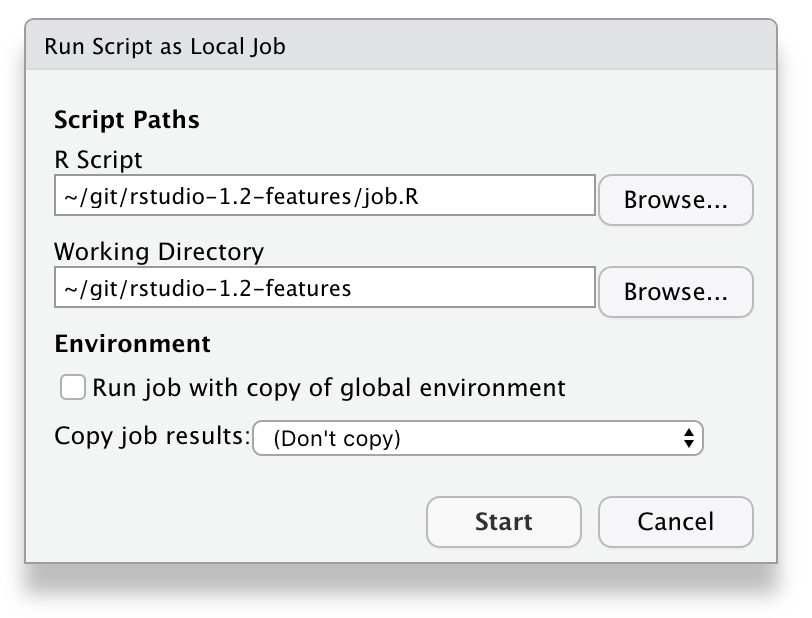
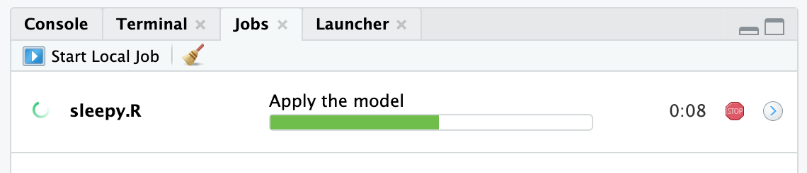
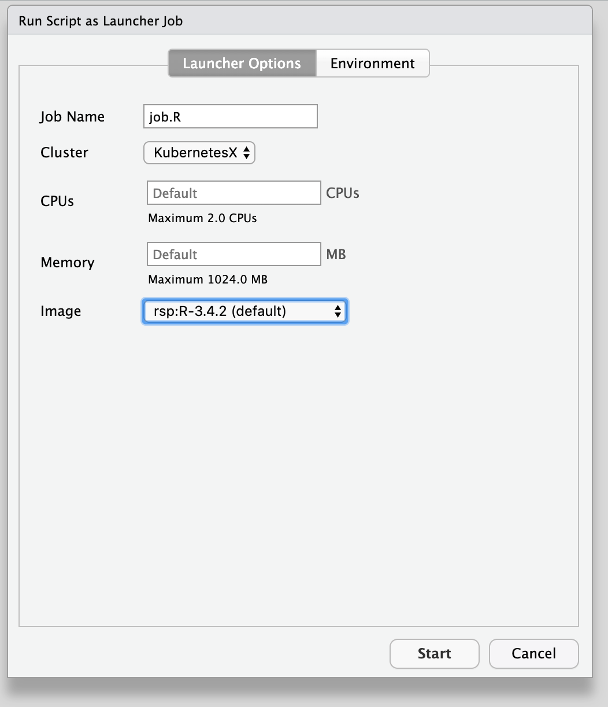
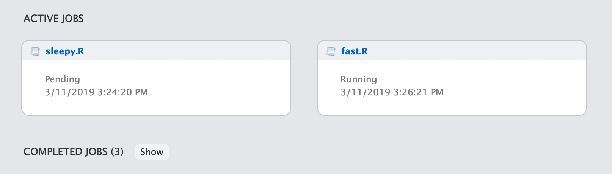

When you run an R script in RStudio today, the R console waits for it to complete, and you can't do much with RStudio until the script is finished running. When your R scripts take a long time to run, it can be difficult to get much done in RStudio while they do, unless you're willing to juggle multiple instances of RStudio.

In RStudio 1.2, we're introducing two new features to keep you productive while your code's working: *local jobs* and *remote jobs*. You can use these to run your scripts in the background while you continue to use the IDE.

## Local jobs

A "local job" is an R script that runs in a separate, dedicated R session. You can run any R script in a separate session by pulling down the Source menu and choosing *Source as Local Job*. 

This will give you some options for running your job.

By default, the job will run in a clean R session, and its temporary workspace will be discarded when the job is complete. This is the fastest and safest configuration, good for reproducible scripts that have no side effects.

However, if you want to feed data from your current R session into the job, or have the job return data to your current R session, change the dialog options as follows:

**Run job with copy of global environment**: If ticked, this option saves your global environment and loads it into the job's R session before it runs. This is useful because it will allow your job to see all the same variables you can see in the IDE. Note that this can be slow if you have large objects in your environment.

**Copy job results**: By default, the temporary workspace in which the job runs is not saved. If you'd like to import data from your job back into your R session, you have a couple of choices:

*Global environment*: This places all the R objects your job creates back in your R session's global environment. Use this option with caution! The objects created by the job will overwrite, without a warning, any objects that have the same name in your environment. 

*Results object*: This places all the R objects your job creates into a new environment named `yourscript_results`.

### Lifetime

Local jobs run as non-interactive child R processes of your main R process, which means that they will be shut down if R is. While your R session is running jobs:

- You will be warned if you attempt to close the window while jobs are still running (on RStudio Desktop)
- Your R session will not be suspended (on RStudio Server)

While local jobs are running, a progress bar will appear in the R console summarizing the progress of all running jobs.

### Detailed progress

The progress bar RStudio shows for your job represents the execution of each top-level statement in your R script. If you want a little more insight into which part of the script is currently running, you can use RStudio's [code sections](https://support.rstudio.com/hc/en-us/articles/200484568-Code-Folding-and-Sections) feature. Add a section marker like this to your R script:

    # Apply the model ----

When your job reaches that line in your script, the name of the section will appear on the progress bar.

You can also emit output using the usual R mechanisms, such as `print`, `message`, and `cat`. This output appears in the Jobs pane when you select your job.

### Scripting

You can script the creation of jobs using the **rstudioapi** package method [jobRunScript](https://www.rdocumentation.org/packages/rstudioapi/versions/0.9.0/topics/jobRunScript); it has options which correspond to each dialog option above. This makes it possible to automate and orchestrate more complicated sets of background tasks. 

Note however that the IDE's background job runner is generally designed for one-off, interactive script runs. If you are writing R code and need to run a subtask asynchronously in a background R session, we recommend using the new [callr package](https://callr.r-lib.org/) instead.

## Remote (Launcher) jobs 

On RStudio Server Pro, you also have the option of running your R script on your company's compute infrastructure, using the new [Job Launcher](https://blog.rstudio.com/2018/11/05/rstudio-rsp-1.2-features/). To do this, select:

When launching a job, you'll have the opportunity to specify how you want to run it, depending of course on the configuration the compute infrastructure exposes to RStudio Server. This can include settings like resource constraints as well as configuration parameters like which Docker image to use.

### Monitoring launcher jobs

Unlike local jobs, launcher jobs are **independent from the R session**. You can safely quit your R session without affecting any launcher jobs you may have started from it. Once you have started a job, you can see its status in the *Launcher* tab, which shows all your jobs (not just those launched from the current session).

You can also monitor the status and progress of your launcher jobs on your RStudio dashboard:

## Showing task progress

RStudio's new Jobs pane can show more than just the progress of background jobs. It can also be scripted from R packages (and R code) to show status, progress, and output for any long-running task.

If you'd like to show progress and/or output from a task using the jobs UI, refer to the [rstudioapi documentation](https://www.rdocumentation.org/packages/rstudioapi/versions/0.9.0) for details; start with `addJob`, which creates a new job in the UI and returns a handle you can use to update the UI as the job progresses.

## Wrap up

We hope RStudio's new Jobs functionality helps streamline your workflow and get the most out of your hardware, especially if you often work with R scripts that take time to execute. Try out the new functionality in the [RStudio 1.2 Preview Release](https://www.rstudio.com/products/rstudio/download/preview/) (stable release coming very soon), and let us know what you think on the [community forum](https://community.rstudio.com/c/rstudio-ide)!

