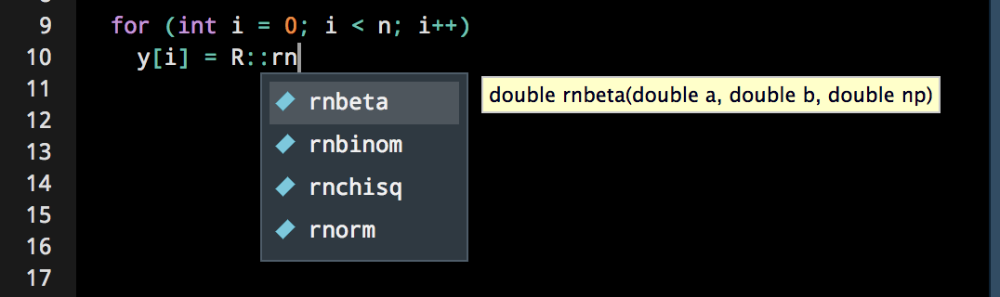
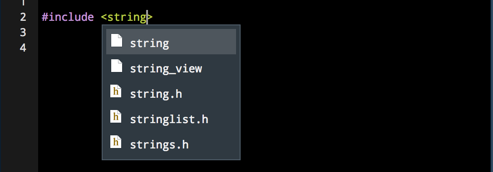
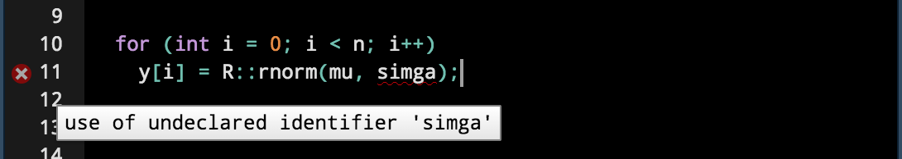

We’ve now discussed the improved support in RStudio v1.2 for <a href="https://blog.rstudio.com/2018/10/02/rstudio-1-2-preview-sql/">SQL</a>, <a href="https://blog.rstudio.com/2018/10/05/r2d3-r-interface-to-d3-visualizations/">D3</a>, and <a href="https://blog.rstudio.com/2018/10/09/rstudio-1-2-preview-reticulated-python/">Python</a>. Today, we’ll talk about IDE support for C/C++ and <a href="http://www.rcpp.org/">Rcpp</a>.

The IDE has had excellent support for C/C++ since RStudio v0.99, including:

<ul>
<li>Tight integration with the <a href="http://www.rcpp.org/">Rcpp</a> package</li>
<li>Code completion</li>
<li>Source diagnostics as you edit</li>
<li>Code snippets</li>
<li>Auto-indentation</li>
<li>Navigable list of compilation errors</li>
<li>Code navigation (go to definition)</li>
</ul>

The major new C/C++ feature in RStudio v1.2 is an upgrade to <a href="https://clang.llvm.org/docs/Tooling.html">libclang</a> (our underlying completion and diagnostics engine). The update improves performance as well as adds compatibility with modern <a href="https://en.wikipedia.org/wiki/C%2B%2B17">C++ 17</a> language features.

<h2>Rcpp</h2>

RStudio integrates closely with <a href="http://www.rcpp.org/">Rcpp</a>, which allows you to easily write performant C++ code and use that code in your R session. For example, the following chunk defines a simple Gibbs sampler:

<pre class="cpp"><code>#include &lt;Rcpp.h&gt;
using namespace Rcpp;

// [[Rcpp::export]]
NumericMatrix gibbs(int N, int thin) {

   NumericMatrix mat(N, 2);
   double x = 0, y = 0;

   for(int i = 0; i &lt; N; i++) {
      for(int j = 0; j &lt; thin; j++) {
         x = R::rgamma(3.0, 1.0 / (y * y + 4));
         y = R::rnorm(1.0 / (x + 1), 1.0 / sqrt(2 * x + 2));
      }
      mat(i, 0) = x;
      mat(i, 1) = y;
   }

   return(mat);
}</code></pre>

Such C++ code can be used both in standalone files (e.g. when used as part of an R package, or when prototyping locally) or within an R Markdown document (within an <code>Rcpp</code> chunk). In each case, we use <code>Rcpp::sourceCpp()</code> to compile and link the code – after this, any exported functions can be called like any other R function in your session.

<pre class="r"><code>gibbs(10, 10)</code></pre>
<pre><code>##         [,1]   [,2]
##  [1,] 0.3488 0.9850
##  [2,] 0.9290 0.8519
##  [3,] 2.0505 0.8685
##  [4,] 0.5318 1.2941
##  [5,] 0.6710 0.8434
##  [6,] 0.1064 0.8212
##  [7,] 0.5903 0.7238
##  [8,] 0.6834 0.7078
##  [9,] 0.5379 0.5887
## [10,] 0.1863 0.9741</code></pre>

Thanks to the abstractions provided by Rcpp, the code implementing <code>gibbs()</code> in C++ is nearly identical to the code you’d write in R, but runs <a href="http://dirk.eddelbuettel.com/blog/2011/07/14/">20 times faster</a>.

<h2>Code Completion</h2>

RStudio provides autocompletion support in C++ source files, and can autocomplete symbols used from R’s C API, Rcpp, and any other libraries you may have imported.

We also now provide autocompletion results for the headers you’d like to use in your program.

<h2>Diagnostics</h2>

RStudio also provides code diagnostics, alerting you to any issues that might exist in your code.

<h2>Updated Libclang</h2>

On Windows and macOS, we’ve updated the bundled version of <code>libclang</code> from 3.5.0 to 5.0.2. With this, RStudio gains improved support for modern C++: all standards from C++ 11, C++ 14 and C++ 17 are now supported.

On Linux, we now default to the version of <code>libclang</code> provided by your package manager, so that RStudio can make use of new and improved C++ tooling as it becomes available on your system. (Currently, Ubuntu 18.04 provides <code>libclang</code> 6.0.0)

<h2>Try it Out</h2>

If you are new to C++ or Rcpp, you might be surprised at how easy it is to get started. There are lots of great resources available, including:

<ul>
<li>
Rcpp website: <a href="http://www.rcpp.org/" class="uri">http://www.rcpp.org/</a>
</li>
<li>
Rcpp book: <a href="http://www.rcpp.org/book/" class="uri">http://www.rcpp.org/book/</a>
</li>
<li>
Tutorial for users new to C++: <a href="http://adv-r.had.co.nz/Rcpp.html" class="uri">http://adv-r.had.co.nz/Rcpp.html</a>
</li>
<li>
Gallery of examples: <a href="http://gallery.rcpp.org/" class="uri">http://gallery.rcpp.org/</a>
</li>
</ul>

You can download the RStudio 1.2 Preview Release at <a href="https://www.rstudio.com/products/rstudio/download/preview/" class="uri">https://www.rstudio.com/products/rstudio/download/preview/</a>. If you have any questions or comments, please get in touch with us on the <a href="https://community.rstudio.com/c/rstudio-ide">community forums</a>.

