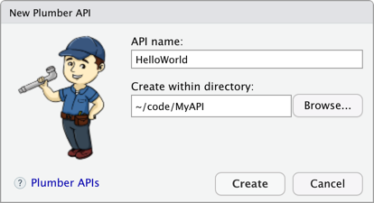
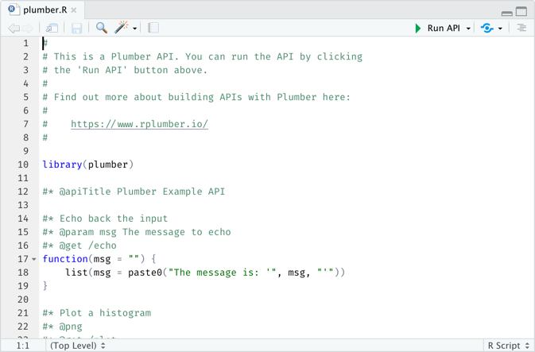
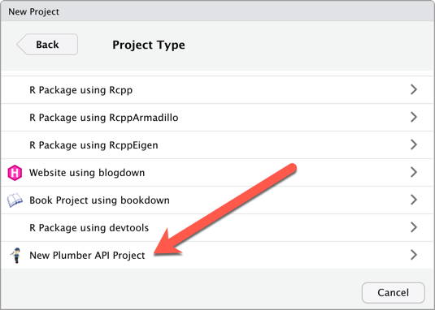
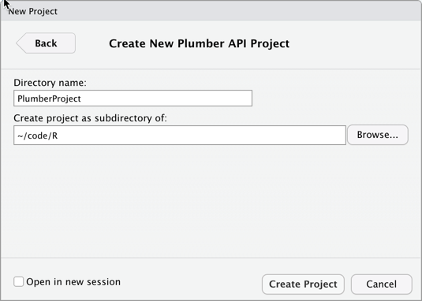
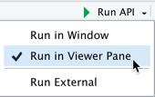
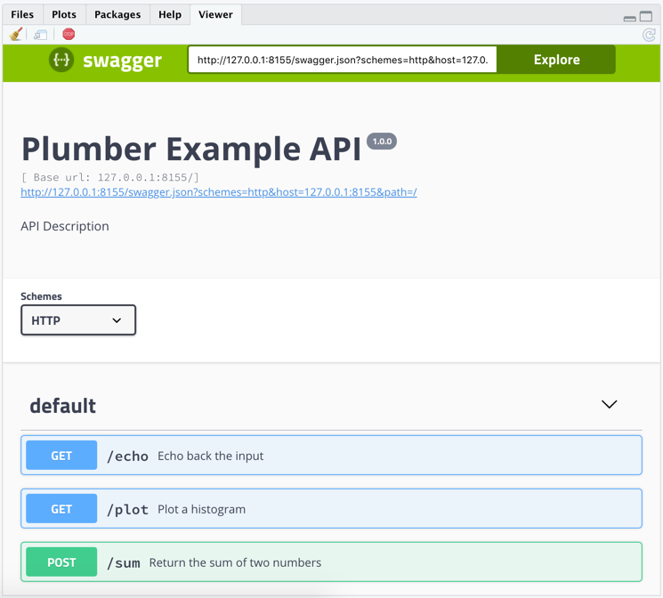
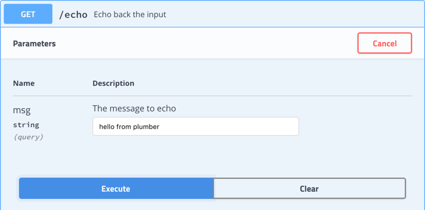
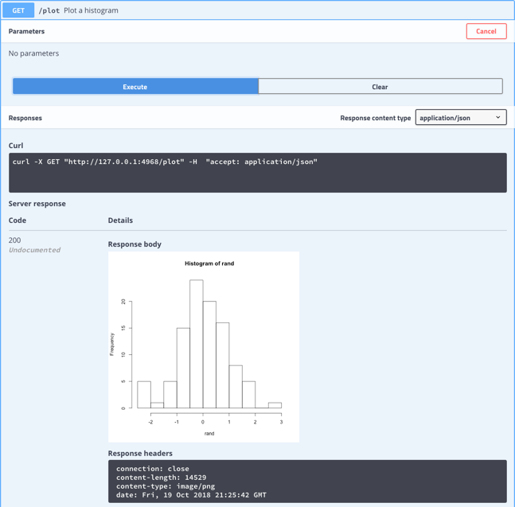
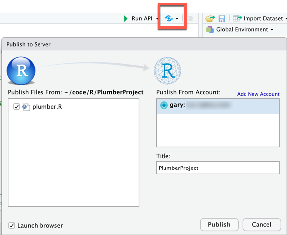

The [RStudio 1.2 Preview Release](https://www.rstudio.com/products/rstudio/download/preview/)
makes it even easier to create RESTful Web APIs in R using the [plumber](https://cran.r-project.org/web/packages/plumber/index.html) package.

> plumber is a package that converts your existing R code to a web API using a handful of special one-line comments.

RStudio 1.2 provides the following plumber-related productivity enhancements:

- push-button local server execution for development and testing
- easy API publishing to [RStudio Connect](https://rstudio.com/products/connect)
- automatic API documentation and interactive execution via Swagger
- create a new Plumber API project or add an API to an existing directory

A full discussion of Web APIs and the plumber package is beyond the scope of this article; for a primer, check out: 
[R Views: REST APIs and Plumber](https://rviews.rstudio.com/2018/07/23/rest-apis-and-plumber/)

Let's take a look at the new features.

## Creating an API

On the RStudio main menu, select **File / New Files / Plumber API**.

RStudio will offer to install plumber and any dependencies, if necessary. Then, give your API a folder name and a location for that folder

An R source file named **plumber.R** containing sample APIs is opened in RStudio. This file shows the essentials of the plumber-specific annotations that identify and document APIs. For the example input above, the location would be `~/code/MyAPI/HelloWorld/plumber.R`.

## Creating a Plumber API project
If a recent version of the plumber package is already installed, you can also create a new RStudio project via **File / New Project / New Directory / New Plumber API Project**. You may have to scroll down the list of project types to see the plumber option:

This will prompt for the same information as the other approach, but the result is a standalone RStudio project containing the **plumber.R** file with the same sample APIs.

## Running a Local API server

Comments beginning with **`#*`** followed by plumber-specific annotations such as **`@get`** identify this as a plumber API file. RStudio adds the **Run API** button in place of the **Run** and **Source** buttons seen on a generic R source file.

> The plumber package also supports a **`#'`** prefix, but these are not recognized by RStudio; be sure to use **`#*`** if you are using RStudio to author APIs, otherwise the **Run API** button will not be shown.

Clicking this button will start a local http server and display the auto-generated API documentation and test page in the location currently selected in the **Run API** button's dropdown.

When an API is running, the **Run API** button changes to **Reload API**; use this after making changes to your API source files to test them out. To stop running the APIs, click the stop icon in the RStudio Console or the pane or window showing the API preview.

## Interacting with the APIs
The plumber package auto-generates a page showing all the APIs defined in your project and displays it in RStudio.

In addition to providing documentation, you can use this page to make test calls to the APIs. Click on the first API, **/echo**, to expand it. Then click **Try it out**. Enter some text in the edit box, and click **Execute** to make a REST call to the API. Scroll down to see both an example of how to construct the REST call, e.g. via **curl**, and the JSON response.

Try the other APIs, as well, and you will see that the output is not limited to `JSON` text; the **/plot** API returns an image, which is shown inline.

## Breakpoints
Authoring APIs directly in RStudio provides a nice workflow. As your APIs become more complex, you may need to debug the code to figure out what's happening.

In an R source file with plumber annotations, inserting **browser()** in the source code at the point you wish to start debugging will trigger a breakpoint. Then RStudio's features can be used to examine and modify the program state, single-step, and so on. For more on RStudio debugging facilities, see [this article](https://support.rstudio.com/hc/en-us/articles/205612627-Debugging-with-RStudio).

## Publishing to Connect

Now that you have some APIs, you need to make them available to others. The easiest way is to publish to an [RStudio Connect](https://rstudio.com/products/connect) server. With Connect, you get push-button publishing, and can leverage features such as load balancing, authentication, and access-control.

> A file named **plumber.R** containing plumber annotations is required to publish an API to RStudio Connect.

Next to the **Run API** button is the publish button. Click that to begin the publishing process.

Upon completion, the browser launches to show your API on Connect. From there, use Connect tools and options to manage the APIs. The Publish button in RStudio may then be used to republish the APIs after you've made changes.

## Publishing elsewhere

The plumber docs provide [details on how to publish to other services](https://www.rplumber.io/docs/hosting.html) such as DigitalOcean, and how to leverage Docker containers for running plumber APIs.

# Resources
- [plumber website](https://www.rplumber.io/) 
- [Webinar: Plumbing APIs with Plumber](https://www.rstudio.com/resources/videos/plumbing-apis-with-plumber/)
- [R Views: REST APIs and Plumber]( https://rviews.rstudio.com/2018/07/23/rest-apis-and-plumber/)
- [RStudio Connect: Publishing APIs](http://docs.rstudio.com/connect/1.5.4/user/publishing.html#publishing-plumber-apis)

