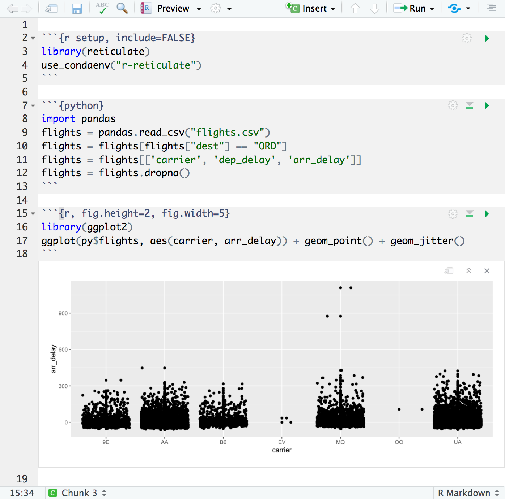
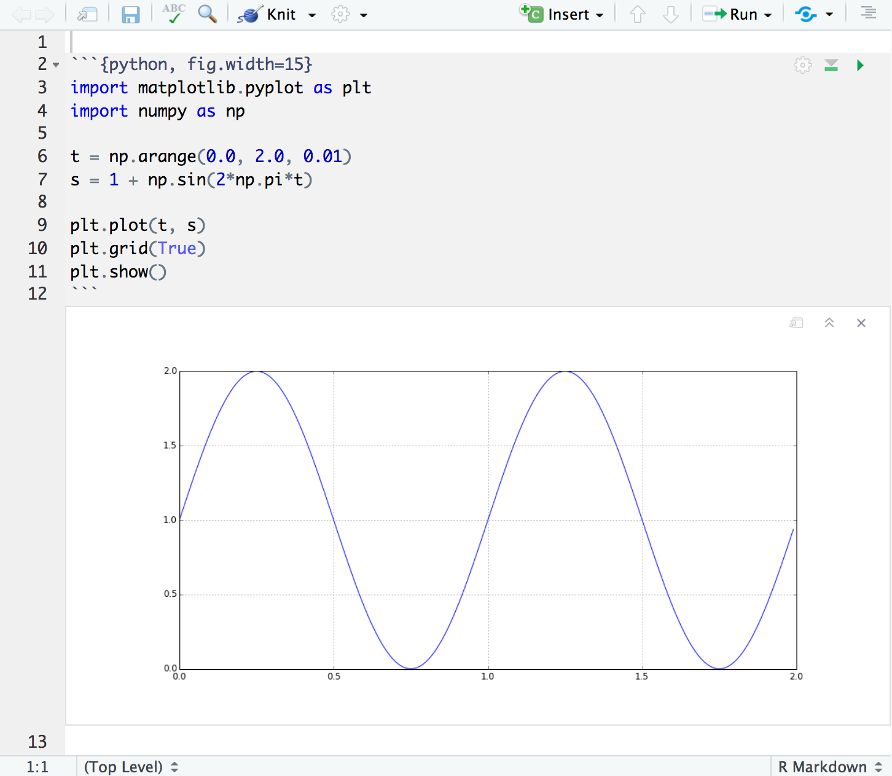
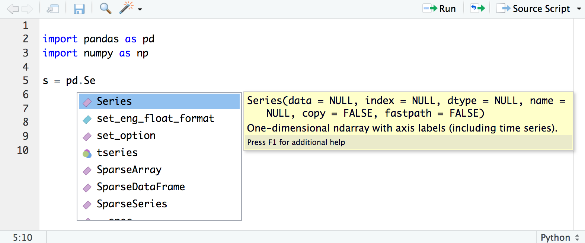
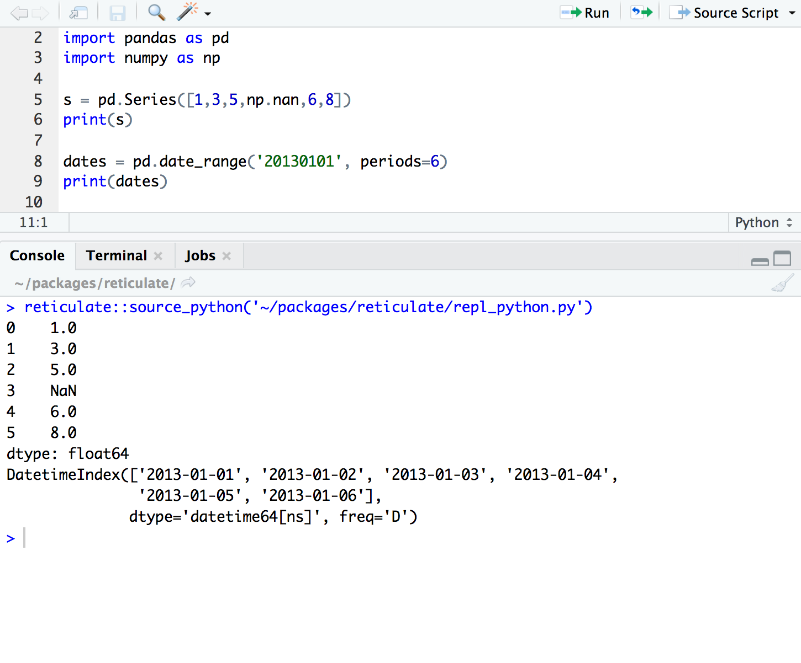

One of the primary focuses of [RStudio v1.2](https://www.rstudio.com/products/rstudio/download/preview/) is improved support for other languages frequently used with R. Last week on the blog we talked about new features for working with [SQL](https://blog.rstudio.com/2018/10/02/rstudio-1-2-preview-sql/) and [D3](https://blog.rstudio.com/2018/10/05/r2d3-r-interface-to-d3-visualizations/). Today we're taking a look at enhancements we've made around the [reticulate](https://rstudio.github.io/reticulate/) package (an R interface to Python).

The [reticulate](https://rstudio.github.io/reticulate/) package makes it possible to embed a Python session within an R process, allowing you to import Python modules and call their functions directly from R. If you are an R developer that uses Python for some of your work or a member of data science team that uses both languages, reticulate can dramatically streamline your workflow. New features in [RStudio v1.2](https://www.rstudio.com/products/rstudio/download/preview/) related to reticulate include:

1) Support for executing reticulated Python chunks within [R Notebooks](https://rmarkdown.rstudio.com/r_notebooks.html).

2) Display of [matplotlib](https://matplotlib.org/) plots within both notebook and console execution modes.

3) Line-by-line execution of Python code using the reticulate `repl_python()` function.

4) Sourcing Python scripts using the reticulate `source_python()` function.

5) Code completion and inline help for Python. 

Note that for data science projects that are Python-only, we still recommend IDEs optimized for that, such as [JupyterLab](https://jupyterlab.readthedocs.io/en/stable/), [PyCharm](https://www.jetbrains.com/pycharm/), [Visual Studio Code](https://code.visualstudio.com/docs/languages/python), [Rodeo](https://rodeo.yhat.com/), and [Spyder](https://www.spyder-ide.org/). However, if you are using reticulated Python within an R project then RStudio provides a set of tools that we think you will find very useful.


## Installation

You can download the RStudio v1.2 preview release here: <https://www.rstudio.com/rstudio/download/preview/>.

All of the features described below require that you have previously installed the reticulate package, which you can do as follows:

```r
install.packages("reticulate")
```

## R Notebooks

R Notebooks have been enhanced to support executing Python chunks using the reticulate Python engine. For example, here we use pandas to do some data manipulation then plot the results with ggplot2:



Python objects all exist in a single persistent session so are usable across chunks just like R objects. R and Python objects are also shared across languages with conversions done automatically when required (e.g. from Pandas data frame to R data frame or NumPy 2D array to R matrix). 

The article on [Calling Python from R](https://rstudio.github.io/reticulate/articles/calling_python.html) describes the various ways to access Python objects from R as well as functions available for more advanced interactions and conversion behavior.

R Notebooks can also display matplotlib plots inline when they are printed from Python chunks:



See the article on the reticulate [R Markdown Python Engine](https://rstudio.github.io/reticulate/articles/r_markdown.html) for full details on using Python chunks within R Markdown documents, including how to call Python code from R chunks and vice-versa.

## Python Scripts

You can execute code from Python scripts line-by-line using the **Run** button (or Ctrl+Enter) in the same way as you execute R code line-by-line. RStudio will automatically switch into reticulate's `repl_python()` mode whenever you execute lines from a Python script:


Type `exit` from the Python REPL to exit back into R (RStudio will also automatically switch back to R mode whenever you execute code from an R script). 

Any Python objects created within the REPL are immediately available to the R session via the `reticulate::py` object (e.g. in the example above you could access the pandas object via `py$s`).

In addition, RStudio now provides code completion and inline help for Python scripts:



## Sourcing Scripts

Click the editor's **Source Script** button (or the Ctrl+Shift+Enter shortcut) within a Python source file to execute a script using reticulate's `source_python()` function:



Objects created within the script will be made available as top-level objects in the R global environment.

## Why reticulate?

Since we released the package, we're often asked what the source of the name "reticulate" is. 

Here's what [Wikipedia](https://en.wikipedia.org/wiki/Reticulated_python) says about the reticulated python:

> The reticulated python is a species of python found in Southeast Asia. They are the world's longest snakes and longest reptiles...The specific name, reticulatus, is Latin meaning "net-like", or reticulated, and is a reference to the complex colour pattern. 

And here's the [Merriam-Webster](https://www.merriam-webster.com/dictionary/reticulate) definition of reticulate:

> 1: resembling a net or network; especially : having veins, fibers, or lines crossing a reticulate leaf. 2: being or involving evolutionary change dependent on genetic recombination involving diverse interbreeding populations.

The package enables you to *reticulate* Python code into R, creating a new breed of project that weaves together the two languages.

The [RStudio v1.2 Preview Release](https://www.rstudio.com/rstudio/download/preview/) provides lots of enhancements for reticulated Python. Check it out and let us know what you think on [RStudio Community](https://community.rstudio.com/c/rstudio-ide) and [GitHub](https://github.com/rstudio/rstudio/issues).  

***UPDATE:*** *Nov. 27, 2019*  
*Learn more about [how R and Python work together in RStudio](https://rstudio.com/solutions/python-and-r/).*

<style type="text/css">
.screenshot, .illustration {
  margin-bottom: 10px;
  margin-top: 10px;
  border: solid 1px #cccccc;
  width: 95%;
}
</style>
   


