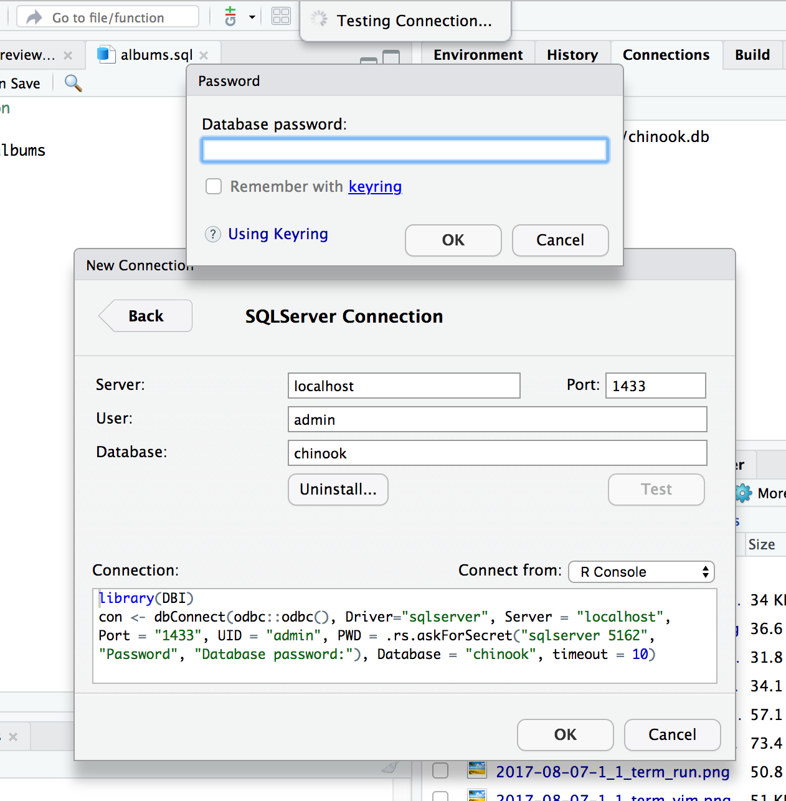
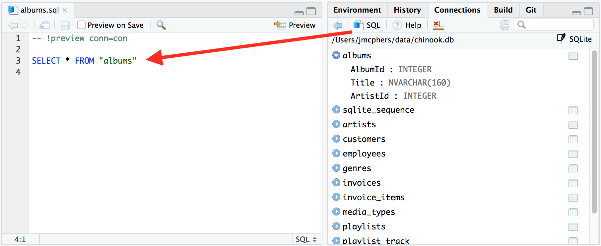
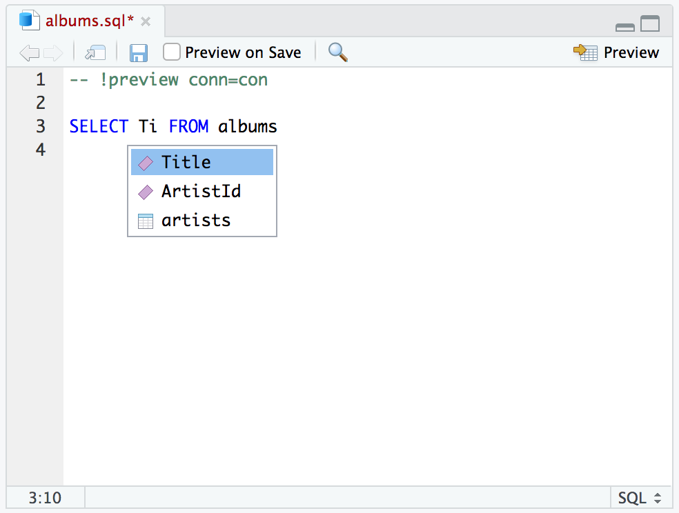
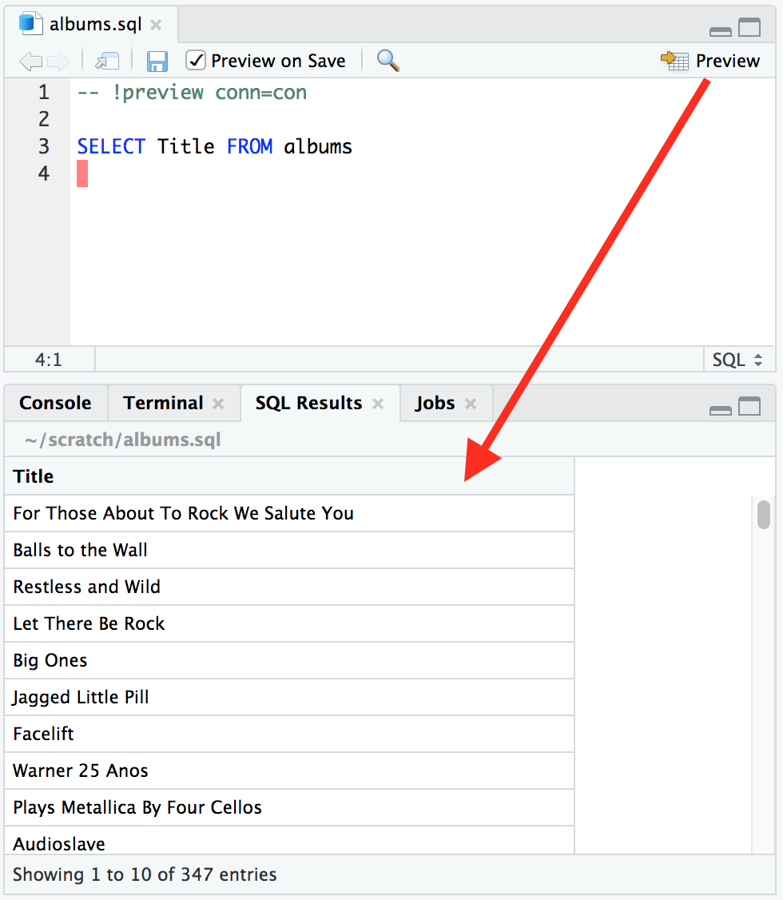
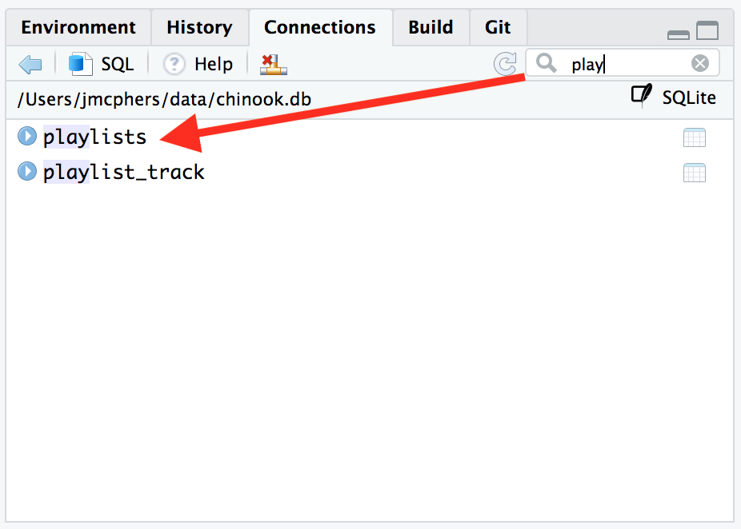

The [RStudio 1.2 Preview Release](https://www.rstudio.com/products/rstudio/download/preview/), available today, dramatically improves support and interoperability with many new programming languages and platforms, including SQL, D3, Python, Stan, and C++. Over the next few weeks on the blog, we're going to be taking a look at improvements for each of these in turn.

Today, we're looking at SQL, and as a motivating example, we're going to connect to a sample *Chinook* database to get a list of album titles. 

## Keyring Integration

We'll start by connecting to the database. When connecting to databases that use usernames and passwords, it's not uncommon to see passwords stored in plain text in the connection string. It's not good practice, but it's understandable; it can be a big hassle to store and retrieve the password securely.

In RStudio 1.2, we've made it much easier to secure your credentials. RStudio now integrates with the [keyring](https://github.com/r-lib/keyring) package. Your password is stored, secure and encrypted, on your system's credential store (such as the MacOS Keychain or Windows Credential Store), so you can share your R code without leaking your password. 

Instead of being prompted to make the password part of the connection string, you'll get a prompt to save it to your keyring.

You can also take advantage of RStudio's API to prompt for secrets in your own packages. See [Using Keyring](https://support.rstudio.com/hc/en-us/articles/360000969634-Using-Keyring) for more information.

## Instant Query

Great, we're connected; it's time to make a query! It's now a lot easier to build and execute SQL queries in RStudio.  First, use the SQL button to generate a new SQL file with the open connection:

## Autocompletion

Now we need to refine our query with the fields we're interested in. RStudio can now autocomplete table names and field names associated with a connection. This works in `.sql` files, R Markdown documents, and R Notebooks. We'll use this to pick up the name of the `Title` field without extra typing or guessing.

## Instant Preview

You'll notice that there's a magic comment RStudio added to the top of the file:

    -- !preview conn=con

This comment tells RStudio to execute the query against the open connection named `con`. We can now click *Preview* or press *Ctrl + Shift + Enter* to run the query. Results appear in a new tab:

You can also preview every time you save, if you're iterating quickly on your query and want to watch the results take shape as you go.

## Filter

Finally, you can now filter the list of displayed tables in the Connections pane by name. This is very useful when your database has a lot of tables!

## Try it out!

If you'd like to try these new features out now, you can download the latest preview release of RStudio from https://www.rstudio.com/products/rstudio/download/preview/. If you do, we'd very much appreciate your feedback on the [RStudio Community Forum](https://community.rstudio.com/c/rstudio-ide)! 

