*Today, we’re continuing our blog series on new features in RStudio 1.2. If you’d like to try these features out for yourself, you can download a [preview release of RStudio 1.2](https://www.rstudio.com/products/rstudio/download/preview/).*

In this blog series thus far, we've focused on the biggest new features in RStudio 1.2. Today, we'll take a look at some of the smaller ones. 

## Detect missing R packages

Many R scripts open with calls to `library()` and `require()` to load the packages they need in order to execute. If you open an R script that references packages that you don't have installed, RStudio will now offer to install all the needed packages in a single click. No more typing `install.packages()` repeatedly until the errors go away!

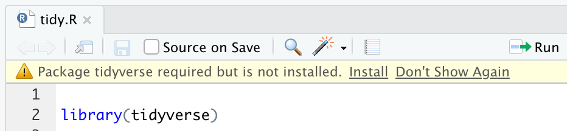

If this isn't helpful in your workflow, disable it in *Options -> Code -> Diagnostics -> [x] Prompt to install missing R packages*.

## Create PowerPoint presentations

R Markdown is a great tool for making presentations -- in addition to being convenient (no more copying and pasting results and graphs!), your whole presentation becomes a reproducible document. Now you can [author PowerPoint presentations in R Markdown](https://bookdown.org/yihui/rmarkdown/powerpoint-presentation.html), thanks to the [new PowerPoint presentation support in Pandoc 2](https://pandoc.org/MANUAL.html#producing-slide-shows-with-pandoc). 

To make a new PowerPoint presentation, go to *File -> New File -> R Markdown -> Presentation -> PowerPoint*. You can also make a PowerPoint presentation out of one of your existing presentations by opening the Knit menu...

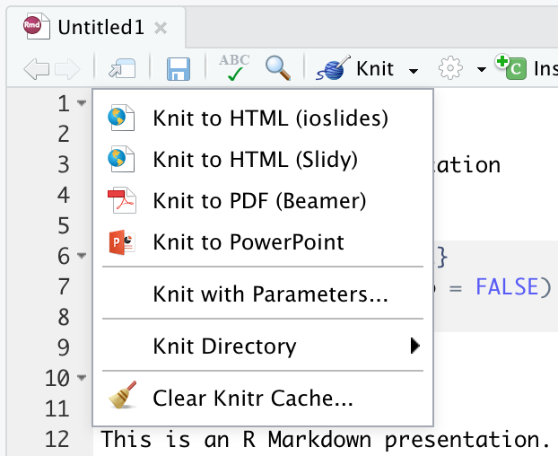

... or just by including `output: powerpoint_presentation` in your presentation's YAML header. 

When working with PowerPoint, using the *Knit* command will cause your slideshow to re-open in PowerPoint right where you left off, so it's easy to iterate on changes. 

Se our [guide to rendering PowerPoint presentations with RStudio](https://support.rstudio.com/hc/en-us/articles/360004672913-Rendering-PowerPoint-Presentations-with-RStudio) for more details, including how to use columns, templates, and speaker notes.

## Filter data with histograms

The data viewer in RStudio 1.1 lets you filter numeric columns by dragging a pair of endpoints to select the range of interest.

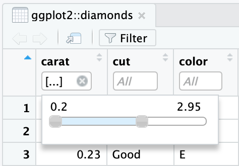

Many of you let us know that you wanted to be able to enter the exact values you wanted to filter by, or type just one value. We've implemented this, and we've also added a histogram to make it easy to see the distribution of the data in the column at a glance.

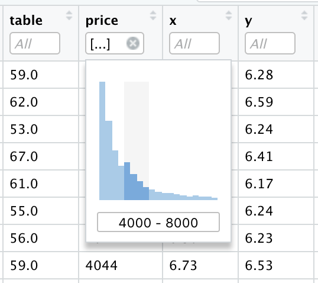

Just brush (drag over) the section of the histogram you're interested in to apply a filter. You can also type your own range into the textbox, or even a single value if that's what you're interested in.

## Show hidden files

RStudio's *Files* pane has traditionally not shown hidden files, with the exception of a handful that it knows to be useful (for example, your `.Rprofile`). Sometimes, however, you really want to be able to see everything -- and now you can. Click *More* on the Files pane, then check *Show Hidden Files*.

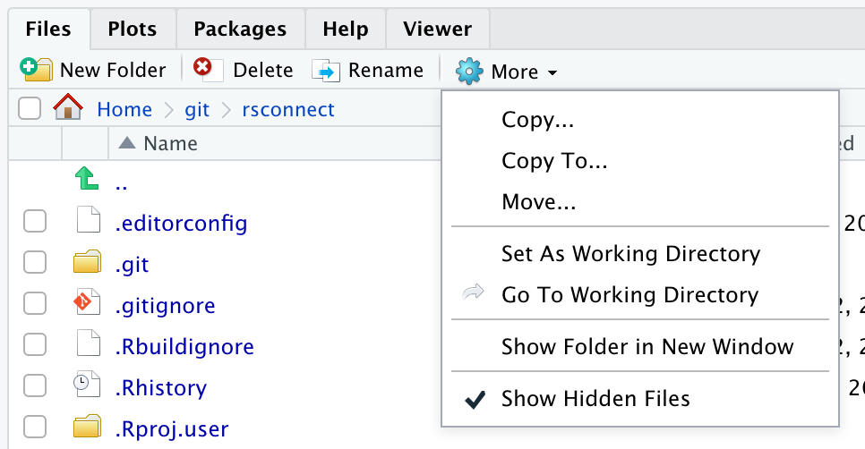

## Click to force promises

You might have noticed that sometimes -- especially while debugging -- values in the Environment pane look disabled and show an expression rather than a value. For example, try typing `data("AirPassengers")`. You'll see this in your Environment pane:

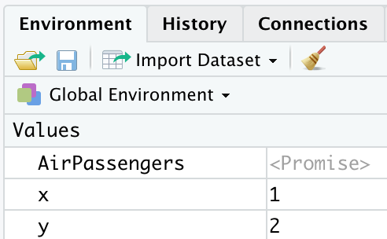

These values are called "promises" and represent function arguments or other unevaluated expressions (read more about promises in the [non-standard evaluation chapter of Advanced R](http://adv-r.had.co.nz/Computing-on-the-language.html)). (Why doesn't RStudio show the value right away? The Environment pane tries hard to avoid causing side effects, so it doesn't evaluate unevaluated expressions.)

If you *do* want to see the value right away, you can now just click it in the Environment pane. RStudio will call `force()` on the promise for you, and you can see its value immediately.

## Explore list columns

Sometimes the data in a data frame isn't simple; if the data frame was derived from nested data (such as JSON) some of its values may themselves be lists (read the [purrr tutorial on list columns](https://jennybc.github.io/purrr-tutorial/ls13_list-columns.html) for more). In RStudio 1.2, the data viewer makes these columns easy to explore by rendering the list values:

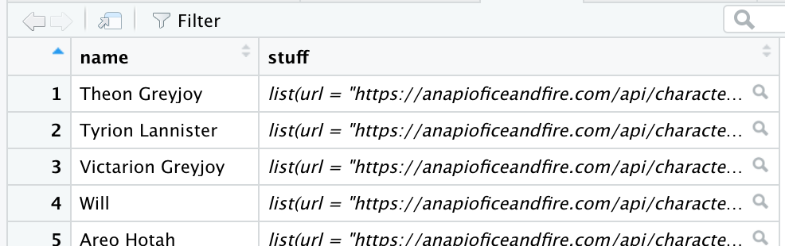

Click on any list value to open it in the Object Explorer.

## Search in Connections

If you connect to a database with a lot of tables, it can be tedious to scroll to the one you want. You can now type part of the table's name in the new Search box instead:

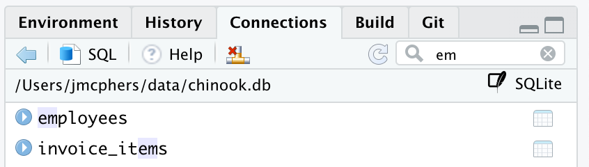

*Note that, for performance reasons, this search field doesn't search all the object names in your database; it only filters the ones that are already visible.*

## Custom knitr engines in R Notebooks

One of the things that makes knitr powerful is its support for custom engines. In RStudio 1.2, we've made R Notebooks more extensible by integrating support for these custom engines. Here's an example of an R Markdown document with a custom engine called `data`, which evaluates a chunk's contents as raw data (in the style of a [bash heredoc](https://www.tldp.org/LDP/abs/html/here-docs.html) for data):

    ---
    title: Hello Text Data
    ---
    
    Register the `data` engine.
    
    ```{{r}}
    knitr::knit_engines$set(data = function(options) {
      assign(options$output.var, 
             read.table(text = options$code), 
             envir = knitr::knit_global()
      )
      NULL
    })
    ```
    
    Use the `data` engine to evaluate this chunk, and save results to `x`.
    
    ```{{data, output.var='x'}}
    26 A L
    30 A L
    18 A M
    20 B H
    ```
    
    Print the resultant value.
    
    ```{{r}}
    x
    ``` 

In RStudio 1.2, you can run all of this code in an R Notebook. The results appear right beneath the chnk:

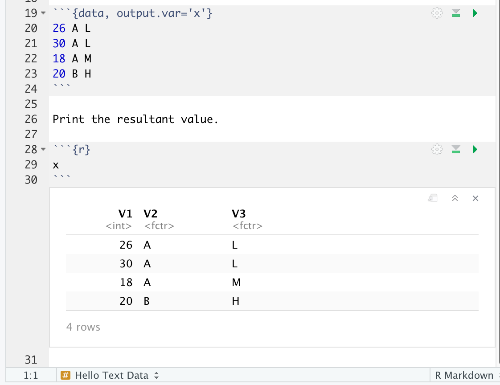

## Improved package and repo management

We've revamped the *Packages* section of Options. Now you can manage primary *and* secondary repositories from inside RStudio.

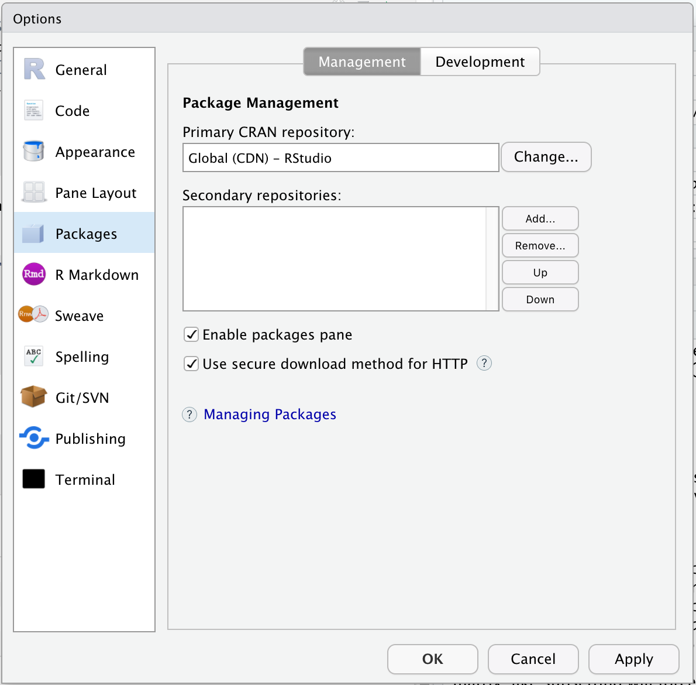

(Hint: this feature works great with the new [RStudio Package Manager](https://www.rstudio.com/products/package-manager/).)

You might also have noticed that we've added web links to every package in the Packages pane. These will take you the package's homepage -- even if it's on Github rather than CRAN.

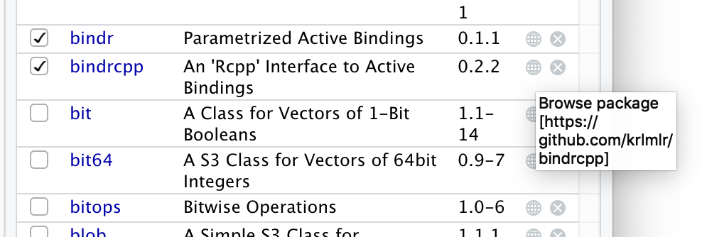

## Magic !source comments

Have you ever wanted to customize the behavior of the *Source* command in RStudio? Maybe you have an R script that needs some pre- or post- actions before `source()`, or you're working with a file for which `source()` doesn't make sense at all -- for instance, when using [alternate R parsers](https://github.com/jimhester/altparsers).

Now you can make RStudio's *Source* command do whatever you like, using a magic comment like the following:

    # !source altparsers::src

This tells RStudio to use `altparsers::src()` instead of `source()` when you invoke the *Source* command. You can customize the behavior even more by using `.file` or `.code` in the magic command to refer to the filename and its contents, respectively.

## Wrapup

We're always looking for little ways to make RStudio a more comfortable environment for your day-to-day work with R, and we hope these small changes add up for you. We very much appreciate your feedback and ideas -- many of the above were suggestions from the community. Download the [RStudio 1.2 Preview](https://www.rstudio.com/products/rstudio/download/preview/) to try these features out, and visit the [community forum](https://community.rstudio.com/c/rstudio-ide) to let us know what you think!


