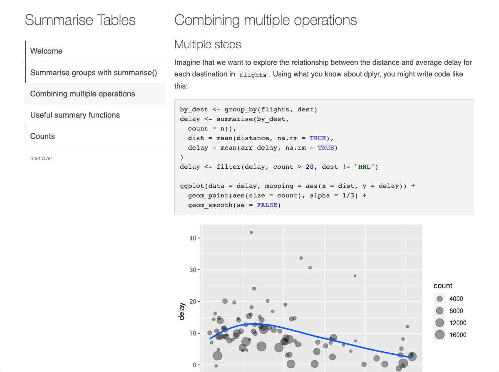

*This blog post is part of a series on new features in RStudio 1.3, currently available as a [preview release](https://www.rstudio.com/products/rstudio/download/preview/).*

We're excited to announce that RStudio v1.3 will gain a newly-minted pane: the **Tutorial** pane, used to host tutorials powered by the [**learnr**](https://rstudio.github.io/learnr/) package.

The **learnr** package makes it easy to turn any [R Markdown](https://rmarkdown.rstudio.com/) document into an interactive tutorial. Here are some example tutorials from the **learnr** package, hosted on [shinyapps.io](https://www.shinyapps.io/):

<div class="rstudio-showcase-row">

<div class="rstudio-showcase-item">
<h3>Summarizing Data</h3>
<a href="https://learnr-examples.shinyapps.io/ex-data-summarise/">

</a>
</div>

<div class="rstudio-showcase-item">
<h3>Filtering Data</h3>
<a href="https://learnr-examples.shinyapps.io/ex-data-filter/">

</a>
</div>

</div>

A *learnr* tutorial can include any of the following:

1. Narrative, figures, illustrations and equations,
2. Code exercises (R code chunks that users can edit and execute),
3. Quiz questions,
4. Videos,
5. Interactive Shiny components.

With the **Tutorial** pane, it is now possible to work through a *learnr* tutorial directly from the comfort of the RStudio IDE. You can use the RStudio IDE to learn, reflect, and tinker as you work through your running tutorial.


## Browsing Tutorials

RStudio will automatically index and display the tutorials provided by the installed R packages in your R library paths:


You can use this list to browse and run tutorials at your convenience.


## Authoring Tutorials

The **learnr** package bundles a selection of tutorials that will introduce users to R, RStudio and the [Tidyverse](https://www.tidyverse.org/), but we hope the R community at large will find this a useful medium for creating and sharing their own R tutorials. If you're interesting in authoring your own *learnr* tutorials, please see the [Publishing](https://rstudio.github.io/learnr/publishing.html) article on the [**learnr** website](https://rstudio.github.io/learnr/).


## Try it Out!

The **Tutorial** pane is available in the latest iteration of the RStudio v1.3 preview release. You can download the latest preview release here:

[RStudio 1.3 Preview](https://www.rstudio.com/products/rstudio/download/preview/)

We'd also like to take this time to highlight a small selection of R packages developed and shared by members of the R community that provide their own *learnr* tutorials:

- [vegawidget](https://vegawidget.github.io/vegawidget/) can be used to render charts specified using the [Vega](https://vega.github.io/vega/) visualization grammar, and includes a *learnr* tutorial exploring how the package can be used;

- [sortable](https://rstudio.github.io/sortable/) includes a tutorial showing how sortable widgets can be included in your own *learnr* tutorials;

- [sur](https://cran.r-project.org/package=sur) includes a tutorial that (quite comprehensively!) explores the manipulation of R data frames, including how missing data can be handled.

If you'd like to try out the tutorials bundled in these packages, you can install the packages from CRAN with:

```
install.packages(c("vegawidget", "sortable", "sur"))
```

and their associated tutorials will automatically become available in the **Tutorial** pane.

---

Questions? Comments? Please share your feedback with us on the RStudio [community forums](https://community.rstudio.com/c/rstudio-ide).

