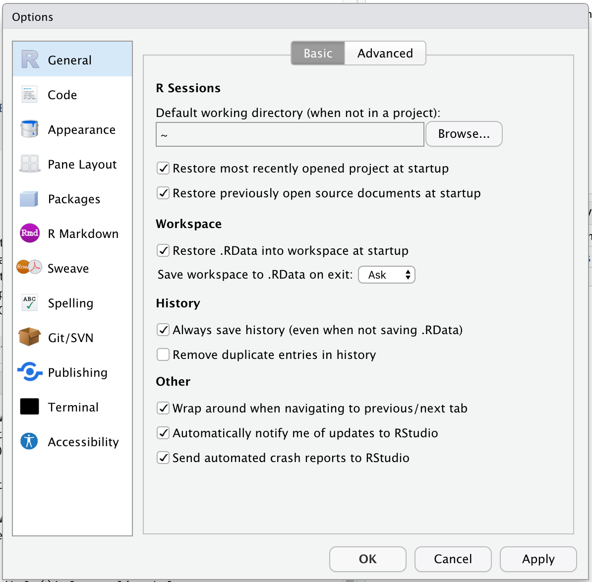

*This blog post is part of a series on new features in RStudio 1.3, currently available as a [preview release](https://www.rstudio.com/products/rstudio/download/preview/).*

Today, we're going to talk about a number of improvements we've made to RStudio 1.3 around configuration and settings. To set the stage, here's how you configure RStudio today:





This point-and-click dialog makes it easy for users to select the settings they want, but has a couple of limitations:

1. For users, there is no way to back up or save settings in e.g., a [dotfiles repo](https://dotfiles.github.io/), nor a way to view or manipulate preferences with external tools.
2. For administrators, there is no way to establish defaults for users.

In RStudio 1.3, we've overhauled the settings and configuration system to address both of these issues, and along the way we've made several portions of the IDE more amenable to configuration.

## User Preferences

All the preferences in the Global Options dialog (and a number of other preferences that aren't) are now saved in a simple, plain-text JSON file named `rstudio-prefs.json`. Here's an example:

```json
{
    "posix_terminal_shell": "bash",
    "editor_theme": "Night Owl",
    "wrap_tab_navigation": false
}
```

The example above instructs RStudio to use the `bash` shell for the **Terminal** tab, to apply the *Night Owl* theme to the IDE, and to avoid wrapping around when navigating through tabs. All other settings will have their default values.

By default, this file lives in `AppData/Roaming/RStudio` on Windows, and `~/.config/rstudio` on other systems. While RStudio writes this file whenever you change a setting, you can also edit it yourself to change settings. You can back it up, or put it in a version control system. You're in control!

If you're editing this file by hand, you'll probably want a reference. A full list of RStudio's settings, along with their data types, allowable values, etc., can be found in the [Session User Settings](https://docs.rstudio.com/ide/server-pro/1.3.820-1/session-user-settings.html) section of the RStudio Server Professional Administration Guide. 

## Administration and the XDG Standard

If you're an administrator of an RStudio Server, you can establish defaults for any setting by using a global set of user preferences, placed here:

    /etc/rstudio/rstudio-prefs.json

RStudio's new configuration system complies with the [XDG Base Directory Specification](https://specifications.freedesktop.org/basedir-spec/basedir-spec-latest.html). This means that in addition to using XDG defaults for most directories, it is also possible to customize the location using environment variables.  For example, you can set `XDG_CONFIG_HOME` for your users so that their configuration is loaded from somewhere other than `~/.config`, or `XDG_CONFIG_DIRS` to establish a different folder for server-wide configuration.

## The Configuration Folder

The user preferences aren't the only thing that lives in the configuration folder. In RStudio 1.3, we've reorganized a number of user-level files and settings so that they're all in the same place. This makes your RStudio configuration much more portable; simply unpacking a backup of this folder will make it possible to apply all of your RStudio customizations at once. 
 
Here's what's inside:

| File/Folder          | Content                                          |
|----------------------|--------------------------------------------------|
| `rstudio-prefs.json` | User preferences                                 |
| `dictionaries/`      | Custom spelling dictionaries                     |
| `keybindings/`       | Editor and workbench keybindings, in JSON format |
| `snippets/`          | Console and source snippets (`*.snippet)`        |
| `templates/`         | Default content for new files                    |
| `themes/`            | Custom color themes (`*.rstheme`)                |

Every one of these elements can now be configured both globally (in e.g., the `/etc/rstudio` configuration folder) and per-user (in e.g., the `~/.config/rstudio` folder).

So, for example, an administrator could pre-install custom themes for their users by placing them in `/etc/rstudio/themes/`, and then instruct RStudio to default to one of the custom themes by changing the `editor_theme` setting in `/etc/rstudio/rstudio-prefs.json`. Or, they could establish a system-wide default template for `.R` files in `/etc/rstudio/templates/default.R`.

More information is available in the Administration Guide here:

[Customizing Session Settings](https://docs.rstudio.com/ide/server-pro/1.3.820-1/r-sessions.html#customizing-session-settings)

## Try it Out!

If you'd like to give the new configuration system a spin, we'd very much welcome your feedback on our [community forum](https://community.rstudio.com/c/rstudio-ide). You can download the RStudio 1.3 preview here:

[RStudio 1.3 Preview](https://www.rstudio.com/products/rstudio/download/preview/)


