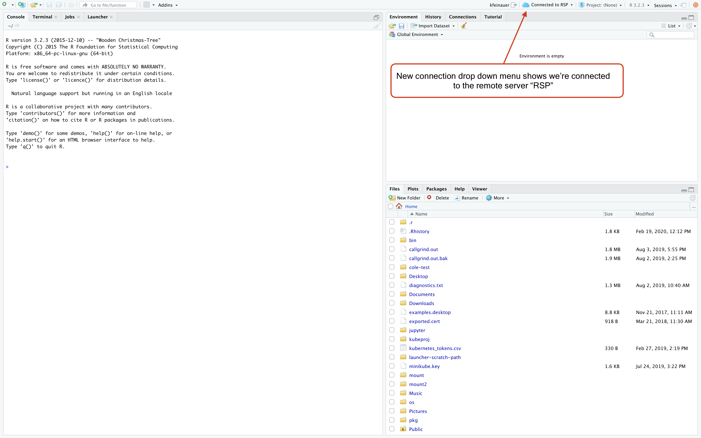
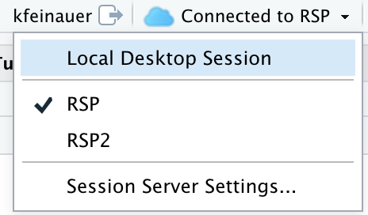
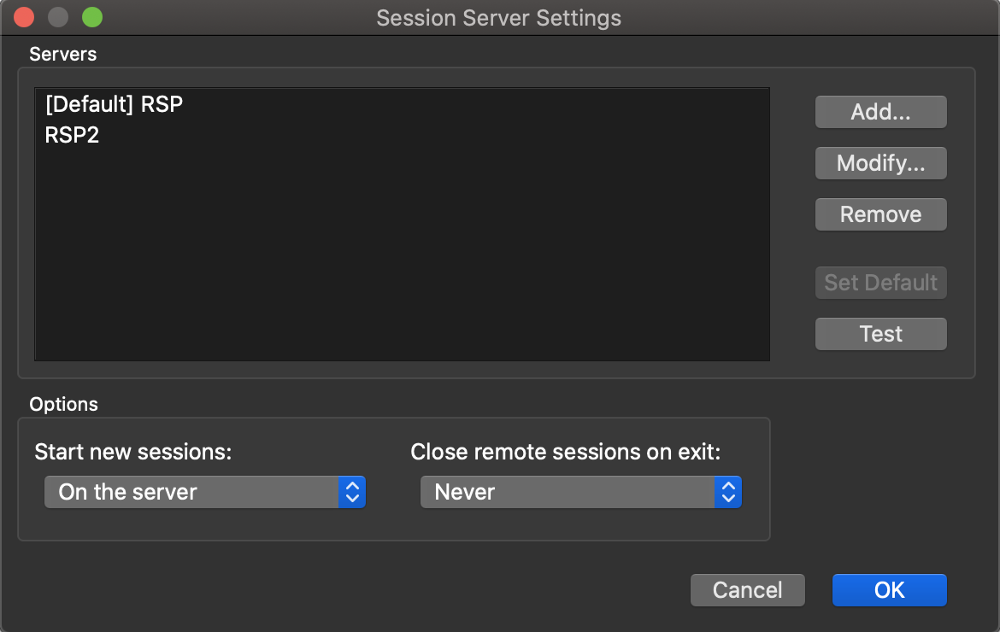
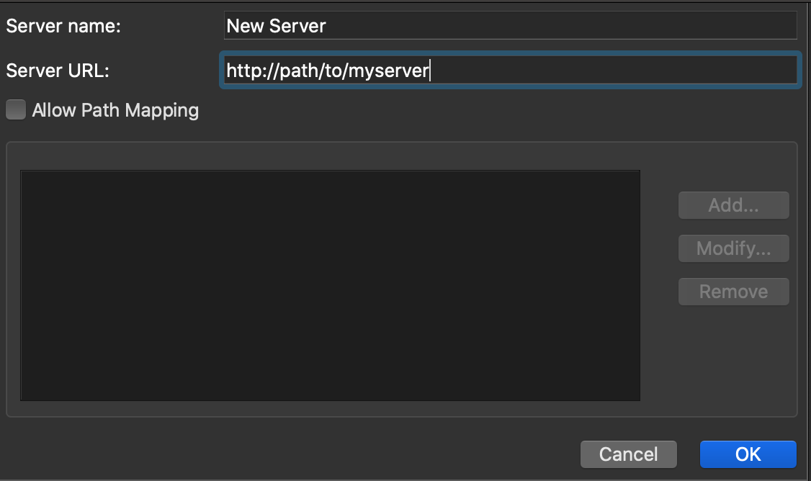

*This blog post is part of a series on new features in RStudio 1.3, currently available as a [preview release](https://www.rstudio.com/products/rstudio/download/preview/).*

Today, we're going to talk about an exciting new feature of RStudio Desktop Pro - the ability to connect to remote sessions running on an existing RStudio Server Pro instance. This new Desktop Pro feature allows you to launch sessions remotely from your desktop to do your work on a more powerful computing system than your local machine, while providing the enhanced look-and-feel of the desktop application. Alternatively, you can continue to run your desktop sessions on your local machine and run resource intensive background jobs on a remote server, allowing your local resources to be used for more focused tasks.

When connected to a remote server, the IDE looks almost exactly the same as it normally does, but it will indicate which server you are connected to, as well as provide a means for managing sessions on that server.

## Prerequisites

In order to use RStudio Desktop Pro to launch remote sessions, you will first need to ensure you have an existing installation of RStudio Server Pro. You will also want to ensure that the version number of RStudio Server Pro matches that of the RStudio Desktop Pro version in use.

## Adding Remote Session Servers

Once RStudio Server Pro is running, you can add it Desktop Pro as a new *Session Server* by clicking on the *Session Server Settings Dialog* from within Desktop Pro, which you can find underneath the connection status dropdown in the upper right corner of the IDE.

Clicking on *Session Server Settings* will present you with a dialog where you can add and remove session servers, each one indicating a remote RStudio Server Pro instance that you can connect to.

Upon clicking on the `Add` button, you will be shown the following dialog to add a session server. Simply give the server the desired name and add the base URL of your RStudio Server Pro instance.

For most installations, these settings are sufficient. However, some installations may want to add path mappings. 

### Path Mappings

Path mappings allow you to map local system paths to remote server paths that will automatically be replaced when running Launcher Jobs on that particular session server. For example, if you map a shared drive on your local Windows machine at `H:` and this maps to `/shared/code` on your remote session server, you can add a path mapping from `H:->/shared/code` to ensure Launcher job paths including local paths are properly rewritten to remote paths.

## Switching Between Servers

You can switch between remote session servers via the aforementioned *Connection Status Dropdown* - simply select which server to connect to, and the desktop will reload, connected to the selected server.

By default, once you have session servers defined, you will be prompted to select where to start your session every time you start Desktop Pro - locally, or on one of the specified servers. You can change this behavior by changing the `Start new sessions` setting on the *Session Server Settings* dialog.

Additionally, if you hold down the *Alt* key while launching Desktop Pro, you will be prompted to select where to start your session, regardless of any other settings.

## Try it Out!

If you'd like to try out the new Desktop Pro, you can download the [RStudio 1.3 Preview](https://www.rstudio.com/products/rstudio/download/preview/). For more detailed documentation on RStudio Pro features, see the [admin guide](http://docs.rstudio.com/ide/desktop-pro/1.3.881-1).

