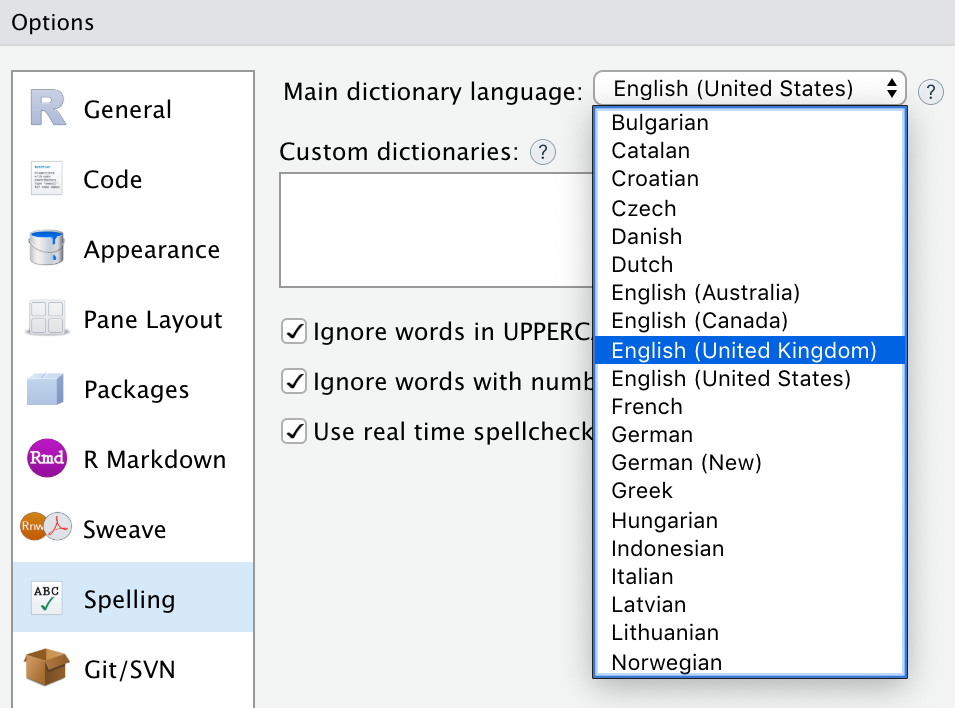

As part of the upcoming 1.3 release of the RStudio IDE we are excited to show you a preview of the real time spellchecking feature that we've added.

Prior to RStudio 1.3, spellchecking was an active process requiring the user to step word by word in a dialog. By integrating spellchecking directly into the editor we can check words as you're typing them and are able to give suggestions on demand.

As with the prior spellcheck implementation (that is still invoked with the toolbar button) the new spellchecking is fully Hunspell compatible and any previous custom dictionaries can be used.

## Interface and usage

Using the new real time spellchecking is simple with a standard and familiar interface. A short period of time after typing in a saved file of a supported format (R Script, R Markdown, C++, and more) a yellow underline will appear under words that don't pass the spellcheck of the loaded dictionary. Right click the word for suggestions, to ignore it, or to add it to your own local dictionary to be remembered for the future. The application will only check comments in code files and raw text in markdown files.

In consideration of the domain specific language of RStudio users we have collected, and are constantly adding to, a [whitelisted set of words](https://github.com/rstudio/rstudio/blob/master/src/gwt/src/org/rstudio/studio/client/common/spelling/domain_specific_words.csv) to reduce the noise of the spellcheck on initial usage. Sadly, _hypergeometric_ and _reprex_ are not yet listed in universal language dictionaries.

## Customization

The new spellcheck feature might not be for you, and that's ok. If you don't want your tools constantly questioning your spelling this feature is easy to turn off. Navigate to **Tools -> Global Options -> Spelling** and disable the "Use real time spellchecking" check box. 

If you are typing in another language or really insist that this section should be spelled _customisation_ you can switch to a different dictionary with the same dropdown interface as RStudio 1.2. Both the manual and real time spellcheck options will load the same dictionary. If none of the dictionaries shipped with RStudio fit your needs you can add any Hunspell compatible dictionary by clicking the _Add..._ button next to the list of custom dictionaries.

### Just the tip of the iceberg

This is just a small sample of what's to come in RStudio 1.3 and we're excited to show you more of what we've been working hard on since 1.2 in the coming weeks. Stay tuned for more!

You can download the new RStudio 1.3 Preview release to try it out yourself:

[Download RStudio 1.3 Preview](https://www.rstudio.com/products/rstudio/download/preview/)

Feedback is welcome on the [RStudio IDE Community Forum](https://community.rstudio.com/c/rstudio-ide).

