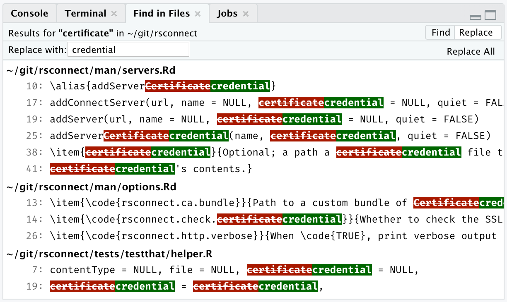
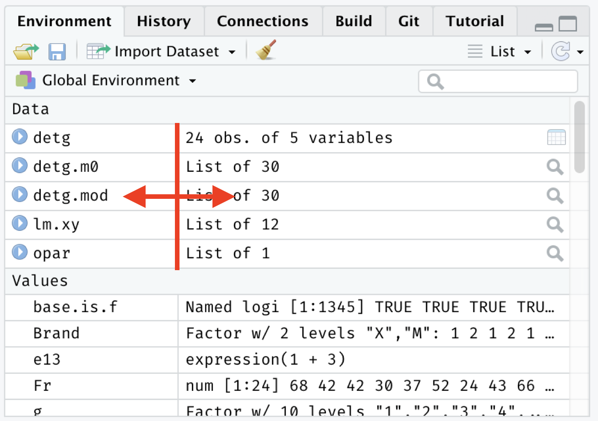
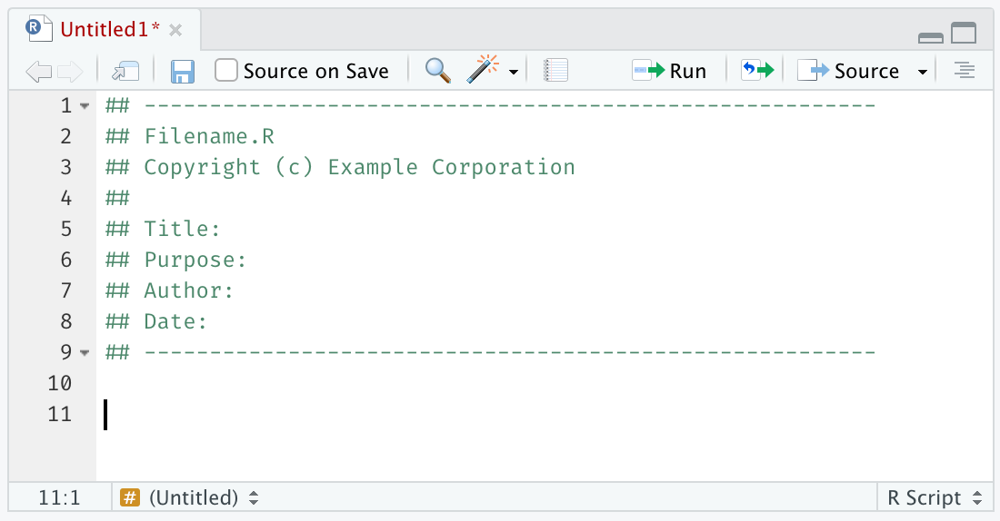
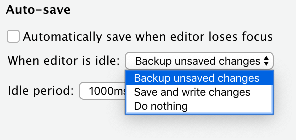
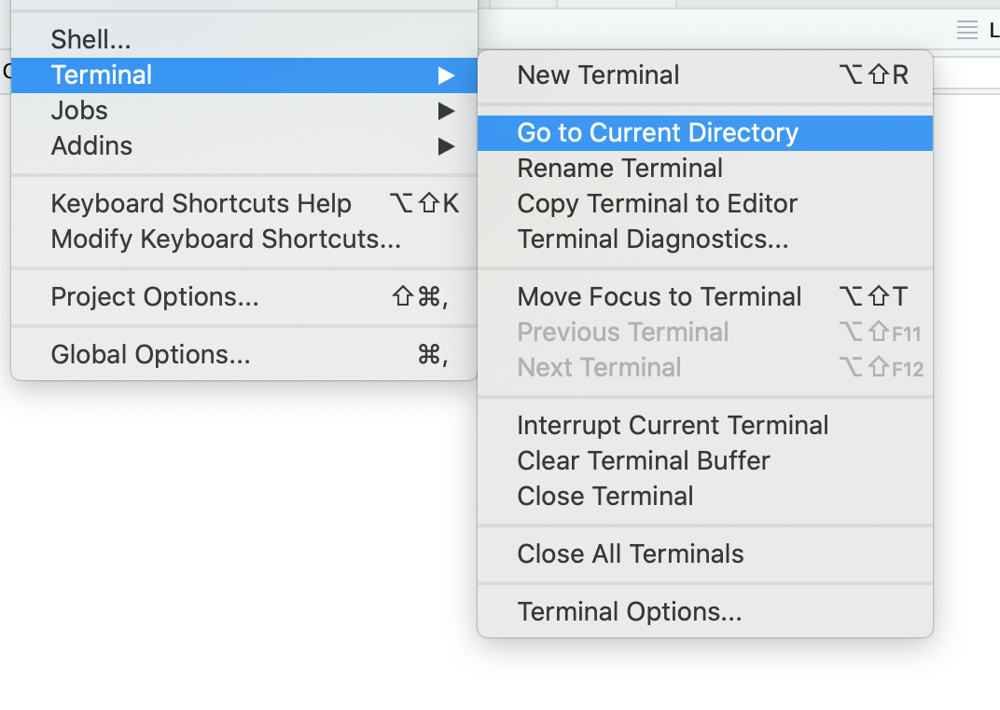

*This blog post is part of a series on new features in RStudio 1.3, currently available as a [preview release](https://www.rstudio.com/products/rstudio/download/preview/).*

In every RStudio release, we introduce dozens of small quality-of-life improvements alongside bigger headline features. This blog post concludes our series on the upcoming RStudio 1.3 release with a look at some of these little conveniences.

### Global Replace

RStudio has long had a *Find in Files* feature, which makes it possible to easily locate text in your project. If you're not familiar with this feature, try it out: press *Ctrl+Shift+F* (MacOS: *Cmd+Shift+F*), or choose *Find in Files...* from the *Edit* menu. 

In RStudio 1.3, it's now possible to **replace** the text you found:

After you've done a search, switch to *Replace* view via the toggle, enter your new text, and click *Replace All*. It works with regular expressions, too.

### Resizable Environment Columns

This really is a little thing, but it drove many of you nuts: the size of the columns in the Environment pane was fixed, so if your variables (or values) were long, it was awkward to try to see the whole thing. Now you can!

### New File Templates

Do you usually start new files with the same information? For example, do you usually include a header comment on your R scripts with metadata you know you'll find useful later? You can now have RStudio inject this header for you when you create a new file.

Create a template in `~/.config/rstudio/templates/default.R` (macOS/Linux) or `AppData/Roaming/RStudio/templates/default.R` (Windows) to try it out. It works with other file types, too; for example creating a file named `default.cpp` will set the content for new C++ files.

If you're an RStudio Server administrator, you can set templates for all the users on your server, which can be helpful if your organization has standards around file headers and structure. Read more in [Default Document Templates](https://docs.rstudio.com/ide/server-pro/1.3.898-1/r-sessions.html#default-document-templates) from the admin guide.

### Autosave

RStudio automatically keeps its own backup copy of files you're editing so that you don't lose changes. We've improved this in two ways in the 1.3 release:

1. When enabled, RStudio will automatically save open files as they are changed. This is useful if you don't want to have to remember to manually save and just want your changes saved at all times.
2. You can also disable the auto-backup, or change the interval at which it is performed. This is useful if you are storing your projects on a cloud-synchronized folder, which sometimes struggle to keep up with RStudio's frequent writes to the backup copy.

### Terminal Ergonomics

You can now set the initial working directory of new terminals, so it's less likely you'll have to begin each terminal session with the same old `cd` command.

We've also added a bunch of commands designed to reduce the number of times you need to manually paste cumbersome file and directory paths between the IDE and the terminal.

Specifically, we've added:

* A command to open a new terminal at location of current editor file
* A command to insert the full path and filename of current editor file into the terminal
* A command in the File pane to open a new terminal at File pane's current location
* A command to change the terminal to current RStudio working directory 

### Shiny Background Jobs

RStudio can now run Shiny applications as background jobs in the Jobs tab we added in RStudio 1.2. 

This has a couple of advantages:

* You can continue to use the R console while your Shiny application runs!
* Your Shiny application runs in a fresh R session. This makes it easier to keep your application's code reproducible, since any implicit dependencies will keep the application from running successfully in the background. 

Note, however, that you can't use RStudio's debugging interface with a Shiny application running in the background, since it is part of a separate R session.

### Wrapup

If you'd like to try out any of these features, we welcome you to download the [RStudio Preview](https://www.rstudio.com/products/rstudio/download/preview/) and give them a spin! 

We hope these little changes make a big difference in your day-to-day work, and we'd love to hear your feedback on the [community forum](https://community.rstudio.com/c/rstudio-ide). 

Finally, we're grateful to you, the R community, for the overwhelming number of ideas, support, and bug reports that have helped us build this release.  We couldn't have done it without you. Watch this space for an announcement of the stable release soon!

