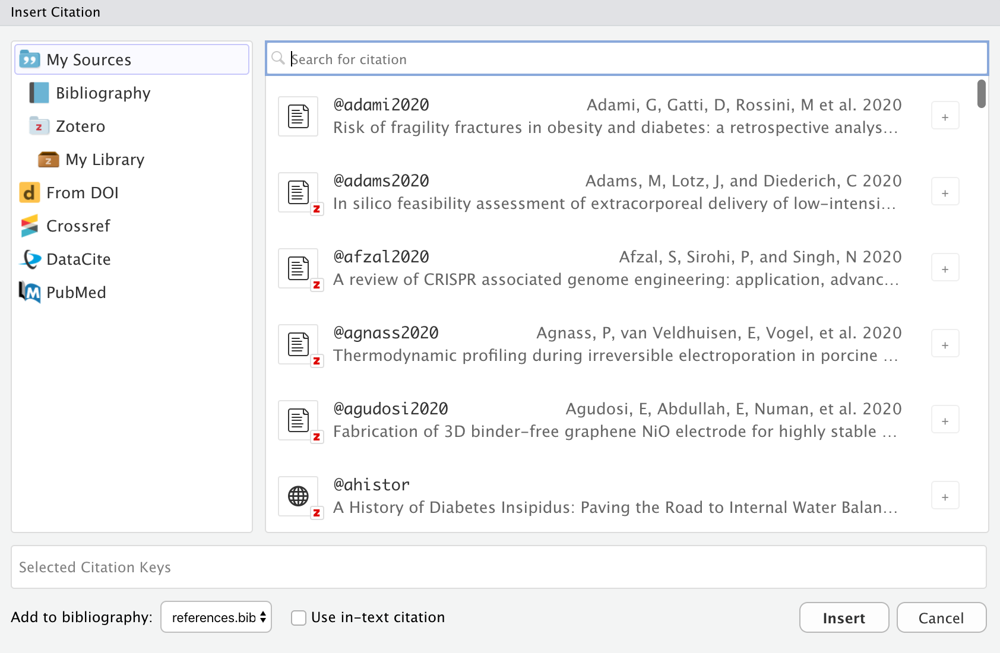
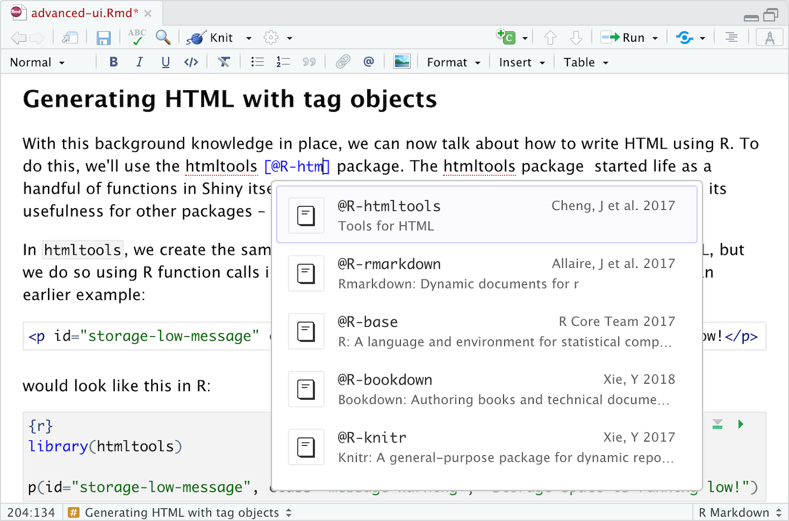
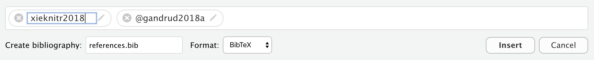
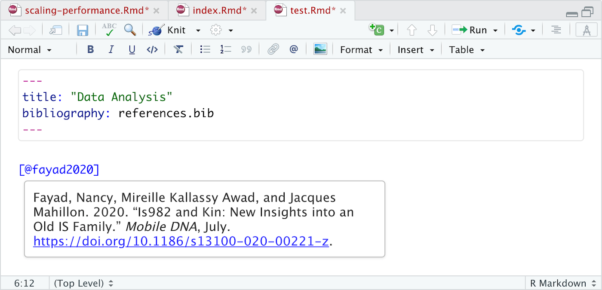
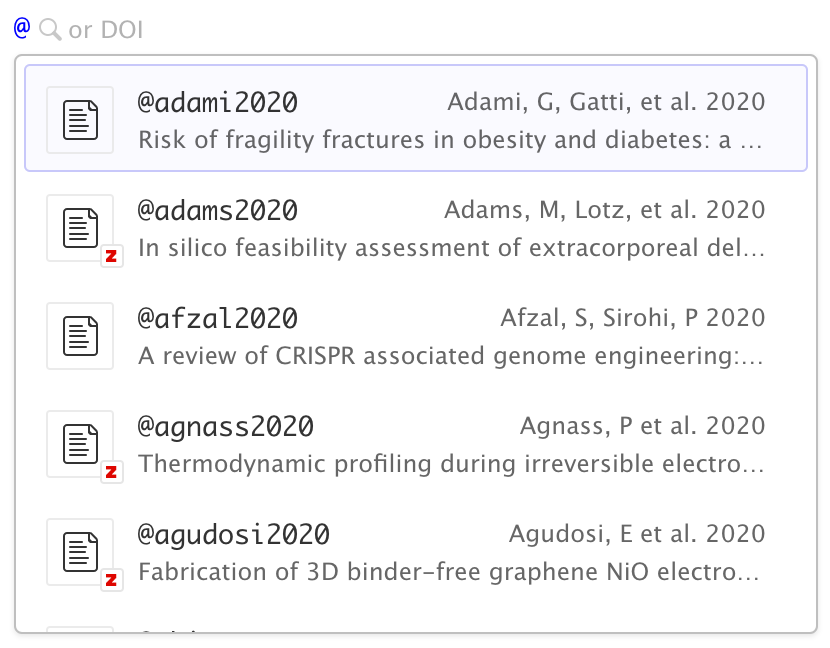
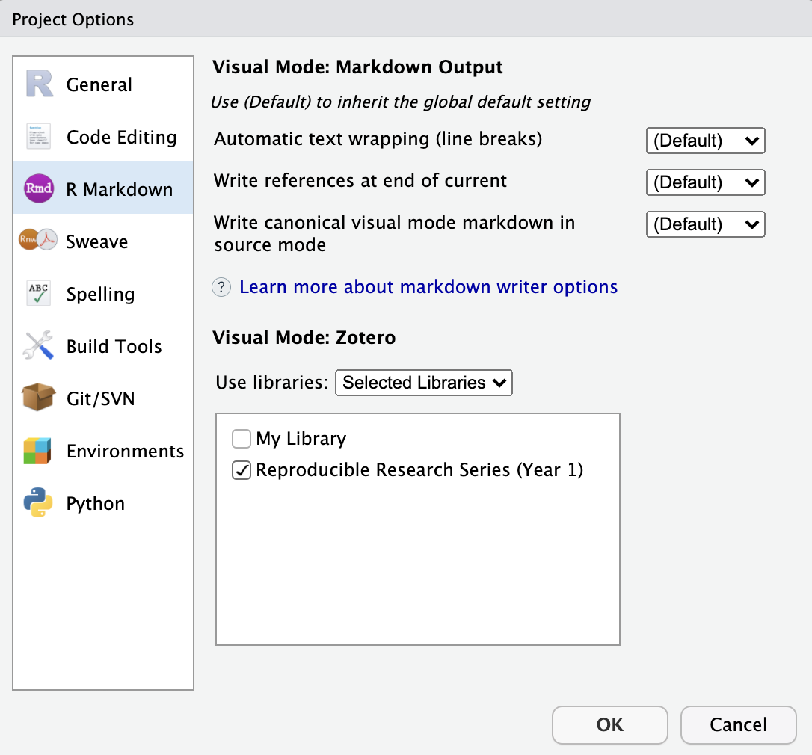
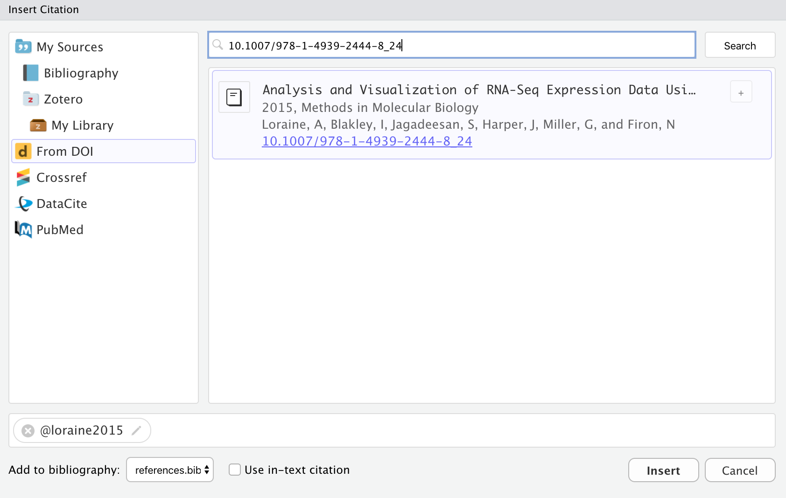
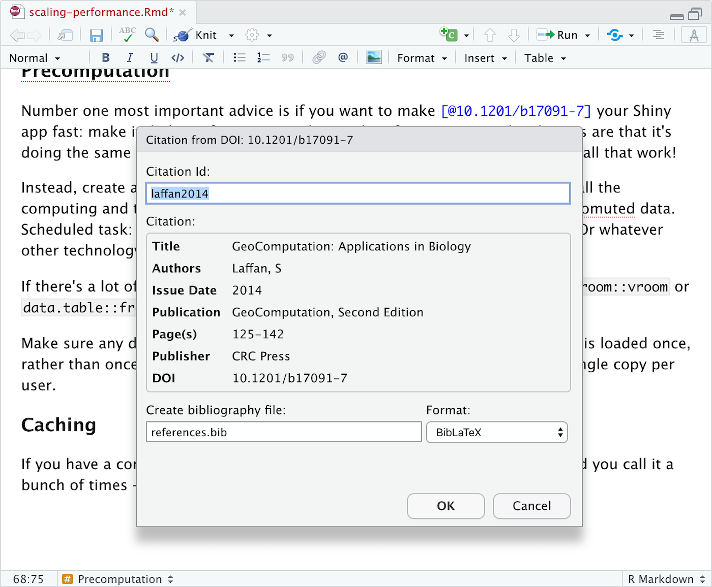
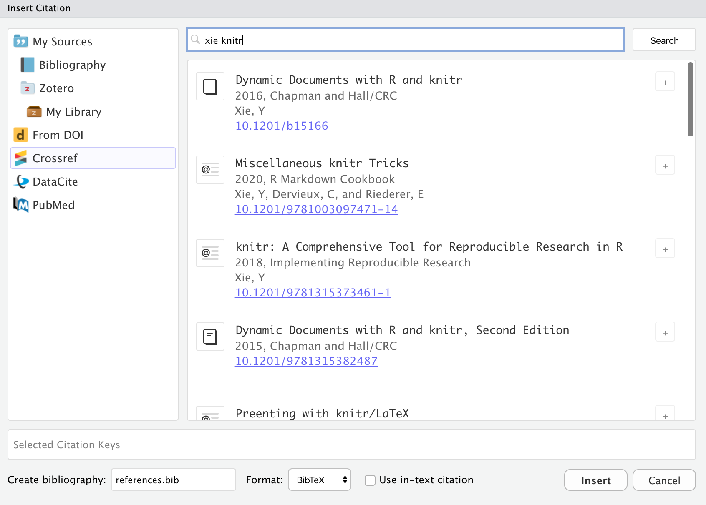

*This post is part of a series on new features in RStudio 1.4, currently available as a [preview release](https://www.rstudio.com/products/rstudio/download/preview/).*

A few weeks ago we blogged about the new [visual markdown editor](https://blog.rstudio.com/2020/09/30/rstudio-v1-4-preview-visual-markdown-editing/) included in RStudio v1.4.
Today we'll go into more depth on the [citation features](https://rstudio.github.io/visual-markdown-editing/#/citations) included in visual mode, including easy insertion of citations from:

1.  Your document bibliography.
2.  [Zotero](#citations-from-zotero) personal or group libraries.
3.  [DOI](#citations-from-dois) (Document Object Identifier) references.
4.  Searches of [Crossref](https://www.crossref.org/), [DataCite](https://datacite.org/), or [PubMed](https://pubmed.ncbi.nlm.nih.gov/).

## Inserting Citations

You may insert citations using the **Insert -\> Citation** command, after placing your cursor in the body of your document where you'd like to insert the citation.
Alternatively, you can use markdown syntax directly (e.g. by typing `[@cite]` or `@cite`) .

Use the <kbd></kbd> toolbar button or the <kbd>⇧⌘ F8</kbd> keyboard shortcut to show the **Insert Citation** dialog:



Note that you can insert multiple citations by using the add button on the right side of the item display.

If you insert citations from Zotero, DOI look-up, or a search then they are automatically added to your document bibliography.

### Markdown Syntax

You can also insert citations directly using markdown syntax (e.g. `[@cite]`).
When you do this a completion interface is provided for searching available citations:



If you aren't familiar with Pandoc's citation syntax, here's a quick refresher.
Citations go inside square brackets and are separated by semicolons.
Each citation must have a key, composed of '\@' + the citation identifier from the database, and may optionally have a prefix, a locator, and a suffix.
Here are some examples:

<div class="illustration">
<div>
  Blah Blah <span class="citation">[</span><span class="citation">@doe99</span>, pp. 33-35, 38-39<span class="citation">]</span>.
  </div>

<div>
  Blah Blah <span class="citation">[</span><span
    class="citation">@smith04</span>;
  <span class="citation">@doe99</span><span class="citation">]</span>.
</div>
  <div>Smith says blah <span class="citation">[</span><span class="citation">-@smith04</span><span class="citation">]</span>.
  </div>
  <div>
    <span class="citation">@smith04</span> <span class="citation">[</span>p. 33<span class="citation">]</span> says blah.
  </div>
</div>

See the [Pandoc Citations](https://pandoc.org/MANUAL.html#citation-syntax) documentation for additional information on Pandoc citation syntax.

### Citation IDs

Before inserting a citation from an external source you will may wish to customize it's ID.
Within the **Insert Citation** dialog, click the edit button on the right side of citations to change their ID:



If you insert a new citation via code completion, you will also be provided with the opportunity to change its default citation ID.

For citations inserted from Zotero, you can also use the [Better BibTeX](https://retorque.re/zotero-better-bibtex/) plugin to generate citation IDs and handle BibTeX export (this can be enabled via [Citation Options](https://rstudio.github.io/visual-markdown-editing/#/options?id=citation-options) if you have Better BibTeX installed).

### Citation Preview

Once you've inserted a citation, place the cursor over it to see a preview of it along with a link to the source if one is available:



The preview (and generated bibliography) will use the currently defined [CSL style](https://citationstyles.org/) for the document (as specified in the `csl` metadata field. A repository of CSL styles can be found at <http://zotero.org/styles>.

## Citations from Zotero

[Zotero](https://zotero.org) is a popular free and open source reference manager.
If you use Zotero, you can also insert citations directly from your Zotero libraries.
If you have Zotero installed locally it's location will be detected automatically and citations from your main library (**My Library**) will be available:


Not that while they aren't enabled by default, you can also insert citations from Zotero [Group Libraries](#group-libraries) (see the next section for details).

Zotero references will also show up automatically in completions:



Items from Zotero will appear alongside items from your bibliography with a small "Z" logo juxtaposed over them.
If you insert a citation from Zotero that isn't already in your bibliography then it will be automatically added to the bibliography.

If you are running both RStudio and Zotero on your desktop, then no additional configuration is required for connecting to your Zotero library.
If however you using RStudio Server and/or want to access your Zotero library over the web, then a few more steps are required (see the [Zotero Web API](https://rstudio.github.io/visual-markdown-editing/#/citations?id=zotero-web-api) documentation for details).

### Group Libraries

[Zotero Groups](https://www.zotero.org/support/groups) provide a powerful way to share collections with a class or work closely with colleagues on a project.
By default, Zotero Group Libraries are not included in the **Insert Citation** dialog or citation completions.
However, there are options available to use group libraries at a global, per-project, or per-document level.

For example, here we specify a project-level option to use the *Reproducible Research Series (Year 1)* group library:



You can also specify one or more libraries within YAML.
For example:

``` yaml
---
title: "Reproducible Research"
zotero: "Reproducible Research Series (Year 1)"
---
```

Note that you can also turn off Zotero entirely for a document using `zotero: false`:

``` yaml
---
title: "Reproducible Research"
zotero: false
---
```

## Citations from DOIs

Use the **From DOI** pane of the **Insert Citation** dialog to insert a citation based on a [DOI](https://www.doi.org/) (e.g that you have retrieved from a PubMed or other search):



If you are using markdown syntax, you can also paste a DOI after the `[@` and it will be looked up:



Once you've confirmed that it's the correct work (and possibly modified the suggested ID), the citation will be inserted into the document and an entry for the work added to your bibliography.

## Citations from Search

Use the **Crossref**, **DataCite**, and **PubMed** panes of the **Insert Citation** dialog to search one of those services for a citation:



Items inserted from a search will automatically be added to your bibliography.

Note that for PubMed queries you can use the full supported query syntax.
For example, this query searches on the author and title fields: `Peterson[Author] AND Embolism[Title]`.
You can learn more about building PubMed queries here: <https://pubmed.ncbi.nlm.nih.gov/advanced/>.

## Try it out!

You can try out the new features from this blog series by installing the [RStudio 1.4 Preview Release](https://www.rstudio.com/products/rstudio/download/preview/).
If you do, we very much welcome your feedback on our [community forum](https://community.rstudio.com/c/rstudio-ide).
Complete documentation for using citations can be found at <https://rstudio.github.io/visual-markdown-editing/#/citations>.

<style type="text/css">
kbd {
  display: inline-block;
  text-align: center;
  padding: 0em 0.4em;
  border: 1px solid hsl(113, 0%, 89%);
  border-radius: 4px;
  background: hsl(113, 0%, 97%);
}
.illustration {
  border: 1px solid rgb(230, 230, 230);
  padding: 6px;
}
.citation {
  color: blue;
}
</style>
