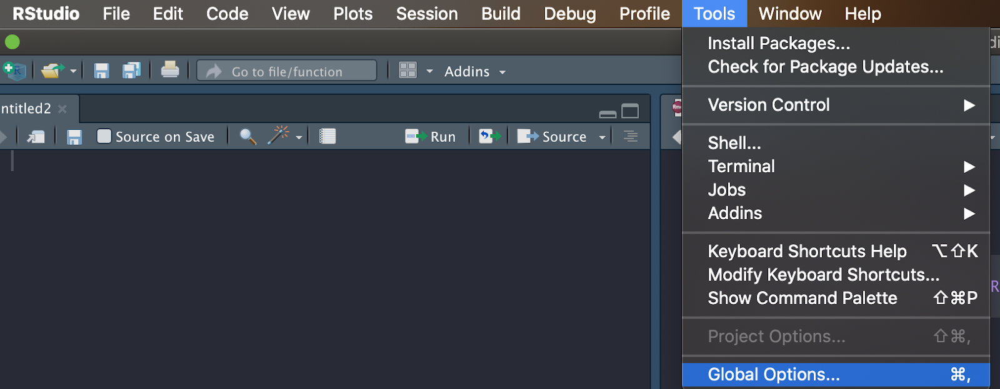
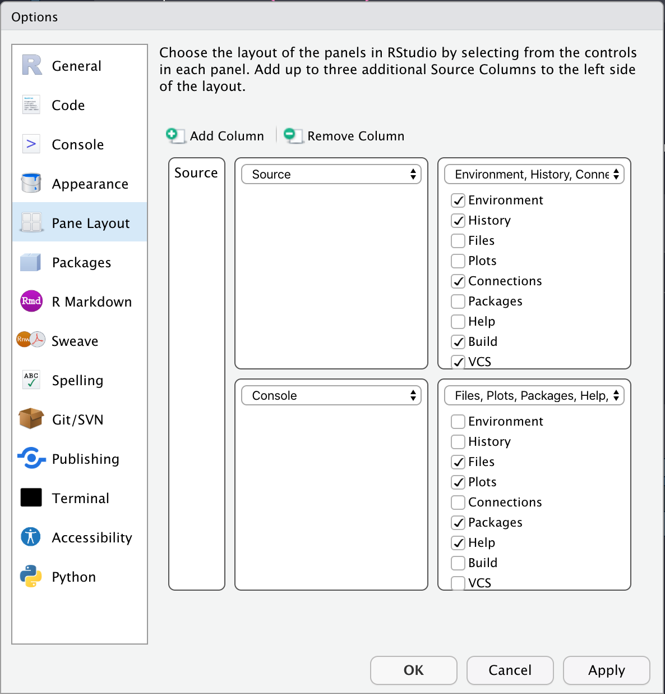

*This post is part of a series on new features in RStudio 1.4, currently available as a [preview release](https://www.rstudio.com/products/rstudio/download/preview/).*

RStudio v1.4 introduces the capability to configure your workbench with multiple source columns.
Multiple source columns give you the ability to view your source editors side-by-side and quickly reference code and data without switching tabs.

### Configuring a Side-by-Side View

Your default RStudio view will not change after installing RStudio v1.4.
Follow the instructions below to configure your new layout:

1.  In the menu bar, open the "Tools" menu.

2.  From the drop down menu, choose "Global Options".

    

3.  In the pane on the left hand side of the options window, click "Pane Layout".

4.  To add a column, click on the "Add Column" button.

    1.  You'll see a column labeled "Source" appear in the layout preview.

    2.  You can add up to three additional columns.

    

5.  Select "Apply" and you'll see the columns appear on your workbench, each with an empty R Script open and ready to go.

6.  Select "Ok" to close the "Global Options" pane and start working with your new columns.

Alternatively, you can quickly add columns with the new commands *Add Source Column* and *Open File in New Column*.
*Add Source Column* can be accessed with the keyboard shortcut `Ctrl + F7` and can be found in the *View* menu under *Panes (View -\> Panes -\> Add Source Column).* To choose a specific file to open in a new column, navigate to the *File* menu *(File -\> Open File in New Column)*.
If you want to be able to pull open the file chooser for a new column via the keyboard, we encourage you to [use the Modify Keyboard Shortcuts command](https://support.rstudio.com/hc/en-us/articles/206382178-Customizing-Keyboard-Shortcuts) to add one.

### **Navigating Multiple Columns**

Within your new layout, you can easily move tabs between columns with the same drag and drop convention you use to organize tabs today.
Any command you run outside of a specific column (e.g. via the menu bar or keyboard) interacts with the last column you used.
For example, if you choose Open a New File, the file will be opened in that last column you've selected.

We've added two commands to aid the experience of moving between columns: *Focus Next Pane* (`F6`) and *Focus Previous Pane* (`Shift + F6`).
These commands not only enable you to move between source columns, they also move focus to any other pane you have open.
*Focus Next Pane* gives focus to the pane to the right of your active one, while *Focus Previous Pane* moves focus to the left.
We've added a new accessibility option which allows you to easily visualize which panel has focus; while it is off by default, you can turn it on in the "Global Options" pane (*Global Options -\> Accessibility -\> Highlight focused Panel*).

### **Removing Source Columns**

To remove a column, simply close or drag out all tabs within that column.
Alternatively, you can close the columns as well as any open tabs by navigating to the *Pane Layout -\> Global Options* pane described above and choosing *Remove Column*.
This closes the left most column and will prompt you to save any unsaved files.

### **Try it out!**

You can try out the new side-by-side source columns by installing the [RStudio 1.4 Preview Release](https://www.rstudio.com/products/rstudio/download/preview/).
If you do, we very much welcome your feedback on our [community forum](https://community.rstudio.com/c/rstudio-ide)!
