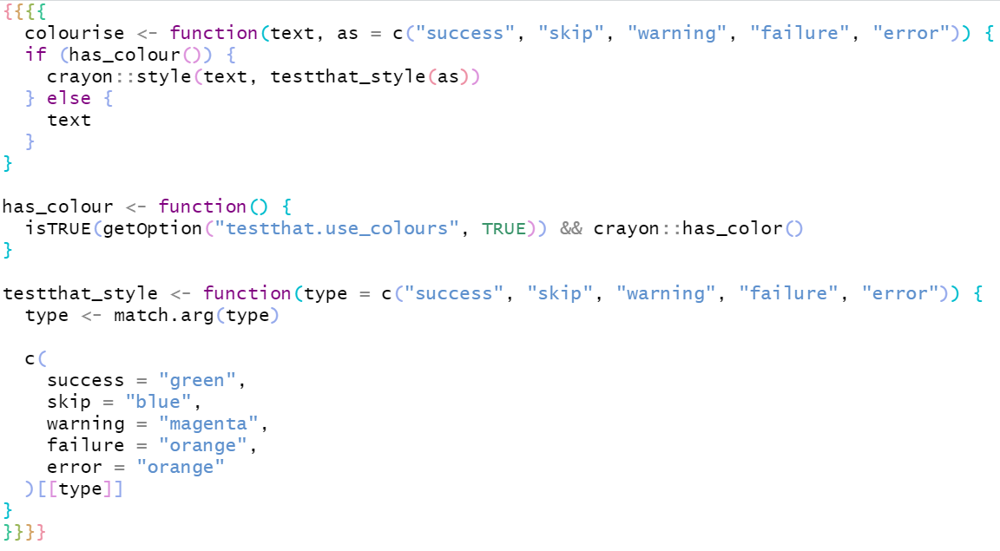
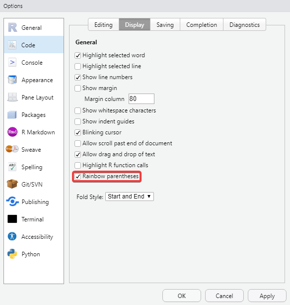
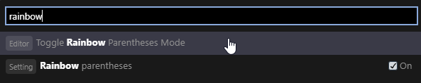
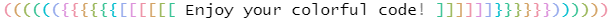

*This post is part of a series on new features in RStudio 1.4, currently available as a [preview release](https://www.rstudio.com/products/rstudio/download/preview/).*

Beautiful code themes and rainbow parentheses, a tale as old as...well [at least 2017](https://github.com/rstudio/rstudio/issues/1888). Being able to color your parentheses (and brackets and braces) based on the level of nesting has been a highly requested feature for years and we're happy to announce that it's available in the upcoming 1.4 release of RStudio.

### Enabling Rainbow Parentheses

Rainbow parentheses are turned off by default. To enable them:

1.  Open Global Options from the Tools menu

2.  Select Code -\> Display

3.  Enable the Rainbow Parentheses option at the bottom

### Optional Use

If you would prefer to only use the Rainbow Parentheses option on a per-file basis (just for specific debugging, for example) you can toggle this option by using the Command Palette. 

1. Open the Command Palette by either using the keyboard shortcut (Default: Control/Command + Shift + P) or through the Tools -\> Command Palette menu option.

2. Type `rainbow` to quickly highlight the `Toggle Rainbow Parentheses Mode` option and select it to toggle the option.

This is on the file itself so the rest of your environment will continue to respect the global setting.

### Configuring

If you don't like the default colors, or they don't quite work for your theme, you can customize them to whatever you like. See [this article](https://rstudio.github.io/rstudio-extensions/rstudio-theme-creation.html) on writing your own RStudio theme. The relevant classes to change are `.ace_paren_color_0` to `.ace_paren_color_6`.

### **Try it out!**

You can try out the new features from this blog series by installing the [RStudio 1.4 Preview Release](https://www.rstudio.com/products/rstudio/download/preview/). If you do, we very much welcome your feedback on our [community forum](https://community.rstudio.com/c/rstudio-ide)!
