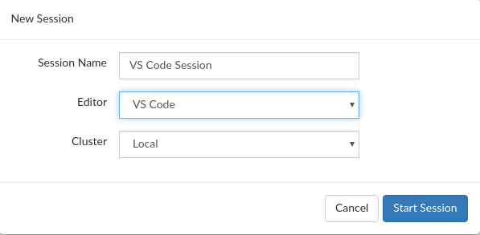
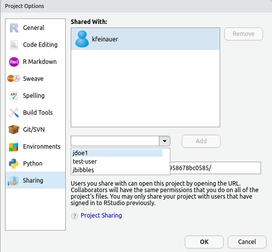

*This blog post is part of a series on new features in RStudio 1.4, currently available as a [preview release](https://www.rstudio.com/products/rstudio/download/preview/).*

Today, we're going to talk about what's new in RStudio Server Pro (RSP) 1.4. The 1.4 release includes integration with a frequently requested editor (VS Code), several quality of life improvements for working with Launcher environments, new user administration commands, and long-awaited SAML support! Let's get started!

## RStudio Server Pro

### Single Sign-On Authentication with SAML 2.0 & OpenID Connect

RSP 1.4 comes with native support for SAML and OpenID authentication for Single Sign-On. This allows RSP to leverage any authentication capabilities provided by your organization's Identity Management such as multi-factor authentication.

**Even when using SSO authentication with SAML or OpenID, RSP continues to require local system accounts.** Similar to the authentication mechanisms supported previously by RSP, automatic account creation (provisioning) can be done via `sssd` integration with your LDAP or Active Directory and with RSP configured to use PAM sessions. You can find more information in the admin guide [here](https://docs.rstudio.com/ide/server-pro/1.4.1021-2/authenticating-users.html#user-provisioning) and [here](https://docs.rstudio.com/ide/server-pro/1.4.1021-2/authenticating-users.html#pam-basics).

If you already have LDAP or Active Directory integration working with RSP with PAM or proxied authentication, getting SAML or OpenID working is just a matter of configuring both RSP and your organization's Identity Management to trust each other. We have some migration recommendations described [here](https://docs.rstudio.com/ide/server-pro/1.4.1021-2/authenticating-users.html#authentication-migration).

When configuring your Identity Management, the only information RSP needs to know about each user is their local account username, so this information is required in assertions or claims sent during authentication. By default, RSP expects an attribute called "Username" (case-sensitive) for SAML and a claim called "preferred_username" for OpenID, but those can be customized if necessary.

Note that RSP will not be able to use email addresses or any other user identifier for authentication purposes. If `sssd` integration is used, the username received by RSP must exactly match the one provided by `sssd` for the same user.

The admin guide contains more information on how to configure [SAML](https://docs.rstudio.com/ide/server-pro/1.4.1021-2/authenticating-users.html#saml-single-sign-on-authentication) and [OpenID](https://docs.rstudio.com/ide/server-pro/1.4.1021-2/authenticating-users.html#openid-connect-authentication).

> Note: SAML and OpenID cannot yet be configured with Google because it does not provide usernames, only emails. If Google is your preferred authentication, you can keep using it, but be aware it will be deprecated in a future release. We will provide a migration path from Google accounts to OpenID at that time.

### VS Code Sessions (Preview)

Many data science teams use [VS Code](https://code.visualstudio.com/) side by side with RStudio as a tool for reproducible research. In this RSP update, we're making it easier to use these tools together; you can now run VS Code sessions in addition to RStudio and Jupyter sessions inside RSP, providing your data scientists with all of the editing tools they need to do their data science more effectively!

Just like RStudio sessions, RSP manages all of the authentication and supervision of VS Code sessions, while providing you a convenient dashboard of running sessions. Starting a new VS Code session is as easy as choosing `VS Code` when you start a new session.

Note that RStudio does not bundle VS Code (it must be installed separately) and that VS Code is only available when RSP is configured with the Job Launcher. The VS Code editing experience is provided by the use of the open source [code-server](https://github.com/cdr/code-server) which must be installed and configured in order to be used. This setup can be done easily by simply running the command `sudo rstudio-server install-vs-code <install path>`, which will download all the necessary binaries and automatically configure the `/etc/rstudio/vscode.conf` file which enables VS Code integration. See the [admin guide](https://docs.rstudio.com/ide/server-pro/1.4.1021-2/vs-code-sessions-preview.html) for more details.

Currently, VS Code Sessions are a Preview feature. The feature itself is stable and usable, but you may find some bugs, and we are still working to complete some aspects of the VS Code development workflow. We highly encourage you to submit your feedback to let us know how we can improve!

### Job Launcher Project Sharing

In previous versions of RSP, use of the Job Launcher automatically prevented you from using the Project Sharing and Realtime Collaboration features within RStudio sessions. We're excited to announce that this limitation has now been removed, and you can share projects within Launcher sessions just the same as with regular sessions.

By default, when selecting the users to share projects with from within a session, only users that have signed in and used RSP will be shown, whereas previously the entire system's users were displayed. This previous behavior was in some cases exhausting, and now also makes no sense in containerized environments (e.g., Kubernetes). The old behavior can be restored by setting `project-sharing-enumerate-server-users=1` in the `/etc/rstudio/rsession.conf` configuration file.

### Local Launcher Load Balancing

In previous versions of RSP, if you wanted to load balance your sessions between multiple nodes running the Local Job Launcher plugin, you had to use an external load balancer to balance traffic between Job Launcher nodes. In RSP 1.4, load balancing has been improved when used with the Local Launcher to ensure that sessions are automatically load balanced across Launcher nodes that are running RSP and configured in the load balancer configuration file `/etc/rstudio/load-balancer`. Simply ensure that each RSP instance is configured to connect to its node-local Launcher instance. For more details, see the [admin guide](https://docs.rstudio.com/ide/server-pro/1.4.1021-2/job-launcher.html#load-balancing-1). 

### User Administration

RSP 1.3 introduced the ability to track named user licenses visually in the admin dashboard, as well as the ability to lock users that are no longer using RSP to free up license slots. In 1.4, we have added new admin commands to perform these operations from the command line instead of having to use the GUI. These commands allow you to:

* List all RSP users
* Add new users before they have signed in, indicating whether or not they should have administrator privileges
* Change the admin status of a user
* Lock and unlock users

Documentation for these commands can be found in the [admin guide](https://docs.rstudio.com/ide/server-pro/1.4.1021-2/server-management.html#listing-users).

---

If you're interested in giving the new RStudio Server Pro features a try, please [download the RStudio 1.4 preview](https://www.rstudio.com/products/rstudio/download/preview). Note that RStudio Server Pro 1.4 requires database connectivity; see the [admin guide](http://docs.rstudio.com/ide/server-pro/1.4.1021-2/database.html) for full documentation on prerequisites.
