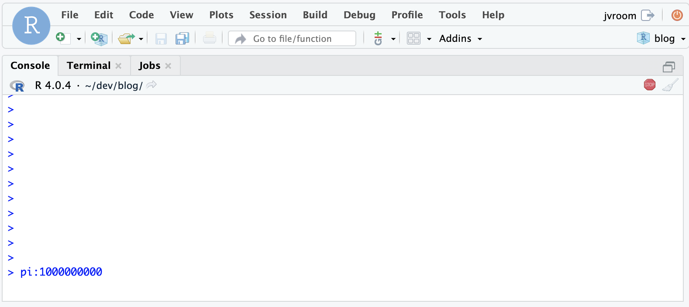
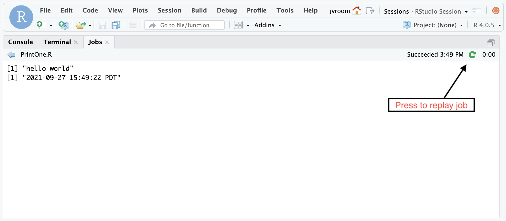

<div style="font-size:60%; display: flex; justify-content: center">Photo by Mick Fournier / HBI Producers of Fine Orchids</div>
</center>

This post describes some of the improvements contained in the RStudio update 2021.09.0, code-named Ghost Orchid:

* [Calendar Versioning](#calendar-versioning)
* [Improved Usability When R is Busy](#improved-usability-when-r-is-busy)
* [Logging Changes](#logging-changes)
* [High DPI Retina Plots](#high-dpi-retina-plots)
* [Replay Local Jobs](#replay-local-jobs)
* [Load Balancing](#load-balancing)
* [Kubernetes Supplemental Groups](#kubernetes---supplemental-groups)

### Calendar Versioning 

One noticeable change in this update is the shift to a calendar based versioning scheme for all RStudio products. This release is an update to v1.4.1717-3. See [this post](https://blog.rstudio.com/2021/08/30/calendar-versioning-for-commercial-rstudio-products/) for details.

### Improved Usability When R is Busy

This release contains a change to improve how the IDE responds to the user when R is in the midst of some types of busy operations. Now you are able to save your changes, use the terminal, and open new files even when R is busy.



To understand this change, it's helpful to understand a bit more about how R works under the hood. Like Python and many other languages, R uses a single thread of execution for access to data so programmers do not have to worry about locking and concurrency. This design however prevents R from supporting preemptive multitasking, a feature that allows the operating system to interrupt a program in the midst of whatever it's doing at the request of the user. Instead, most long-running R routines are written to periodically yield control back to the system. This allows the system to check to see if the user has requested an interrupt, and to do background tasks for user-interactivity. These checks allow the RStudio IDE to support interrupts, and to respond to clicks and commands from the user.

Some long running R operations unfortunately do not make these yield calls, and when this happens in v1.4, it's not possible to open or save files, use the terminal, or even for the IDE to respond. Further, when using the IDE connecting to a remote server, the browser only allows a small number of outstanding requests. Once those are all used up, it causes a logjam where even the abort operation is not received. In these extreme circumstances, the only option left for the user in v1.4 is to wait for the operation to complete or to refresh the browser.

Now in 2021.09.0, the RStudio IDE allows you to open and save files even when R is in one of these uncooperative busy states. It also allows you to use the terminal so you can monitor the CPU usage and see the state of files on the disk. Another change is that the memory usage statistic will update even when R is busy.

And to avoid the browser logjam with RStudio Server, a placeholder response is returned to free up the browser connection. This means that you'll always be able to send an interrupt or abort request to the IDE.

### Logging Changes

System log files help administrators of the system diagnose problems. In this release, we have improved both the logging infrastructure and the quality and quantity of logging messages for the open source products and RStudio Workbench. As with the previous release, all logging configuration settings should be placed in `/etc/rstudio/logging.conf`. 

#### Message Improvements

There have been a number of improvements to the messages logged by the system:

* Info messages logged at startup to detail which configuration files were used
* Additional debug messages for the rserver to trace request handling and load balancing
* Details added to a number of errors to provide more context

#### File Logging 

The default setting for logger-type has changed to `file` from `syslog`. Even with this default, warnings and errors continue to be logged to syslog by default, but that can be disabled by setting `warn-syslog=0`. By default, log files are placed in the new directory `/var/log/rstudio`. There is an `rstudio-server` subdirectory that contains rserver and rsession logs. Those pertaining to the job launcher are placed in the `launcher` subdirectory. This is team effort to put all RStudio logs in one place.

Note that the RStudio monitor log, that combines server and session logs into one stream, is still created in the old location: `/var/lib/rstudio-server/monitor/log/rstudio-server.log`.

#### JSON Format

To support better integration with external log file index and search, log files can be formatted as JSON by setting:

```log-message-format=json```

#### Session Protocol Debugging

To diagnose problems with an R session, it can be helpful to see the sequence of requests that lead up to that error. There's a new IDE preference called `Session Protocol Debug`, settable from the [Command Palette](https://blog.rstudio.com/2020/10/14/rstudio-v1-4-preview-command-palette/). When enabled, it turns on debug logging for the session and enables a special option to show messages before and after each request handled by the IDE. This information is placed by default in a log file in `/var/log/rstudio/rstudio-server/rsession-username.log`. 

This log complements the session diagnostics option, providing an easier to read log than the existing 'strace' option that logs all system calls at a low level. 

#### Logging Details

Read more about RStudio logging in the [admin guide](https://docs.rstudio.com/ide/server-pro/server_management/logging.html).

### High DPI Retina Plots

Images generated for displays that have more dots-per-inch (DPI), such as the Mac retina, should be rendered at a higher resolution to match what's possible with those displays. The Mac Desktop version of RStudio has supported higher resolution plots for a long time, but in 2021.09.0, this feature is supported for RStudio Server and the other desktop versions as well.

### Replay Local Jobs

The RStudio IDE has a new button that allows you to quickly re-run a local job with the same parameters:




### Load Balancing

RStudio Workbench now supports a more flexible way to configure nodes in the cluster. For details, see [this post](https://blog.rstudio.com/2021/09/21/rstudio-workbench-load-balancing-changes/).

### Kubernetes - Supplemental Groups

In RStudio Workbench, when using Kubernetes to manage session instances, the `launcher-sessions-create-container-user` option allows you to create a unix account for the session user on-the-fly when the session starts. This eliminates the need to provision user accounts on the Kubernetes session image. Instead, the user-id and group information from the user's account on the RStudio Workbench system is used to create a matching account on the system image when the session is started. This allows the session to access the network file systems that use those ids for permissions.

New in 2021.09.0, enabling this option will also create supplemental groups ids.

### More Info

There's lots more in this release, and it's [available for download today](https://www.rstudio.com/products/rstudio/download/). You can read about all the features and bugfixes in the "Ghost Orchid" update in the [RStudio Release Notes](https://www.rstudio.com/products/rstudio/release-notes/), and we'd love to hear your feedback about the new release on our [community forum](https://community.rstudio.com/c/rstudio-ide/9).

