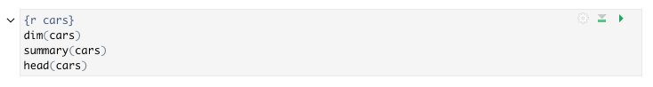
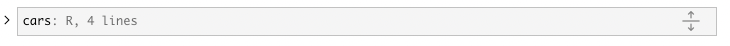
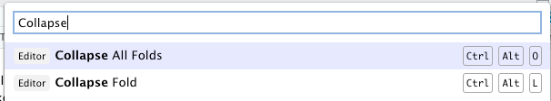
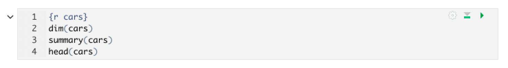
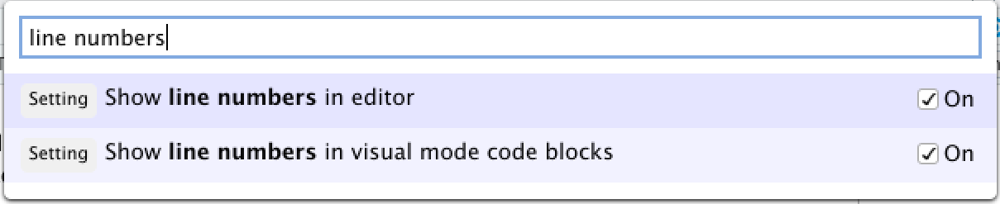
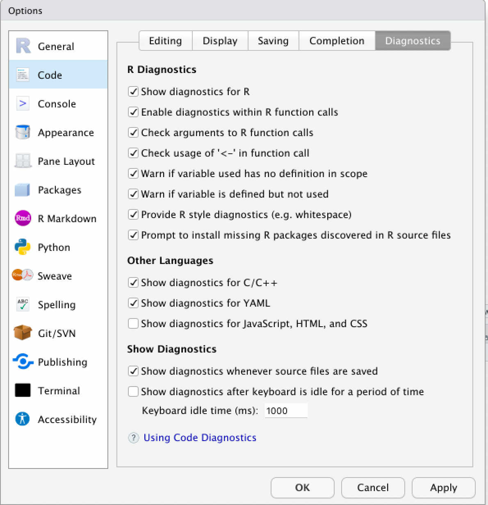

This post highlights some of the improvements in the latest RStudio IDE release 2022.02.0, code-named "Prairie Trillium". To read about all of the new features and updates available in this release, check out the latest <a href="https://www.rstudio.com/products/rstudio/release-notes/" target="_blank">Release Notes</a>.

-   [Support for R (\>= 4.2.0)](#support-for-r-4-2-0)
    -   [Updated graphics engine support](#updated-graphics-engine)
    -   [Windows support for R (\>= 4.2.0)](#windows-r-4-2-0)
-   [RMarkdown Visual editor improvements](#visual-mode-editor-improvements)
    -   [Collapsible code chunks in visual editor](#collapsible-code-chunks)
    -   [Optional line numbering in code chunks in visual editor](#line-numbering-visual)
    -   [Optional code diagnostics in visual editor](#code-diagnostics-visual)
-   [More info](#more-info)

# Support for R (\>= 4.2.0) {#support-for-r-4-2-0}

The development build of R, which will be released as R 4.2.0 later this year, features a <a href="https://cran.r-project.org/doc/manuals/r-devel/NEWS.html" target = "_blank">number of changes</a>. The latest RStudio release supports the most significant of these changes.

## Updated graphics engine support {#updated-graphics-engine}

The graphics engine, which is used to render plots in the RStudio Plots pane, has been upgraded to graphics engine version 15 in R 4.2.0. Older versions of RStudio displayed a warning that <tt>R graphics engine version 15 is not supported by this version of RStudio</tt> and plots opened in a separate window rather than in the Plots pane. In this release, the Plots Pane is fully compatible with R \>= 4.2.0.

## Windows support {#windows-r-4-2-0}

-   R 4.2.0 will use UTF-8 as the native encoding on recent Windows systems, such as Windows 10, Windows Server 2016, or later. Builds of R \>= 4.2.0 on Windows use UCRT to support this use of UTF-8. This RStudio release provides support for UTF-8 native encoding on Windows, including listing file paths and directories containing non-ASCII UTF-8 characters that may be common for international users working in other languages and locales.

-   R 4.2.0 soft-deprecated the download method of `wininet`, which was commonly used as a method of downloading files and installing packages in R on Windows platforms. This release updates the file download method used when installing packages; users will no longer see a warning indicating that <tt>the 'wininet' method is deprecated</tt> when installing R packages via RStudio.

# Visual editor improvements {#visual-mode-editor-improvements}

## Collapsible code chunks {#collapsible-code-chunks}

The visual editor now has the ability to expand or collapse some or all code chunks to make it easier to navigate the document. You can collapse a code chunk by clicking on the code-folding arrow to the top-left corner of each chunk. Each collapsed chunk will display the number of lines of code that have been collapsed. Output can be collapsed independently of the code itself.

Alternatively, you can use the Command Palette or keyboard shortcuts to collapse or expand a single code chunk, or all code chunks at once. You can collapse a single code chunk with `Ctrl` + `Alt` + `L`, with your cursor in the code chunk, and expand it again with `Ctrl` + `Alt` + `Shift` + `L`.

## Optional line numbering {#line-numbering-visual}

Users now have the option to display line numbers, code diagnostic markers, or both in the left-hand margin of each code chunk in the visual editor.

The option to display line numbering in the visual editor is separate from the option controlling line numbering in the source editor, and these line numbers are disabled by default, even if line numbering is turned on in the source editor. To turn on line numbering for the visual editor, go to **`Tools > Global Options > RMarkdown > Visual`** and check the box to "Show line numbers in code blocks".

Each code chunk will now display its own line numbering within the code chunk.

Alternatively, you can also enable line numbering by opening the Command Palette and searching for "line numbers" to check the setting "Show line numbers in visual mode code blocks".

## Optional code diagnostics {#code-diagnostics-visual}

You can also display code diagnostics within the visual editor, using the same settings to enable these in both the visual editor and the source editor. For more details on enabling and using code diagnostics in general, see [the support article](https://support.rstudio.com/hc/en-us/articles/205753617-Code-Diagnostics-in-the-RStudio-IDE "Support: Code diagnostics in the RStudio IDE") on code diagnostics within the IDE.

After enabling code diagnostics for both the visual and source editor in **`Tools > Global Options > Code > Diagnostics,`** lines of code detected as potentially having issues will be indicated in the left-hand margin with an , , or  symbol, depending on the nature of the issue.

For example, in the code sample below, issues are denoted with diagnostic markers next to the line numbers, and for certain issues, the affected code is underlined.

By hovering over the associated marker, we can read a message as to the nature of the issue(s) with that line of code. After editing and saving the file, if the issue has been successfully resolved, the marker, and any associated underlining, will disappear.

# More Info {#more-info}

There's lots more in this release, and it's <a href="https://www.rstudio.com/products/rstudio/download/" target="_blank">available for download today</a>. You can read about all the features and bugfixes in the RStudio 2022.02.0 "Prairie Trillium" release in the <a href="https://www.rstudio.com/products/rstudio/release-notes/" target="_blank">RStudio Release Notes</a>. We'd love to hear your feedback about the new release on our <a href="https://community.rstudio.com/c/rstudio-ide/9" target="_blank">community forum</a>.

