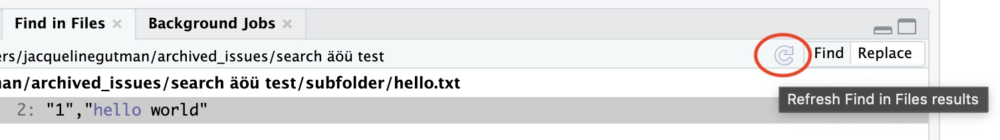
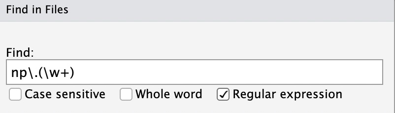
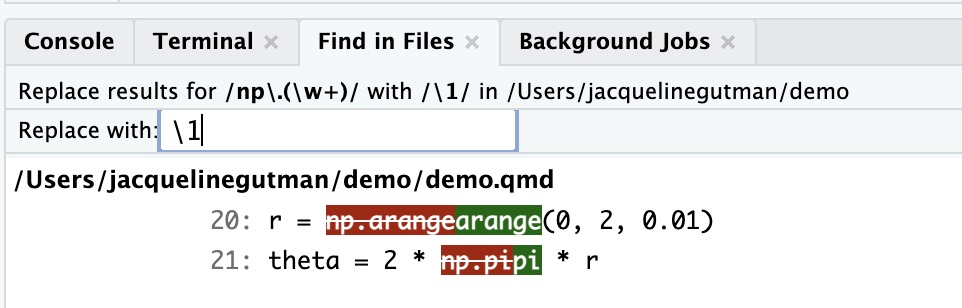
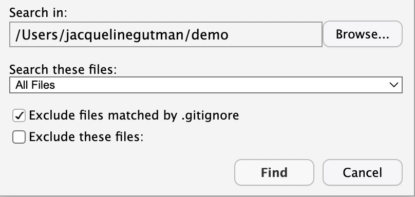
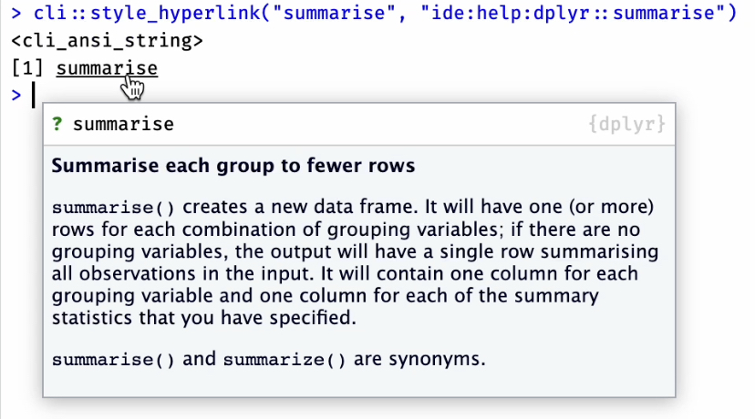
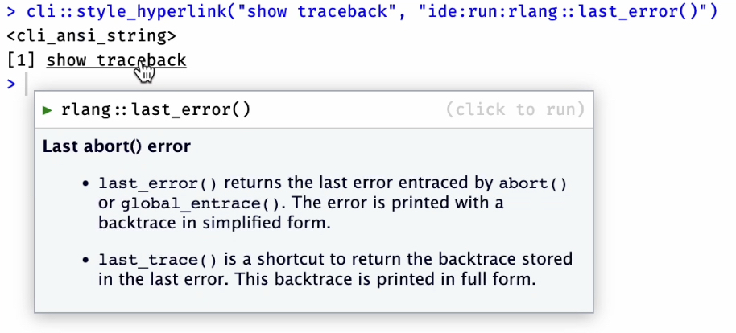
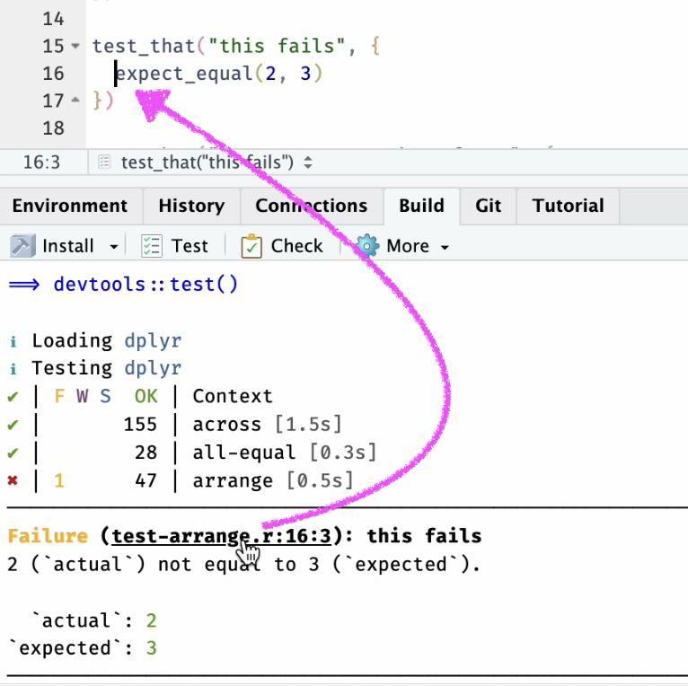
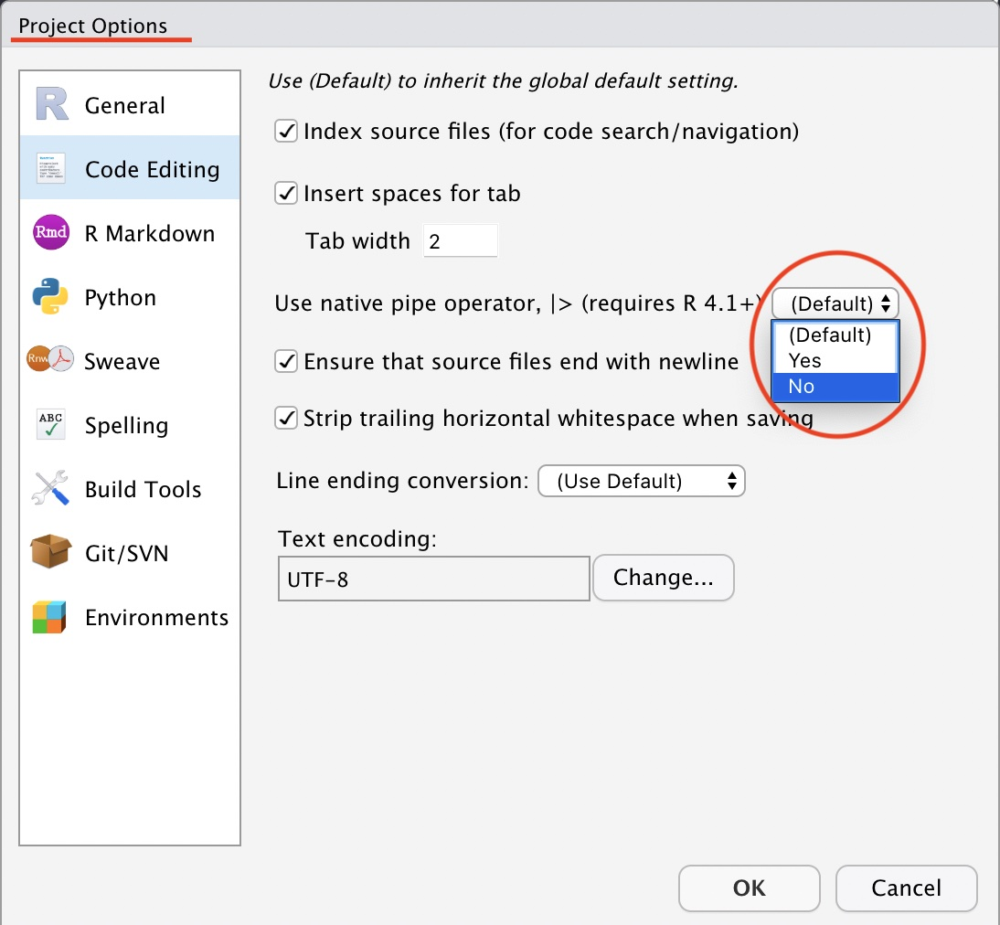
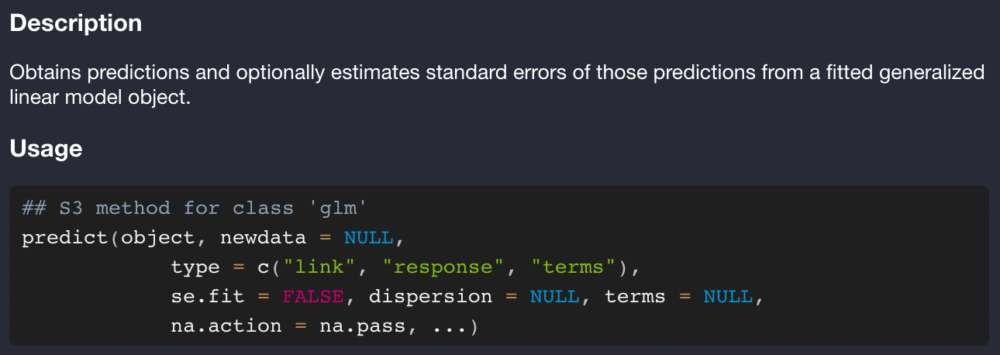

This post highlights some of the improvements in the latest RStudio IDE release 2022.07.0, code-named "Spotted Wakerobin". To read about all of the new features and updates available in this release, check out the latest <a href="https://www.rstudio.com/products/rstudio/release-notes/" target="_blank">Release Notes</a>.

-   [Find in Files improvements](#find-in-files-improvements)
-   [Hyperlinks](#hyperlinks)
-   [Support for R (\>= 4.2.0)](#support-for-r-4-2-0)
-   [More info](#more-info)

## Find in Files improvements {#find-in-files-improvements}

We've made some significant improvements to the Find in Files pane, across all platforms but with particularly significant improvements in Windows.

- The Find in Files pane has gained a Refresh button, so that users can manually refresh possible matches/replacements to capture any changes to the files since the search was last run. 

- We've upgraded the version of `grep` we use with RStudio on Windows. This more modern version of `grep` enables improved searching through directories and subdirectories with non-ASCII characters in the path name, such as `C:\Users\me\Éñçĥìłăḏà` or `C:\你好\你好`.

- We've also changed the flavor of regular expressions supported by the Find in Files search. Previously, Find in Files supported only POSIX Basic Regular Expressions. As of this release, Find in Files is now powered by <a href="https://en.wikibooks.org/wiki/Regular_Expressions/POSIX_Basic_Regular_Expressions" target="_blank">Extended Regular Expressions</a>, when the `Regular expression` checkbox is checked. What does this mean for your searches? Previously, if you used the special characters `?`, `+`, `|`, `{}`, or `()`, they were treated as character literals; now they will be interpreted according to their special regex meaning when unescaped, and as character literals only when escaped with a single backslash. This change also adds additional support for Find and Replace using regular expressions with `\b`, `\w`, `\d`, `\B`, `\W`, and `\D`, which now return the expected results in both Find and Replace mode. These changes bring Find in Files search more closely in line with the flavor of regular expressions supported by R's base `grep` function (using `PERL=FALSE`), but note that where the `grep` function within R requires double backslashes, Find in Files requires only a single backslash as the escape character.

- When using Find in Files with the search directory set to a Git repository, users will by default have the option to ignore searching through any files or subdirectories listed within the `.gitignore` for that repo. Users can uncheck this option if they wish to include these files in their search.

A number of other small bug fixes have been included in this release to improve the reliability and usability of Find in Files search. We hope this makes the feature more powerful and straightforward for users.

## Hyperlinks {#hyperlinks}

Support for hyperlinks, as generated by <a href="https://cli.r-lib.org/reference/style_hyperlink.html" target="_blank">cli::style_hyperlink()</a>, has been added to the console output, build pane and various other places. Depending on their url, clicking a hyperlink will:

- go to a website `cli::style_hyperlink("tidyverse", "https://www.tidyverse.org")`, a local file `cli::style_hyperlink("file", "file:///path/to/file")`, or a specific line/column of a file `cli::style_hyperlink("file", "file:///path/to/file", params = c(line = 10, col = 4))`

- open a help page `cli::style_hyperlink("summarise()", "ide:help:dplyr::summarise")` or a vignette `cli::style_hyperlink("intro to dplyr", "ide:vignette:dplyr::dplyr")`, 
with some preview information in the popup when the link is hovered over. 

- run code in the console `cli::style_hyperlink("Show last error", "ide:run::rlang::last_error()")`. This also shows information about the function that will 
run when the link is clicked. 

Some packages (e.g. `testthat` and `roxygen2`) have started to take advantage of this feature to improve their user experience, and we hope this will 
inspire other packages. 

## Support for R (\>= 4.2.0) {#support-for-r-4-2-0}

R 4.2+, officially released in April 2022, received extensive IDE support in the previous release of the RStudio IDE. In this release, we add support for some additional features as well as some critical bug fixes.

- We resolved an issue where files would appear to be blank when opened in projects not using UTF-8 encoding on Windows with R 4.2.0, which could result in users inadvertently overwriting their files with an empty file. 
- We added further support for the R native pipe, first introduced in R 4.1. Code diagnostics now recognize and support the use of unnamed arguments in conjunction with the native pipe (e.g. `LETTERS |> length()`) as well as the use of the new placeholder character (e.g. `mtcars |> lm(mpg ~ cyl, data = _)`) added in R 4.2.0.
- We've also made it easier for users to configure whether they want to use the native R pipe `|>` or the `magrittr` pipe `%>%` when using the *Insert pipe* command (Cmd/Ctrl + Shift + M). Previously, this was only configurable at the global level, from the Global Options pane. As of this release, you can now inherit or override the global option in Project Options as well, to help maintain code style consistency within a RStudio project.

- R 4.2 also introduced extensive changes to the Help system; we've updated support for this new enhanced Help system to ensure it displays crisply and legibly in the IDE especially when using a dark theme.

## More info {#more-info}

There's lots more in this release, and it's <a href="https://www.rstudio.com/products/rstudio/download/" target="_blank">available for download today</a>. You can read about all the features and bugfixes in the RStudio 2022.07.0 "Spotted Wakerobin" release in the <a href="https://www.rstudio.com/products/rstudio/release-notes/" target="_blank">RStudio Release Notes</a>. We'd love to hear your feedback about the new release on our <a href="https://community.rstudio.com/c/rstudio-ide/9" target="_blank">community forum</a>.
