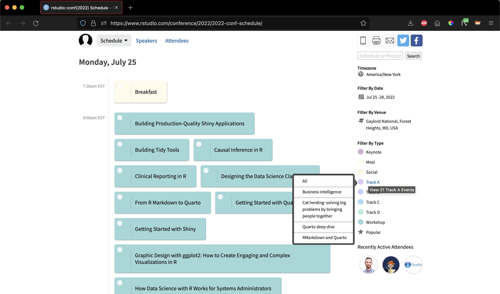

We are delighted to announce the rstudio::conf schedule!  Expect four days of amazing speakers, workshops, and events on a range of topics: data science processes, industry use cases, working with Shiny, and more!

Visit the <a href="https://rstd.io/conf-sched-2022" target = "_blank">Conference Schedule</a> to see the impressive list of events and start planning your conference experience.

<a class="btn btn-primary" href="https://rstd.io/conf-sched-2022" target="_blank">Visit the Conference Schedule Page</a>

## Exploring rstudio::conf events and topics

The scheduler provides event descriptions and details. All talks will be live streamed.

Toggle between different simple or expanded views and view the speakers and attendees. On the right-hand side, you can filter by track. Hover over the links to see categories of talks.

 
 
Check out the impressive list!

## Save your schedule of talks

Sign up to save your schedule and add events to your calendar. Once you create an account, you can complete your profile, receive email announcements, and save your custom schedule.

We will have an app available for easy access to the schedule during the conference --- we'll update the website once it is ready.

## Register now!

We cannot wait to see you at rstudio::conf in July!

* <a href="https://www.rstudio.com/conference/" target = "_blank">Register</a> to attend rstudio::conf in-person.
* To begin the conference, we have <a href="https://www.rstudio.com/conference/2022/2022-conf-workshops-pricing/" target = "_blank">two days of hands-on workshops</a>. These are not offered online — be sure to sign up!
