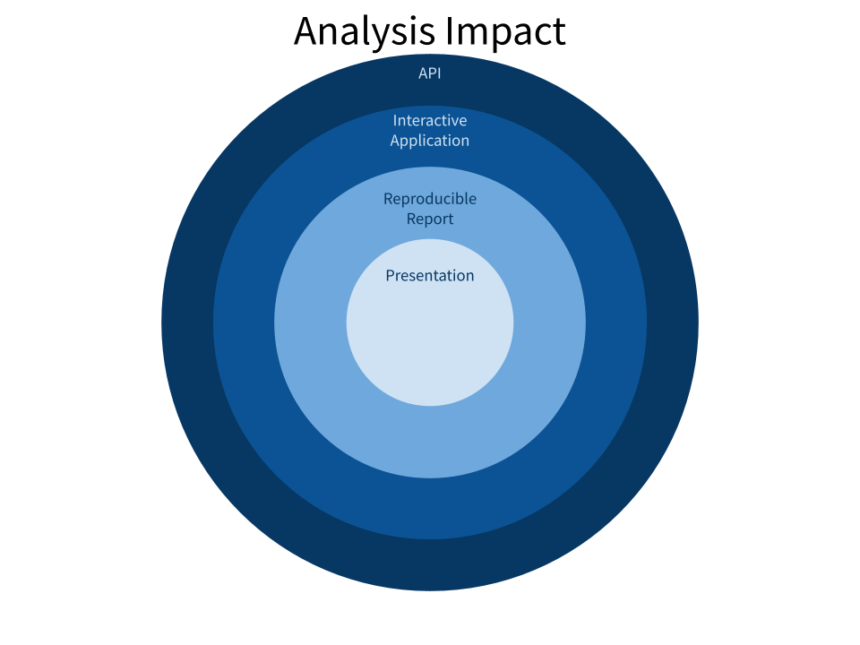
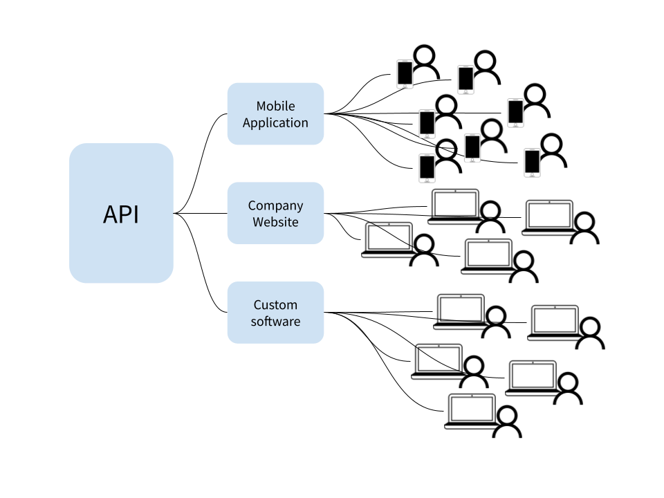
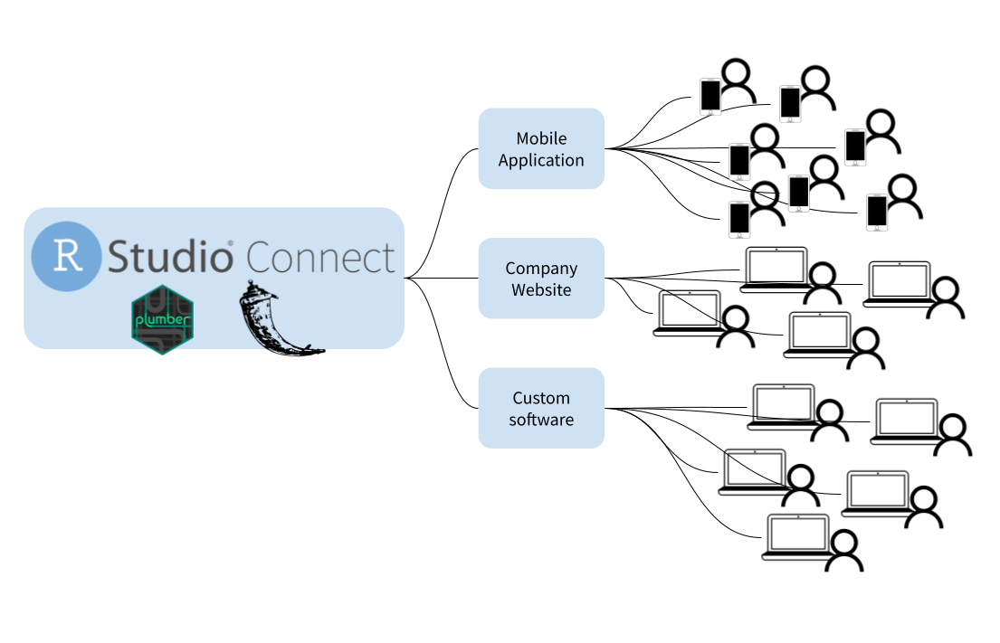

Photo by <a
href="https://unsplash.com/@samthewam24?utm_source=unsplash&utm_medium=referral&utm_content=creditCopyText">Samuel
Sianipar</a> on <a
href="https://unsplash.com/s/photos/pipes?utm_source=unsplash&utm_medium=referral&utm_content=creditCopyText">Unsplash</a>

Data Scientists and analysts work to constantly deliver valuable insights from
data. In many cases, these individuals practice a [Code First
approach](https://www.rstudio.com/resources/why-your-enterprise-needs-code-first-data-science/),
using a programming language like R or Python to explore and understand data.
Once an analysis reaches conclusion, it is important to carefully consider what
happens next. Perhaps the analysis resulted in a complex machine learning model
that can generate valuable predictions on new data. Or perhaps it resulted in
some new business logic that can be implemented to improve efficiency. In any
case, ensuring the longevity of analysis outcomes increases business value long
after the original analysis concludes.

## Increasing the impact of an analysis

There are common, standard methods for distributing results and increasing the
impact of a given analysis. Data scientists may choose one or more of several
options:

* **Prepare and present a presentation** to business stakeholders.
* **Create a reproducible report** that is widely shared and distributed.
* **Develop and share an interactive dashboard or application** to provide
others with self-service access to the analysis results and findings at their
convenience.
* Or, as we’ll discuss in this post, **share the analysis as an API** that
allows real time interactivity with other technologies.

In each case, the goal is to increase the potential impact of the analysis.The
greater the reproducibility, interactivity and reach of the analysis, the
greater the potential impact.

Let’s consider an example. Sofia works as a business analyst for a large SaaS
company. She was recently assigned a project to analyze customer usage of the
company platform to better identify customers at risk of churning. After careful
analysis, Sofia determines the top 5 contributing factors to customer churn. At
this point, she has learned something of value, and she can share those insights
with business leaders via a presentation or email to help inform future
decisions. However, this outcome has limited impact. What if Sofia created a
reproducible report or a dashboard using Shiny or Dash to better understand the
existing customer base and their risk factors? Now the analysis impact has
dramatically increased.

As a result of Sofia’s analysis, the company wants to generate real time
predictions for each customer. This will allow each customer interaction to be
informed by the customers current level of risk. In order to achieve this, the
work Sofia has done **needs to be responsive and accessible in real time, from a
variety of other tools and technologies.** This is when creating an API can
prove particularly useful.

## APIs provide real time analysis outcomes

APIs are, in their most basic form, a standardized way for computers to
communicate with one another. Just as human communication is improved by a
shared baseline or common language, APIs allow different digital platforms to
communicate with one another. In the case of data analytics, APIs can empower
real time interaction with statistical models and analysis outcomes. This
enables other developers either inside or outside of an organization to
integrate directly with and build upon work that’s already been done without the
need for costly re-implementation.

The impact of a given analysis can often be measured by how accessible its
results are. Slide presentations, reports, and interactive applications all
increase analysis impact by distributing results to a wider audience. APIs can
further increase impact by allowing other tools within the organization to
quickly make use of analysis results. Unfortunately, many organizations stop
short of creating these APIs and don’t realize the full impact potential of a
given analysis.

This isn’t to say that every analysis should result in an API. When an analysis
is expected to be short lived or exists only as a proof of concept, an API may
be unnecessary. However, when other tools want to build upon the work done in an
existing analysis, an API becomes a useful tool that enables quick integration.

## To learn more

RStudio Connect enables enterprise data science teams to quickly deliver
analysis results to a wide variety of business stakeholders. In addition to
supporting interactive applications and static reports, RStudio Connect can also
be used to deploy and manage R and Python APIs, using the Plumber and Flask
frameworks. To learn more:

* Visit the [Connect product page](https://www.rstudio.com/products/connect/),
or [set up a meeting](http://rstd.io/r_and_python) with our Customer Success
team.
* Watch the webinar, [“Expanding R Horizons: Integrating R with Plumber
APIs”](https://www.rstudio.com/resources/webinars/expanding-r-horizons-integrating-r-with-plumber-apis/)
* Check out these examples of
[Plumber](https://solutions.rstudio.com/r/rest-apis/) and
[Flask](https://solutions.rstudio.com/python/flask/) APIs.
