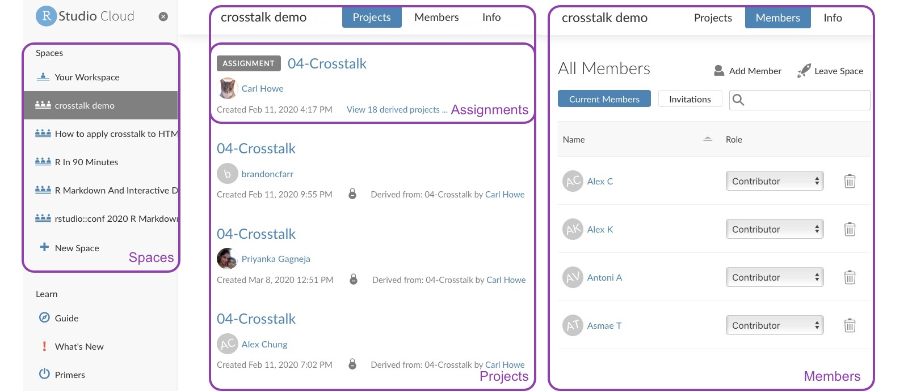

RStudio is proud to announce the general availability of  <a href="https://rstudio.cloud/" target="_blank" rel="noopener noreferrer">RStudio Cloud</a>, its cloud-based platform for doing, teaching, and learning data science using only a browser. This general release incorporates feedback from thousands of users, based on more than 3.5 million hours of compute time.

## What is RStudio Cloud?

RStudio Cloud is a lightweight, cloud-based solution that allows anyone to do, share, teach, and learn data science online. RStudio Cloud makes it easy to:

*   **Analyze your data** using the RStudio IDE, directly from your browser.
*   **Share projects** with your team, class, workshop, or the world.
*   **Teach data science** with R to your students or colleagues.
*   **Learn data science** in an instructor-led environment or with interactive tutorials.

With RStudio Cloud, there's nothing to configure, and no dedicated hardware or installation is required. Individual users, instructors, and students only need a browser. 

We will always offer a free plan for casual use, and we now offer paid premium plans for professionals, instructors, researchers, and organizations as well. Learn more about what plans are <a href="https://rstudio.cloud/plans/free" target="_blank" rel="noopener noreferrer">available here</a>. 

RStudio Cloud is a great platform for both casual and professional data scientists. The ability to share projects makes it easy for researchers from different groups or institutions to collaborate and is useful for any data science team that wants to build and share data science work without having to maintain their own IT infrastructure. With this release, our new premium offerings also give users the option of scaling their environments up to more cores and memory if needed.    

We have many exciting features planned over the coming months. This first release focuses on helping users teach and learn Data Science. These capabilities have been refined through extensive alpha/beta testing by over a thousand academic institutions and other organizations.

<figure>

<figcaption><em>Figure 1: RStudio Cloud Primers help you learn the basics of data science via interactive tutorials. See <a href="https://rstudio.cloud/learn/primers" target="_blank" rel="noopener noreferrer">https://rstudio.cloud/learn/primers</a> for more information.</em></figcaption>
</figure>

RStudio Cloud simplifies the process of teaching R, whether to students or colleagues, by letting the instructor focus on the content, not the infrastructure. Students learn directly from their web browsers, with nothing to install locally, and with no infrastructure for the instructor to maintain.

<figure>

<figcaption><em>Figure 2: Create projects within your personal workspace to teach and share with others.</em></figcaption>
</figure>

As shown in Figure 2, RStudio Cloud is designed from the ground up to make data science teaching easier for instructors and students, including new features such as:

*   **Projects:** The fundamental unit of work on RStudio Cloud, projects encapsulate  R code, packages and data files and provide isolation from other analyses. Projects can be public or private. 
*   **Spaces:** Every RStudio Cloud user gets a personal workspace in which to create projects. You can also create private, shared spaces that function as virtual classrooms for courses and workshops.
*   **Members:** Users who can access a space. Members can be assigned different roles, giving them capabilities appropriate for instructors, TAs and students.
*   **Assignments:** When teaching a class or workshop, projects can be made into assignments. Students can make copies of projects created by the instructor, with the necessary environment automatically replicated. Instructors can peek into student projects and check their progress.

To learn more or sign up for free, visit <a href="https://rstudio.cloud/" target="_blank" rel="noopener noreferrer">RStudio Cloud</a> or check out our recent webinar on <a href="https://rstudio.com/resources/webinars/teaching-r-online-with-rstudio-cloud/" target="_blank" rel="noopener noreferrer">Teaching R Online with RStudio Cloud</a>.

