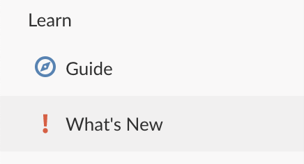

We roll out new features and improvements regularly on RStudio Cloud, typically every week or two. You can always view the list of significant new features on Cloud’s <a href="https://rstudio.cloud/learn/whats-new" target="_blank" rel="noopener noreferrer">What’s New</a> page, which you can access via the left hand navigator in Cloud.

But to go into a bit more detail, we have decided to begin periodic postings here on the RStudio Blog to highlight significant new developments. We hope you find it useful.

Here are the new features we’ve released over the past month or so:

*   Cloud Plus Plan
*   RStudio 1.4
*   Python 3.8
*   Project Memory Gauge

### Cloud Plus Plan

We’ve had lots of users (many of them students) request a plan on Cloud that just lets them use more hours on the service.  Many don’t need all the premium features of our paid plans, but love the convenience of accessing their work from any computer without needing to install any software and want to be able to use Cloud more than the hours included with the Free plan.

We’re happy to announce that a Cloud Plus plan is now available for $5/month. Cloud Plus includes all the features of our Cloud Free plan, plus 50 project hours per month. Any additional project hours are billed at 20¢ per hour (as is the case with all our self-service, paid plans).

If the Cloud Free features meet your needs, but you use more than 15 project hours a month, this is likely the right plan for you. Please visit the Cloud <a href="https://rstudio.cloud/plans/plus" target="_blank" rel="noopener noreferrer">Plans & Pricing</a> page for more details. 

### RStudio 1.4

The latest release of our world class IDE is now available on Cloud. All your new and existing projects on RStudio Cloud will automatically be updated to use this new release.

To learn more about all the great new features and capabilities of RStudio 1.4, please take a look at our blog post <a href="https://blog.rstudio.com/2021/01/19/announcing-rstudio-1-4/" target="_blank" rel="noopener noreferrer">Announcing RStudio 1.4</a>.

### Python 3.8

If you use python on Cloud (for example, via the reticulate package), Cloud has been updated to use python 3.8. This should make it easier to use the latest versions of many python packages on Cloud — and stay tuned for more exciting python developments this year…

### Project Memory Gauge

Every project on RStudio Cloud runs inside its own container and by default is allocated 1GB of RAM. Depending on your subscription, you can increase a project’s allocation up to 8GB.

You can now see how much of your project's allocated memory is currently in use: when you open a project you will find a project memory gauge in the header. This gauge updates roughly every ten seconds.

Note that reclaiming unused memory is controlled by R and the operating system. You may see “uncanny” fluctuations in the gauge as the system manages memory.

## What’s Next?

We don’t like to pre-announce features before they’re available, but the team is busy both improving our underlying systems and developing new features. If there is something you’d love to see improved or added to Cloud, please let us know in the <a href="https://community.rstudio.com/c/rstudio-cloud" target="_blank" rel="noopener noreferrer">RStudio Cloud section</a> of the RStudio Community site.

If you are new to RStudio Cloud and would like to learn more about the platform and various plans available, check out the <a href="https://rstudio.com/products/cloud/" target="_blank" rel="noopener noreferrer">RStudio Cloud product page</a>. 

Thanks!
