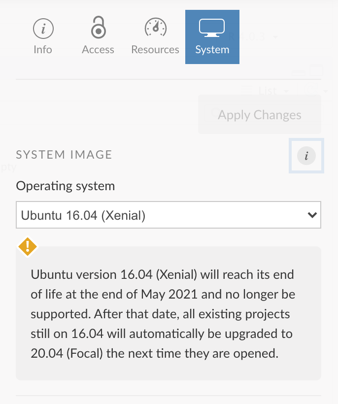
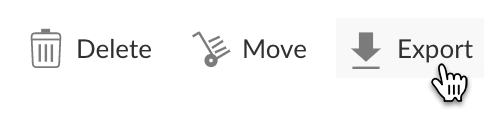
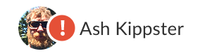

Here are the new features and improvements we’ve rolled out on RStudio Cloud since our last post in <a href="https://www.rstudio.com/blog/rstudio-cloud1/" >February, 2021</a>. Note that you can always see the latest significant new features as they are released on Cloud’s <a href="https://rstudio.cloud/learn/whats-new" target="_blank" rel="noopener noreferrer">What’s New</a> page.

## What’s New

*   Upgraded Operating System
*   Export Project
*   Updated User Panel
*   Account Notifications
*   Additional Usage Data Access
*   Teaching with Cloud Guide
*   Compare Plans page

## Upgraded Operating System

Each RStudio Cloud project is deployed into its own container - we have upgraded the operating system in these containers to Ubuntu 20.04 (Focal) for all new projects. This will ensure that you can use the latest versions of R and python packages with confidence that the underlying operating system has the features they require.

For existing projects, you can choose to upgrade to the updated operating system as well. At the end of May 2021, we will automatically upgrade any project still using the older operating system (Ubuntu 16.04) the next time it is opened.

  How To

To change a project’s OS version, press the  button to open the project settings pane, then click on the System tab.

  

## Export Project

You can export the contents of a project as a .zip file directly from any projects listing. You don’t  need to open the project first in order to create and download the .zip file. This feature lets you easily work on a project locally if you have the RStudio IDE installed on your computer.

  How To

Click the Export action next to the project that you wish to download. After a short while you will be provided with a link to download the project.

  

## Updated User Panel

The user panel has a new look, and now includes some at-a-glance information about your account.

  How To

Click on your icon/name on the right side of the header to open the user panel.

  

## Account Notifications

You will see a notification indicator on your icon/name in the header when we have important information to tell you about your account.

  

  How To

Click your icon/name to view the full message in the user panel.

We will also send notification emails when you reach your project hours limit (Cloud Free plan only) or your included hours for the month (Cloud Plus, Premium or Instructor plans).

## Additional Usage Data Access

In addition to viewing usage data by calendar month, you can now view usage data by account usage period. This option is available for all accounts/spaces you own.

You can now also see your usage data for Your Workspace.

  How To

Navigate to Your Workspace and press the  in the header.

## Teaching with Cloud Guide

For those of you using Cloud to help with your teaching, we’ve added a <a href="https://rstudio.cloud/learn/guide#course-spaces" target="_blank" rel="noopener noreferrer">Teaching with Cloud</a> section to the <a href="https://rstudio.cloud/learn/guide" target="_blank" rel="noopener noreferrer">Guide</a> to help you get started. It lays out the typical steps to take to use Cloud with your students - and covers questions that are frequently asked by educators.

## Compare Plans Page

To make it easier to understand how our plans measure up against one another, we’ve added a <a href="https://rstudio.cloud/plans/compare" target="_blank" rel="noopener noreferrer">Compare Plans</a> page that lists all our plans, their features and pricing options, in a single table.

## What’s Next

We don’t like to pre-announce features before they’re available, but the team is busy both improving our underlying systems and developing new features. If there is something you’d love to see improved or added to Cloud, please let us know in the <a href="https://community.rstudio.com/c/rstudio-cloud" target="_blank" rel="noopener noreferrer">RStudio Cloud section</a> of the RStudio Community site.

If you are new to RStudio Cloud and would like to learn more about the platform and various plans available, check out the <a href="/products/cloud/">RStudio Cloud product page</a>.

Thanks!
