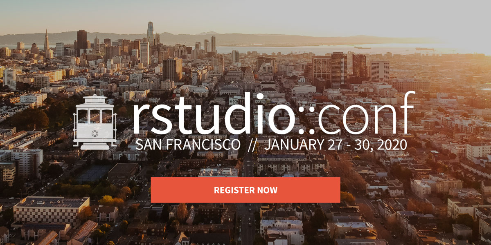

[rstudio::conf](https://cvent.me/1DdKa?RefId=dev-blog&utm_source=DevBlog&utm_medium=Site&utm_campaign=Site%20Promo), the conference for all things R and RStudio, will take place January 29 and 30, 2020 in San Francisco, California. It will be preceded by Training Days on January 27 and 28. Early Bird registration is now open!

## Conference: Wednesday-Thursday, Jan 29-30

Join me, your host and Chief Scientist of RStudio, for our keynote speakers:

* [Hilary Parker](https://hilaryparker.com/about-hilary-parker/) (Stitch Fix) and 
  [Roger Peng](http://www.biostat.jhsph.edu/~rpeng/) (Johns Hopkins)

* [Martin Wattenberg](http://www.bewitched.com/about.html) and
  [Fernanda Viegas](http://www.fernandaviegas.com) (Research Scientists, Google).
  
* [Jenny Bryan](https://jennybryan.org) (Engineer, RStudio).

* [JJ Allaire](https://github.com/jjallaire) (CEO, RStudio).

Along with 80 other talks in four parallel tracks. 

As well as RStudio data scientists and engineers, you'll also hear from and interact with outstanding speakers drawn from the wider R and data science communities. Stay tuned for announcements about our invited speakers, and our call for contributed talks.

Check out our [videos from the last conference](https://resources.rstudio.com/rstudio-conf-2019) to get a sense of the depth and breadth of the typical content.

## Training days: Monday-Tuesday, Jan 27-28

Preceding the conference on Monday and Tuesday, January 27-28, RStudio will offer two days of optional in-person training. This year, we've expanded our training program to include 19 workshops taught by experts throughout the R community. These workshops span 3 categories of learning:

* Introductory: Workshops that require minimal or no R experience
* Intermediate/Advanced: Workshops that expand your existing R knowledge and focus on a specialized area of R
* Professional Development: Workshops focusing on professional skills that complement your R knowledge.

Your workshop choices this year include:

| **6 Introductory Workshops**  | **Instructor(s)** |
|:------------- |:-------------|
| Designing The Data Science Classroom | [Mine Cetinkaya-Rundel](https://www2.stat.duke.edu/~mc301/) |
| Introduction to Machine Learning with the Tidyverse | [Alison Hill](https://alison.rbind.io) & [Garrett Grolemund](https://www.linkedin.com/in/garrett-grolemund-49328411/) |
| Communicating with R Markdown and Interactive Dashboards | [Carl Howe](http://carlhowe.com) & [Yihui Xie](https://yihui.name/en/vitae/) |
| R for Excel Users | [Julia Lowndes](https://jules32.github.io/) & [Allison Horst]( https://www.bren.ucsb.edu/people/Faculty/allison_horst.htm) |
| Shiny From Start To Finish | Danny Kaplan |
| Introduction to Data Science in the Tidyverse | [Amelia McNamara](http://www.amelia.mn) & [Hadley Wickham](http://hadley.nz) |

| **11 Intermediate and Advanced Workshops**  | **Instructor(s)** |
|:------------- |:-------------|
| Text Mining with Tidy Data Principles | [Julia Silge](https://juliasilge.com/about/) |
| Modern Geospatial Data Analysis with R | [Zev Ross](http://zevross.com/information/about-zevross/) |
| Data Visualization with R | Kieran Healy |
| Time Series and Forecasting in R | [Rob Hyndman](https://robjhyndman.com) |
| My Organization's First R Package | Rich Iannone & Malcolm Barrett |
| Applied Machine Learning | Max Kuhn |
| Building Tidy Tools | Charlotte Wickham & [Hadley Wickham](http://hadley.nz) |
| What They Forgot to Teach You About R | Kara Woo, Jenny Bryan, & Jim Hester |
| Big Data with R | Edgar Ruiz |
| JavaScript for Shiny Users | [Garrick Aden-Buie](https://www.garrickadenbuie.com/) |
| Deep Learning with Keras and TensorFlow in R | [Bradley Boehmke](http://bradleyboehmke.github.io) |

| **2 Workshops for Partners, Professionals and Administrators**  | **Instructor** |
|:------------- |:-------------|
| RStudio Professional Products administration | Andrie de Vries |
| Instructor Training | [Greg Wilson](http://third-bit.com/cv/) |

While we've expanded the number of workshop attendees we can accommodate by nearly 50% in 2020, RStudio::conf workshops are very popular and do sell out quickly. We urge attendees who would like to attend workshops to register well in advance of the conference registration deadline.

## Who should go?

[rstudio::conf](https://cvent.me/1DdKa?RefId=dev-blog&utm_source=DevBlog&utm_medium=Site&utm_campaign=Site%20Promo) is for RStudio users, R administrators, and RStudio partners who want to learn how to write better Shiny applications, explore all the capabilities of R Markdown, work effectively with Spark or TensorFlow, build predictive models, understand the tidyverse of tools for data science, build tidy tools themselves, discover production-ready development & deployment practices, earn certification as a trainer for Shiny or the Tidyverse, or become a certified administrator of RStudio professional products.

## Why do people go to rstudio::conf?

Because there is simply no better way to learn about all things R & RStudio.

> After #rstudioconf, I shut my laptop for four days to decompress, marinate
> and spend some time with family. It's back to work tomorrow and I couldn't 
> be more excited to start coding again and *this feeling* is why I love the
> R community so much.
> --- [Caitlyn Hudon](https://twitter.com/beeonaposy/status/1087914863194710016)

> Thing I learned at #Rstudioconf that sticks out to me the most: it turns out 
> that this group of people who are so kind and welcoming online are also kind 
> and welcoming in real life. More than any library or api that’s what makes 
> #rstats great.
> --- [Nick Strayer](https://twitter.com/NicholasStrayer/status/1086681100787822592)

> [Wrote a little post](https://drmowinckels.io/blog/why-rstudio-conf-is-the-best-conference-experience-i-have-had/) 
> on why #rstudioconf is the best conference experience i have had. No kidding. 
> I am on a high! 
> --- [Athanasia Mowinckel](https://twitter.com/DrMowinckels/status/1086469524772306945)

## What should I do now?

Be an early bird! Attendance is limited. All seats are are available on a first-come, first-serve basis. Early Bird registration discounts are available (Conference only) and a capped number of Academic discounts are also available for eligible students and faculty. 

Stay tuned for information about diversity scholarships which will be announced mid August.

If all tickets available for a particular workshop are sold out before you are able to purchase, we apologize in advance!

<a href="https://cvent.me/1DdKa?RefId=dev-blog&utm_source=DevBlog&utm_medium=Site&utm_campaign=Site%20Promo" button type="button"  style= "padding: 12px 20px; border: none; font-size: 18px; border-radius: 3px; cursor: pointer; background-color: #4c83b6; color: #fff; box-shadow: 0, 1px, 3px, 0px, rgba(0,0,0,0.10);">Register now!</a>

If you have any questions or issues registering, please email <conf@rstudio.com>
.

