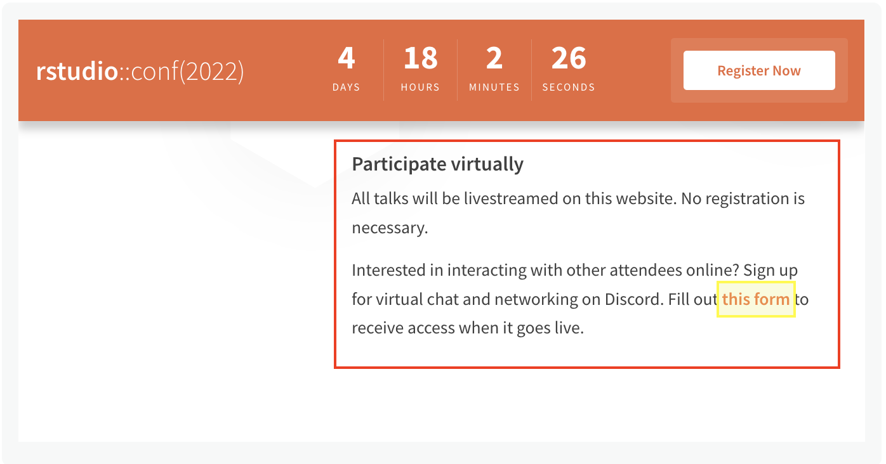

While we hope to see you in person at rstudio::conf(2022), we want to include as many of you as possible, so we invite you to join us virtually!

* **Live streaming:** Keynotes and talks will be livestreamed on the <a href="https://www.rstudio.com/conference/" target = "_blank">rstudio::conf website</a>, free and open to all. No registration is required.
* **Virtual networking on Discord:** Sign up to access the conference Discord server so you can chat with other attendees, participate in fun community events, and keep up with announcements. This is open to both in-person and virtual attendees.
    * A lot of RStudio folks are attending conf virtually. Come hang out!
    * Need help? Ask questions on the #🧐-discord-help-and-how-to channel.
    * <a href="https://www.rstudio.com/conference/" target = "_blank">Sign up for Discord server access!</a> The sign-up form is under the "Participate virtually" heading.

<i><caption>Discord Sign Up Form Location</caption></i>

* **Social media:** Follow our social media accounts and use the hashtags #RStudioConf and #RStudioConf2022 to share and engage with others!
  * <a href="https://twitter.com/rstudio" target = "_blank">RStudio Twitter</a>
  * <a href="https://twitter.com/rstudio_glimpse" target = "_blank">RStudio Glimpse Twitter</a> 
  * <a href="https://www.linkedin.com/company/rstudio-pbc/" target = "_blank">RStudio LinkedIn</a>
  * <a href="https://www.instagram.com/rstudio_pbc/?hl=en" target = "_blank">RStudio Instagram</a>
  * <a href="https://www.tiktok.com/t/ZTRBRBpvg/" target = "_blank">RStudio TikTok</a>
  
## Plan your virtual experience

* Go to the <a href="https://www.rstudio.com/conference/2022/schedule/" target = "_blank">Schedule page</a> and add talks to your calendar.
* On July 27-28th, head to the <a href="https://www.rstudio.com/conference/" target = "_blank">conference website</a> to watch the livestreams and ask questions alongside other attendees.
* <a href="https://www.rstudio.com/conference/" target = "_blank">Join the Discord server</a> to chat, network, and share with others attendees at conf.
* Follow our activity on social media.
* Use the hashtags #RStudioConf and #RStudioConf2022 to be part of the party online. Post photos, quotations, thoughts, or questions!

Recordings of the keynotes and talks will be available on the RStudio website in a few weeks.

We can’t wait to see you there!
