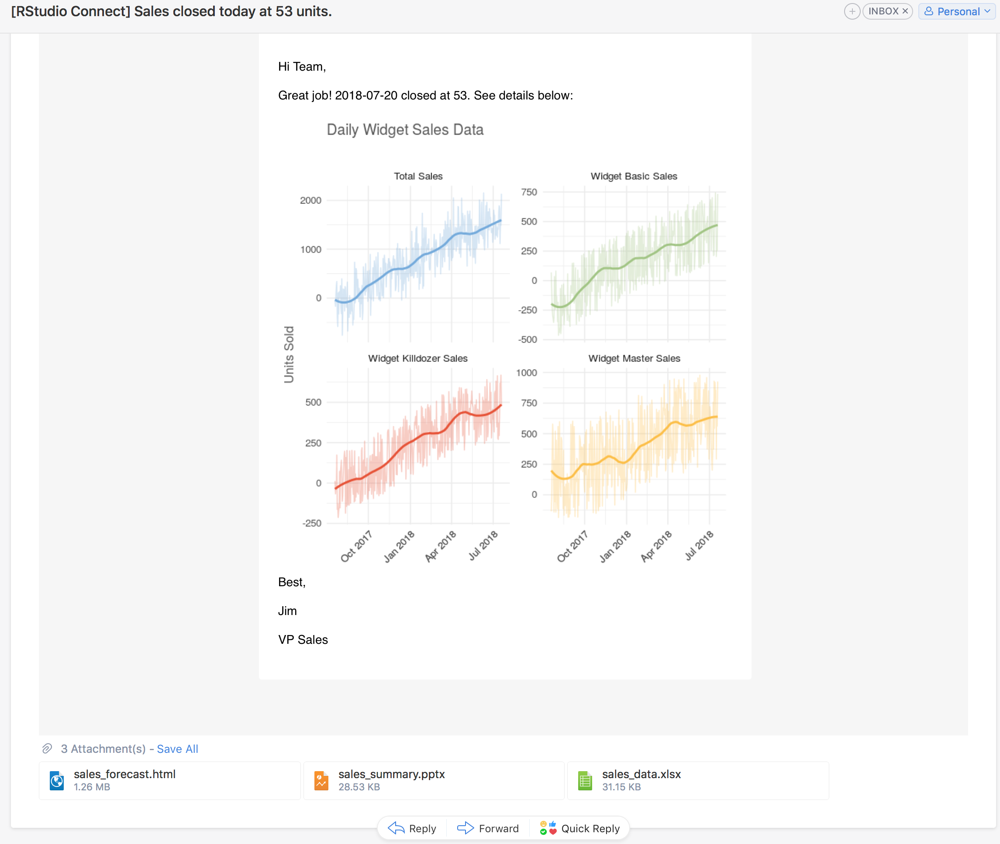

We are excited to announce RStudio Connect 1.6.6! This release caps a series of improvements to RStudio Connect’s ability to deliver your work to others.



## Custom Email 

The most significant change in RStudio Connect 1.6.6 is the new ability for publishers to customize the emails sent to others when they update their data products.  In RStudio Connect, it is already possible to schedule the execution of R Markdown documents and send emails to subscribers notifying them of new versions of content. **In this release, publishers can customize whether or not an email is sent, add email attachments, specify the email subject line, and dynamically build beautiful email messages with plots and tables produced by your analysis.**

```r
````{{r}}
email <- blastula::compose_email(
  body = "
     Hello Team,
     Great job! We closed {today()} at {final_sales}.
     {add_ggplot(p, width = 6, height = 6)}
     - Jim
  "
)

if (sales > 10000) {
  rmarkdown::output_metadata$set(
    rsc_email_subject = glue('Sales at {final_sales} for {today()}'),
    rsc_email_body_html = email$html_str,
    rsc_email_images = email$images,
    rsc_email_attachments = c('sales_summary.pptx', 'sales_data.xlsx')
  )
} else {
   rmarkdown::output_metadata$set(rsc_email_suppress_scheduled = TRUE)
}
````
```
All customizations are done using code in the underlying R Markdown document. The embedded code provides complete control over the email, but does not impact the result of the rendered report. For example, a report about sales numbers could be set up to only email end users if a critical threshold is reached.

Full examples are available in the RStudio Connect [user guide](http://docs.rstudio.com/connect/1.6.6/user/r-markdown.html#r-markdown-email-body).

## Other Updates

- **Historical Reports**  RStudio Connect currently allows users to view previously rendered reports. In RStudio Connect 1.6.6, when users are viewing a report with a history, they can open and share a link directly to the historical versions, or send an email including the historic content.

- **Instrumentation** RStudio Connect 1.6.6 will track usage events and record information such as who uses the content, what content was used, and when content was viewed. We don't provide access to this data yet, but in future releases, this information will be accessible to publishers to help answer questions like, “How many users viewed my application this month?”.

- The `usermanager alter` command can now be used to manage whether a user is locked or unlocked. See the admin guide for details and other updates to the `usermanager` command. 

- **User Listing in the Connect Server API**  The public Connect Server API now includes an endpoint to list user information. See the [user guide](http://docs.rstudio.com/connect/1.6.6/user/cookbook.html#use-offset-pagination) for details.

## Security & Authentication Changes

- **Removing the “Anyone” Option** New [configuration options](http://docs.rstudio.com/connect/1.6.6/admin/content-management.html#limiting-allowed-viewership) can be used to limit how widely publishers are allowed to distribute their content. 

- **The People Tab** In certain scenarios, it is undesirable for RStudio Connect viewers to be able to see the profiles of other RStudio Connect users. The `Applications.UsersListingMinRole` setting can now be used to prevent certain roles from seeing other profiles on the People tab. Users limited in this way will still see other user profiles in the content settings panel, but only for content they can access.

- **LDAP / Active Directory Changes** RStudio Connect no longer relies on the distinguished name (DN) of a user. Existing installations will continue working, but administrators should use the new `LDAP.UniqueIdAttribute` to tell RStudio Connect which [LDAP attribute identifies users](http://docs.rstudio.com/connect/1.6.6/admin/authentication.html#unique-id-attribute).

- A new `HTTP.ForceSecure` option is available, which sets the `Secure` flag on RStudio Connect browser cookies. This setting adds support for the `Secure` flag when RStudio Connect is used behind an HTTPS-terminating proxy.  See the existing `HTTPS.Permanent` setting if you plan to use RStudio Connect to terminate HTTPS.

## Deprecations & Breaking Changes

- **Breaking Change** In RStudio Connect 1.6.6, the `--force` flag in the `usermanager alter` command has been changed to `--force-demoting`.

- **Breaking Change** All URLs referring to users and groups now use generated IDs in place of IDs that may have contained identifying information. Existing bookmarks to specific user or group pages may need to be updated, and pending account confirmation emails will need to be resent.

- `Applications.EnvironmentBlacklist` is deprecated in favor of `Applications.ProhibitedEnvironment`, and `LDAP.WhitelistedLoginGroups` is deprecated in favor of `LDAP.PermittedLoginGroups`. Both settings will be removed in the next release.

Please review the full [release notes](http://docs.rstudio.com/connect/1.6.6/news/).

> #### Upgrade Planning 
> If you use LDAP or Active Directory, please take note
> of the LDAP changes described above and in the [release notes](http://docs.rstudio.com/connect/1.6.6/news/). Aside from the
> deprecations above, there are no other special considerations, and upgrading
> should take less than 5 minutes. If you’re upgrading from a release older
> than v1.6.4, be sure to consider the “Upgrade Planning” notes from the
> intervening releases, as well.

If you haven't yet had a chance to download and try [RStudio Connect](https://rstudio.com/products/connect/), we encourage you to do so. RStudio Connect is the best way to share all the work that you do in R (Shiny apps, R Markdown documents, plots, dashboards, Plumber APIs, etc.) with collaborators, colleagues, or customers.

You can find more details or download a 45-day evaluation of the product at [https://www.rstudio.com/products/connect/](https://www.rstudio.com/products/connect/). Additional resources can be found below.
 
 - [RStudio Connect home page & downloads](https://www.rstudio.com/products/connect/)
 - [RStudio Connect Admin Guide](http://docs.rstudio.com/connect/admin/)
 - [What IT needs to know about RStudio Connect](https://www.rstudio.com/wp-content/uploads/2016/01/RSC-IT-Q-and-A.pdf)
 - [Detailed news and changes between each version](http://docs.rstudio.com/connect/news/)
 - [Pricing](https://www.rstudio.com/pricing/#ConnectPricing)
 - [An online preview of RStudio Connect](https://beta.rstudioconnect.com/connect/)


