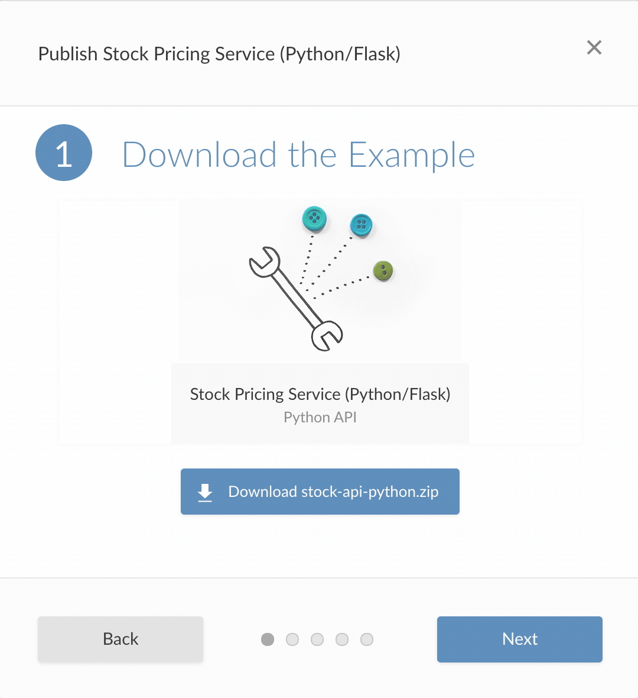

## A big update for our Python community

One of the biggest frustrations for a data scientist, whether your primary language is R or Python, is to have your hard work go underutilized. A stream of disposable reports, emails, and presentations that get viewed once and cast aside are not the ideal recipe for how to make an impact. To combat this, we have seen data scientists create more interactive content (such as applications, APIs, and dashboards) to engage the divided attention of stakeholders. Unfortunately, delivering interactivity often comes at the cost of learning far more about IT and infrastructure than perhaps you had planned. 

At RStudio, we believe data scientists shouldn’t have to become experts in DevOps just to share their work with the rest of their organization. RStudio Connect was created to handle the burden of deployment and provide a single platform for all the content your team produces in R and Python. Today we are excited to announce RStudio Connect 1.8.2, with new options for data scientists who use Python to share and communicate; including support for Python APIs (with Flask) and beta support for interactive Python applications with Dash.

<h3 align="center"><a href="https://rstudio.chilipiper.com/book/schedule-time-with-rstudio">Schedule a demo of RStudio Connect</a></h3>

## Flask API Deployment

RStudio Connect 1.8.2 introduces support for Python API deployment, including applications built with Flask and other WSGI-compatible frameworks. This functionality lets data science teams make models developed in Python available as REST APIs. Once deployed, an RStudio Connect publisher can give other teams or services access to the API, securely delivering data science insights across their organization.

RStudio Connect automatically integrates with several Flask extension packages like `Flask-RESTX`, `Flask-API`, and `Flasgger` to provide web-accessible documentation or an API console interface. Examples for each of these extensions can be found in the [User Guide](https://docs.rstudio.com/connect/user/flask/#examples).

Publishing a Python API to RStudio Connect requires the [`rsconnect-python`](https://pypi.org/project/rsconnect-python/) package. This package is available to install with pip from PyPi and enables a command-line interface that can be used to publish from any Python IDE including PyCharm, VS Code, JupyterLab, Spyder, and others. 

Developers with RStudio Connect publisher accounts can follow along with the new Python API Jump Start Example to learn the basic deployment workflow:

Additional getting started information and examples can be found in the [User Guide](https://docs.rstudio.com/connect/user/flask/).

<h3 align="center"><a href="https://rstudio.com/products/connect/evaluation/">Download RStudio Connect 1.8.2</a></h3>

## Beta Support for Dash Applications

Dash applications provide an easy way for Python users to create interactive applications and dashboards that help decision makers engage with their work.

Python users can develop Dash applications in the IDE of their choosing. Publishing an application to RStudio Connect is supported using the [`rsconnect-python`](https://pypi.org/project/rsconnect-python/) package. Refer to the [User Guide](https://docs.rstudio.com/connect/user/dash/) for details.

Once deployed to RStudio Connect, publishers can control access to their application, add viewers or collaborators, and adjust runtime settings to maximize performance or scale to meet audience demand.

This is a Dash application hosted on RStudio Connect that shows availability predictions for Washington DC’s docked bike-share stations. To see more examples like this, visit our [Solutions Engineering](https://solutions.rstudio.com/python/overview/) website.

**What does "Beta" Mean?** _Dash support is a beta feature which is still undergoing final testing before its official release. Should you encounter any bugs, glitches, lack of functionality or other problems, please let us know so we can improve before public release._

<h3 align="center">Learn how data science teams use RStudio products <a href="https://rstudio.com/solutions/r-and-python/">Visit R & Python - A Love Story</a></h3>

## New & Notable

- For **Publishers**, 1.8.2 makes it easy to share filtered content lists:

Easily share links to custom views of the content dashboard page, such as specific tags or search results. 

- For **Administrators and Publishers**, this release includes new default runtime settings that allow APIs and applications to scale more efficiently.

- The User and Admin Guide documentation sites have been updated:
    - Visit the [Admin Guide](https://docs.rstudio.com/connect/admin/)
    - Visit the [User Guide](https://docs.rstudio.com/connect/user/)

## Security, Deprecations & Breaking Changes

- **Security** Enforce locked user restrictions for active browser sessions.

- **Breaking Change** The `Postgres.URL` database connection URL no longer supports the `{$}` password placeholder. The `Postgres.URL` automatically uses the `Postgres.Password` value without a placeholder.

- **Breaking Change** The `Postgres.InstrumentationURL` database connection URL no longer supports the `{$}` password placeholder. `The Postgres.InstrumentationURL` automatically uses the `Postgres.InstrumentationPassword` value without a placeholder.

- **Breaking Change** Due to breaking changes to the `virtualenv` package, Python installations must have a version of `virtualenv` below 20, e.g.: `virtualenv<20`. The version of `setuptools` must be 40.8 or higher. Incompatible versions will result in an error at startup. 

- **Deprecation** The settings `SAML.IdPSigningCertificate` and `SAML.SPEncryptionCertificate` would previously accept the contents of a certificate as a long Base64 inline value. This option is no longer supported and a warning will be issued during startup if used. Now, these settings only support a path to a PEM certificate file.

- **Deprecation** The setting `SAML.IdPMetaData` has been deprecated. If this setting is currently used, a configuration migration will take place to transfer its value to either `SAML.IdPMetaDataURL` or `SAML.IdPMetaDataPath`. The deprecated metadata setting will be removed in a future release. The configuration migration for SAML settings is an automatic process that does not require immediate intervention but that will need a single manual step to be completed.

Please review the full version of the release notes available [here](http://docs.rstudio.com/connect/news).

> #### Upgrade Planning
> Due to breaking changes to the `virtualenv` package, Python installations must have a version of `virtualenv` below 20, e.g.: `virtualenv<20`. The version of `setuptools` must be 40.8 or higher. Incompatible versions will result in an error at startup. Review the [documentation](https://docs.rstudio.com/rsc/integration/python/) for more details. If you are upgrading from an earlier version, be sure to consult the release notes for the intermediate releases, as well.

<h3 align="center"><a href="https://rstudio.com/products/connect/">Click through to learn more about RStudio Connect</a></h3>

