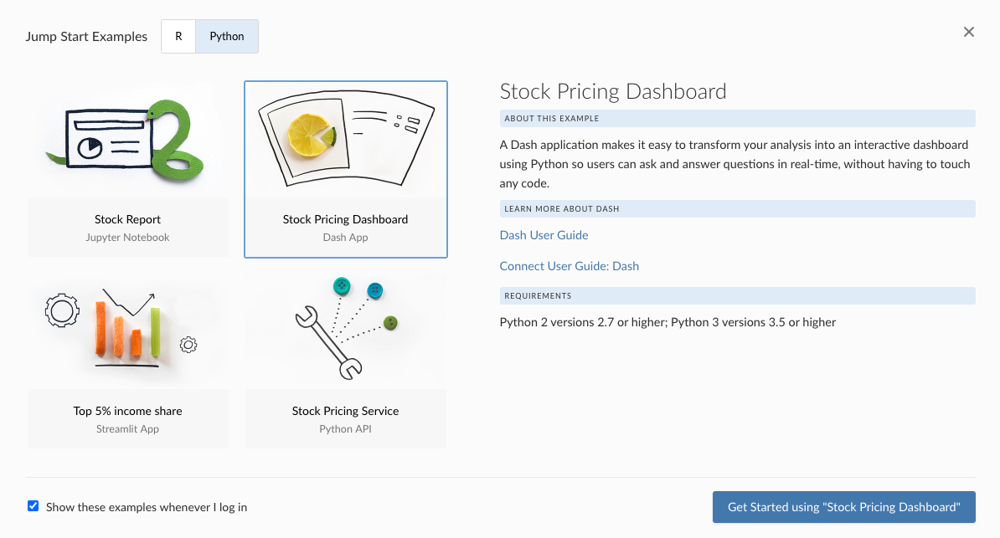
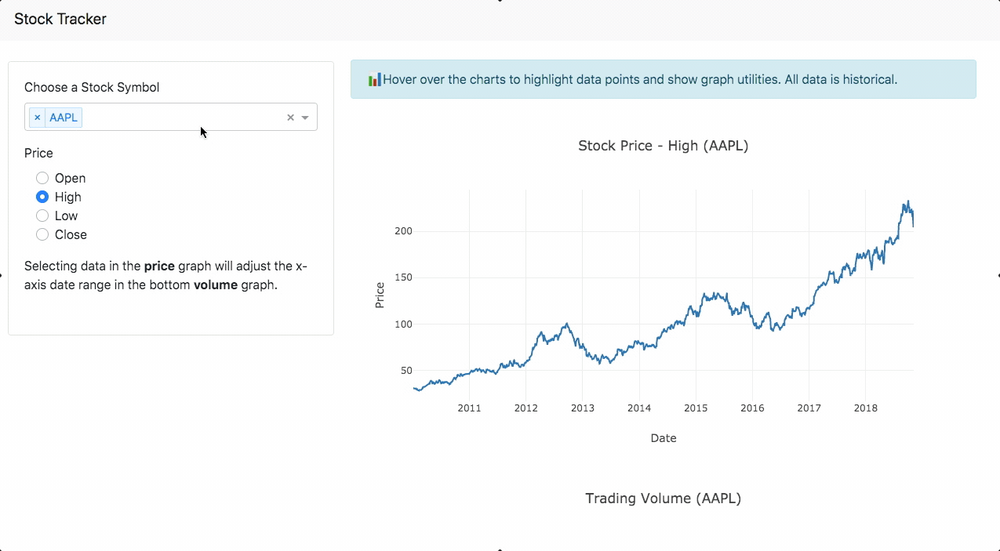
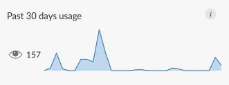

## A place for Python applications

For data science teams looking to promote data-driven decision making within an organization, interactive applications built in R and Python are often the gold standard. These interactive tools, built by data science teams, are powerful when put in the hands of the right people, but they don’t do much good at all if they only run locally. R users who build Shiny applications hit this roadblock, and so do Python users working with tools like Dash, Bokeh, and Streamlit. IT departments want to help but often aren't sure how. RStudio Connect solves this problem, for both R and Python applications.

RStudio Connect 1.8.4 focuses on helping Python users by including support for a full suite of interactive application types. Support for publishing Dash applications is now generally available, and this release introduces new Beta offerings for <a href="https://bokeh.org/" target="_blank">Bokeh</a> and <a href="https://www.streamlit.io/" target="_blank">Streamlit</a> application deployment.

<h3 align="center"><a href="https://rstudio.chilipiper.com/book/rsc-demo">See RStudio Connect in Action</a></h3>

## Interactive Python Applications

### Get started with the RStudio Connect Jump Start

For a hands-on approach to learning about Python content in RStudio Connect, try exploring the Jump Start Examples. This resource contains lightweight data science project examples built with various R and Python frameworks. The Jump Start Examples appear in the RStudio Connect dashboard when you first log in. You can download each project, run it locally, and follow the provided instructions to publish it back to the RStudio Connect server; or you could simply browse the examples and deployment steps to get a sense for how you might publish your own project.



### Develop and deploy Python applications from your favorite Python IDE

New users often ask, _Do I have to develop Python applications in the RStudio IDE in order to publish them in RStudio Connect?_ The answer is no! You do not need to touch the RStudio IDE for Python content development or publishing. 

Publishing Python applications to RStudio Connect requires the <a href="https://pypi.org/project/rsconnect-python/" target="_blank">`rsconnect-python`</a> package. This package is available to install with pip from PyPI and enables a command-line interface that can be used to publish from any Python IDE including PyCharm, VS Code, JupyterLab, Spyder, and others.

Once you have the `rsconnect-python` package, the only additional information you need to supply is the RStudio Connect server address and a [publisher API key](https://docs.rstudio.com/connect/user/api-keys/).  

The application shown here is the Stock Pricing Dashboard built with Dash and available for download from the Jump Start Examples available in RStudio Connect. The example comes packaged with everything needed to run it locally in the Python IDE of your choice. When you’re ready to try publishing, the Jump Start will guide you through that process, including all the required commands from `rsconnect-python`. 



### Streamlit and Bokeh Applications

Data scientists who develop Streamlit or Bokeh applications can also use the <a href="https://pypi.org/project/rsconnect-python/" target="_blank">`rsconnect-python`</a> package to publish to RStudio Connect. If you've previously used the `rsconnect-python` package for other types of Python content deployment, make sure you upgrade to the latest version before attempting to use the Beta features with RStudio Connect 1.8.4. 

This release ships with a example for Streamlit, located in the Jump Start Examples Python tab. For Bokeh, we recommend starting with examples from the <a href="https://docs.bokeh.org/en/latest/docs/gallery.html#server-app-examples" target="_blank">Bokeh App Gallery</a>. Source code for the Bokeh gallery applications is available from the <a href="https://github.com/bokeh/bokeh/tree/master/examples/app/" target="_blank">Bokeh GitHub repository</a>. 

Visit the User Guide to learn more about our beta support for Streamlit and Bokeh:

- Learn more about [deploying Streamlit applications](https://docs.rstudio.com/connect/user/streamlit/)
- Learn more about [deploying Bokeh applications](https://docs.rstudio.com/connect/user/bokeh/)

**What does "Beta" Mean?** _Bokeh and Streamlit app deployment are beta features. This means they are still undergoing final testing before official release. Should you encounter any bugs, glitches, lack of functionality or other problems, please let us know so we can improve before public release._

<h3 align="center">Learn how data science teams use RStudio products<br/><a href="https://rstudio.com/solutions/r-and-python/">Visit R & Python - A Love Story</a></h3>

## New & Notable

### Scheduling Across Time Zones
A new time zone option for scheduled reports can be used to prevent schedules from breaking during daylight savings time changes. Publishers can now configure a report to run in a specific time zone by modifying the settings available in the [Schedule panel](https://docs.rstudio.com/connect/user/scheduling/).

### Content Usage Tracking
In previous versions of RStudio Connect, content usage was only available for static and rendered content, as well as Shiny applications. With this release, Python content and Plumber API usage data is available via the [Instrumentation API](https://docs.rstudio.com/connect/api/#instrumentation). Learn more about tracking content usage on RStudio Connect in the [Server API Cookbook](https://docs.rstudio.com/connect/cookbook/user-activity/). 



## Authentication Changes

### OpenID Connect
RStudio Connect 1.8.4 introduces OpenID Connect as an authentication provider for single sign-on (SSO). This new functionality is built on top of the existing support for OAuth2, which was previously limited to Google authentication. For backwards compatibility, Google is the default configuration, so no action is necessary for existing installations. See the [OAuth2](https://docs.rstudio.com/connect/admin/authentication/oauth2/) section of the Admin Guide for details.

### Automatic User Role Mapping
RStudio Connect now supports assigning user roles from authentication systems that support remote groups. Roles can be assigned in a custom attribute or automatically mapped from an attribute or group name. See [Automatic User Role Mapping](https://docs.rstudio.com/connect/admin/user-management/#user-role-mapping) for more details.

### Custom Login & Logout for Proxied Authentication
Proxied authentication now supports more customizable login and logout flows with the settings ProxyAuth.LoginURL and ProxyAuth.LogoutURL. See the [Proxied Authentication](https://docs.rstudio.com/connect/admin/authentication/proxied/) section of the Admin Guide for details.

<h3 align="center"><a href="https://rstudio.com/products/connect/evaluation/">Try the free 45 day evaluation of RStudio Connect 1.8.4</a></h3>

## Deprecations & Breaking Changes

- **Breaking Change** SSLv3 is no longer supported, since it is considered cryptographically broken.
- **Deprecation** The setting `Python.LibraryCheckIsFatal` has been deprecated. Python library version checks are now non-fatal and result in a warning in the RStudio Connect log at startup.

Please review the [full release notes](http://docs.rstudio.com/connect/news).

> #### Upgrade Planning
> For RStudio Connect installations that make use of Python, note that the latest version of the virtualenv package (version 20) is now supported. This is a reversal of the previous RStudio Connect 1.8.2 requirement on virtualenv. 
> This release also provides support for Ubuntu 20.04 LTS.

To perform an upgrade, download and run the installation script. The script installs a new version of RStudio Connect on top of the earlier one, and existing configuration settings are respected.

```
# Download the installation script
curl -Lo rsc-installer.sh https://cdn.rstudio.com/connect/installer/installer-v1.1.0.sh

# Run the installation script
sudo bash ./rsc-installer.sh 1.8.4-11
```

<h3 align="center"><a href="https://rstudio.com/products/connect/">Click through to learn more about RStudio Connect</a></h3>

