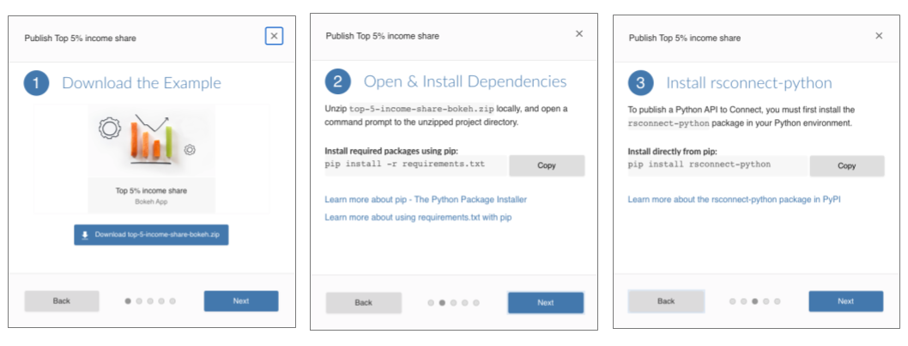

## Bokeh and Streamlit support is now generally available

We are happy to announce that the newest interactive Python content types, Bokeh and Streamlit, are now generally available in RStudio Connect.

**Thank You!** to everyone who reached out to provide feedback on Bokeh and Streamlit during the Beta period. 

The RStudio Connect User Guide contains information about our support for Bokeh and Streamlit, including detailed deployment instructions, example applications, and known limitations/compatibility requirements for each framework:

- [RStudio Connect User Guide for Bokeh](https://docs.rstudio.com/connect/1.8.6/user/bokeh/)
- [RStudio Connect User Guide for Streamlit](https://docs.rstudio.com/connect/1.8.6/user/streamlit/)

<h3 align="center"><a href="https://rstudio.chilipiper.com/book/rsc-demo">Request a demo of Python in RStudio Connect</a></h3>

For a hands-on approach to learning about Python content in RStudio Connect, try exploring the Jump Start examples. The Jump Start examples now contain tutorials for Bokeh and Streamlit application publishing under the Python tab.

<h3 align="center"><a href="https://rstudio.com/solutions/r-and-python/">Learn how data science teams use RStudio for R and Python</a></h3>

> #### RStudio Connect 1.8.6
> - Return to the general announcement post to learn about more features and [updates here](https://blog.rstudio.com/2020/12/16/rstudio-connect-1-8-6/).
> - For upgrade planning notes, continue reading [more here](https://blog.rstudio.com/2020/12/16/rstudio-connect-1-8-6-admin-digest/).
