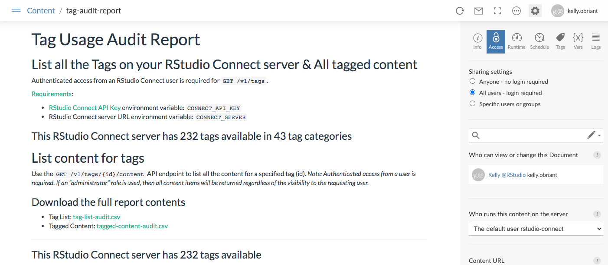

## Audit Server Content with the RStudio Connect API

In 1.8.6, RStudio Connect administrators have the ability to create reports that track and manage the content on their servers. If you’ve ever wanted the answers to questions like: 

- How do I produce a list of all the content we have published to RStudio Connect?
- Which applications can be accessed by which people and which groups?
- Which versions of R and Python are actually being used, and by which publishers?
- How much unpublished content is on the server, and can it be removed?
- Which vanity URLs do we have in use across the server, and how do I list them out?

You’re not alone. We’ve had a flood of requests for making the APIs for accessing this information publicly available. Using an API key and the content enumeration endpoint, RStudio Connect administrators can now build custom reports to answer all these questions and more. 

**Visit the RStudio Connect [Server API Showcase](https://solutions.rstudio.com/examples/rsc-server-api-overview/) for access to code examples and template reports that can be deployed straight to Connect.** 

### Content Enumeration API

Retrieve detailed information about the content that is available on your Connect instance using the `GET /v1/content/ ` endpoint. Administrators can retrieve all content items regardless of visibility and permissions.

- **Get the code for a [Basic Server Content Audit Report](https://solutions.rstudio.com/examples/rsc-apis/basic-audit-report)** 

Read more about content enumeration in the [RStudio Connect API Cookbook](https://docs.rstudio.com/connect/1.8.6/cookbook/content/#content-listing).
 
### Content Permissions API

This set of endpoints will let you manage the user permissions associated with a content item:

- List the permissions for a specified content item with `GET /v1/content/{guid}/permissions`
- Grant access to a user or group for a content item with `POST /v1/content/{guid}/permissions`

These permissions are used when the content item's `access_type` is `acl` (Access Control List).

- **Get the code for a [Content Access Settings Audit Report](https://solutions.rstudio.com/examples/rsc-apis/acl-audit-report)** 

Read more about managing content access in the [RStudio Connect API Cookbook](https://docs.rstudio.com/connect/1.8.6/cookbook/sharing).

### Vanity Auditing and Management APIs

All RStudio Connect content receives a URL that includes its numerical ID at the time of deployment. Administrators and publishers (if allowed) can create “vanity paths” for content which make the content available at an additional, customized URL.

`GET /v1/vanities` can be used to list all defined vanity URLs on a server. You must have an API key with administrator privileges to call this endpoint. 

- **Get the code for a [Vanity URL Audit Report](https://solutions.rstudio.com/examples/rsc-apis/vanity-audit-report)** 

In addition to auditing vanity URLs, there are also API methods for setting and deleting vanities on individual content items:

- Use `GET /v1/content/{guid}/vanity` to get the vanity URL, if any, for a single content item.
- Use `PUT /v1/content/{guid}/vanity` to set the vanity URL for a content item.
- Use `DELETE /v1/content/{guid}/vanity` to remove the vanity URL for a content item and revert to using its numerical ID for URL construction.

If `Authorization.PublishersCanManageVanities` is enabled, publishers can set and delete the vanity URL for content items that they have permission to change. Otherwise, administrator permissions are required.

Read more about content organization and vanity URL management in the [RStudio Connect API Cookbook](https://docs.rstudio.com/connect/1.8.6/cookbook/organizing/#vanities).

### Tag Auditing and Management APIs

Tags are the primary content organization concept available in RStudio Connect. Tags and content items have a many-to-many relationship: any content item may be associated with multiple tags, and any tag may be associated with multiple content items. This gives you the flexibility to group and organize your content in whatever way best suits your organization.

The new tag API endpoints introduce management tools for tags as well as their associations with content items.

#### Tag and Tagged Content Auditing:

- List all tags with `GET /v1/tags`
- List all of the content for a specified tag with `GET /v1/tags/{id}/content`
- List all the tags for a specified content item with `GET /v1/content/{guid}/tags`

- **Get the code for a [Tag Usage Audit Report](https://solutions.rstudio.com/examples/rsc-apis/tag-audit-report)** 

Read more about content organization and tag management in the [RStudio Connect API Cookbook](https://docs.rstudio.com/connect/1.8.6/cookbook/organizing/#tags).

> #### RStudio Connect 1.8.6
> - Return to the general announcement post to learn about more features and [updates here](https://blog.rstudio.com/2020/12/16/rstudio-connect-1-8-6/).
> - For upgrade planning notes, continue reading [more here](https://blog.rstudio.com/2020/12/16/rstudio-connect-1-8-6-admin-digest/).
