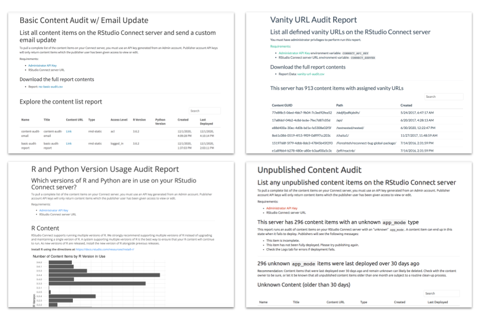

RStudio Connect helps teams of all sizes operationalize their data science work, and provides a single point of access to data products for decision makers. In this release, we have emphasized features that will help address maturing DevOps requirements within organizations seeking to deploy and scale data science.  

This release of RStudio Connect builds on the existing Server API, making experimental endpoints officially supported and introducing a brand new slate of API improvements based on feedback we’ve received from the community.

- **Automate Deployments** Learn how to implement CI/CD pipelines or programmatic publishing with the RStudio Connect Server API … [read more](https://blog.rstudio.com/2020/12/16/rstudio-connect-1-8-6-deployment-api/)
- **Audit Server Content** Explore new auditing and content management workflows with the RStudio Connect Server API … [read more](https://blog.rstudio.com/2020/12/16/rstudio-connect-1-8-6-server-api/)

<h5 align="center">Visit the <a href="https://solutions.rstudio.com/examples/rsc-server-api-overview/">RStudio Connect Server API Showcase</a> for access to code examples and template reports that can be deployed straight to your own Connect server.</h3>

- **Bokeh and Streamlit** support has now moved from Beta to being Generally Available … [read more](https://blog.rstudio.com/2020/12/16/rstudio-connect-1-8-6-python-update/)
- **LDAP / Active Directory** Groups will now be synchronized via a background process on a scheduled interval. This change enables support for `session$groups` in Shiny applications … [read more](https://blog.rstudio.com/2020/12/16/rstudio-connect-1-8-6-admin-digest/) 

<h3 align="center"><a href="https://rstudio.chilipiper.com/book/rsc-demo">See RStudio Connect in Action</a></h3>

> Note: This release includes some deprecations and breaking changes. Please read [more here](https://blog.rstudio.com/2020/12/16/rstudio-connect-1-8-6-admin-digest/), or review the [release notes](https://docs.rstudio.com/connect/news/#rstudio-connect-186).

To receive email notifications for RStudio professional product releases, patches, security information, and general product support updates, subscribe to the **Product Information** list by visiting the RStudio [subscription management portal](https://rstudio.com/about/subscription-management/).
