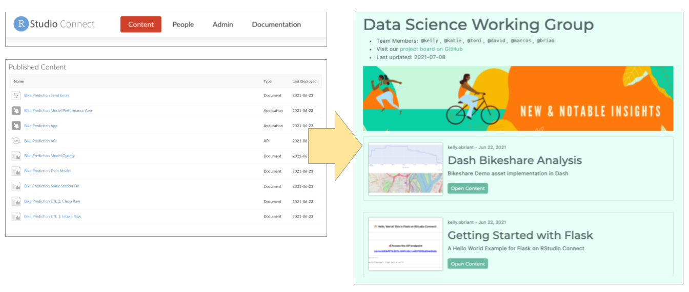

As publishers add more content to RStudio Connect, content organization, distribution, and discovery can become a challenge. Distributing individual links to all your most important content is tiresome, and the default Connect dashboard contains more information than end users often want or need.

This release of RStudio Connect introduces tools for addressing these common content curation concerns:

> How do you make sure your audience finds what they need on RStudio Connect without paging through the dashboard, remembering the right search terms, or bookmarking every content item you share?

> After deploying many pieces of related content, how do you share them as a cohesive project?

You might be interested in these content curation tools if you've ever wanted to create:

-   A summary/reference page for a complex project.
-   A content hub or knowledge repository for work belonging to a team or objective.
-   A customized entry point into RStudio Connect for stakeholders.
-   A presentation layer for any curated list of notable content items.

We've seen some impressive solutions to these problems from our advanced user community, but our ultimate goal has been to make content curation and distribution easy for all RStudio Connect publishers. With this in mind, content curation for RStudio Connect is structured around the following design principles:

-   Code-based and reproducible
-   Built for existing, familiar RStudio Connect content types
-   Polished, presentable defaults
-   Customizable, easy to brand
-   No RStudio Connect Server API experience required

## Introducing `connectwidgets`

[`connectwidgets`](https://github.com/rstudio/connectwidgets/) is an RStudio-maintained R package that can be used to query a Connect server for a subset of your existing content items, then organize them within `htmlwidget` components in an R Markdown document or Shiny application.

<div align="center"><font size="2",skip=0pt></div><div align="right">This example makes use of a free banner image from <a href="https://www.canva.com/" target="_blank">Canva</a></div></font>

The package provides organization components for card, grid, and table views:

-   Card and grid components display metadata about each piece of content. The title, description, and preview image can be set from the RStudio Connect dashboard.
-   Table components display a fixed set of content metadata: Name, Owner, Type, and Updated.
-   Each card, grid, or table row item links to the "open solo" version of the associated content item on RStudio Connect.
-   Search and Filter components can be applied to the table view (as shown below) or the grid view.

Visit the package [documentation site](https://rstudio.github.io/connectwidgets/) for a full set of code examples.

### Theming

`connectwidgets` components support styling in `rmarkdown::html_document` via the `bslib` package. You can supply a Bootswatch theme in the yaml header, or pass a custom theme consistent with your organization's style.

Bootswatch theme example:

    ---
    output:
    html_document:
        theme:
          bootswatch: minty
    ---


### Get Started

To start using `connectwidgets` with your own RStudio Connect server content, you must first upgrade to 1.9.0.

Install `connectwidgets` from CRAN and load the library:

``` 
install.packages(‘connectwidgets’)
library(connectwidgets)
```

Use the package template to learn about each of the components:

```
rmarkdown::draft("example-page.Rmd", template = "connectwidgets", package = "connectwidgets")
```

Alternatively, follow the RStudio Connect Jump Start example directions, or code examples available on the package [documentation site](https://rstudio.github.io/connectwidgets/).

### Contribute

`connectwidgets` is an open source R package. We would love to hear your thoughts and feedback. Make a feature request by opening an issue on the [package repository](https://github.com/rstudio/connectwidgets). Contribute code by submitting a pull request.

<h3 align="center"><a href="https://docs.rstudio.com/rsc/upgrade/">Upgrade to Start Curating</a></h3>

## Additional Relevant Features

### Streamlined Publishing

*Introduced in RStudio Connect 1.8.8*

By default, RStudio Connect will now automatically provision Server Address (`CONNECT_SERVER`) and an API Key (`CONNECT_API_KEY`), scoped to the publisher so that items are not published in a broken state.

If you've ever published content to RStudio Connect that relies on the presence of environment variables, you will know to expect errors on the initial deployment. Content items that make use of the new `connectwidgets` package will need two environment variables to run: API key, and server address. This feature isn't only relevant for `connectwidgets`; any workflow that expects a publisher's API key to be passed to the content runtime (e.g. updating a Pin, or pulling audit information from the RStudio Connect Server API), will benefit from this change.

-   `CONNECT_SERVER` and `CONNECT_API_KEY` are available across all content runtimes except TensorFlow.
-   These variables can be overwritten if necessary by explicitly setting them in the [Vars settings pane](https://docs.rstudio.com/connect/user/content-settings/#content-vars).
-   This feature is enabled by default, but can be [globally disabled](https://docs.rstudio.com/connect/admin/appendix/configuration/#Applications.DefaultServerEnv).

### Content Access Requests

*Introduced in RStudio Connect 1.8.8*

Since `connectwidgets` components are rendered with the same permissions you have on the RStudio Connect server, viewers of your pages may discover content they don't otherwise have access to. If a viewer follows a link to a content item they don't have permission to view, they will be directed to request access.

The example below shows what a `connectwidgets` grid view content item looks like to someone who doesn't have access permissions to view it. Note that the "preview image" for that content item has been replaced with the generic placeholder and a "Request Access" overlay. The access permissions dialog prompts the requesting user to select the level of access desired. In this example, the requesting user is a publisher, so they can choose either Collaborator or Viewer permissions. This triggers an email to be sent to the content owner and collaborators who can confirm or deny the request.


<h3 align="center"><a href="https://rstudio.chilipiper.com/book/schedule-time-with-rstudio">See RStudio Connect in Action</a></h3>

## RStudio Connect Administrator Digest

### New Email Configuration Settings

Two new configuration settings have been added to increase the customization options for emails sent by RStudio Connect through your email server:

-   **Sender Name Customization** The `Server.SenderEmailDisplayName` setting has been added to allow customization of the server display name (alias) that is used when sending administrative emails.
-   **From and Sender Address Headers** The `Server.EmailFromUserAddresses` setting indicates that outbound email messages sent on behalf of your users should specify both the Sender and From addresses. When enabled, the From field of an email message uses the name and email address associated with the sending user. The Sender field will be populated with the value from the `Server.SenderEmail` configuration setting. This setting is disabled by default. Not all email servers support this feature.

Learn more about these new configuration settings in the [Admin Guide](https://docs.rstudio.com/connect/1.9.0/admin/email/#configuring-other-email-settings).

### Configurable Unix Group for `RunAs` Users

RStudio Connect now allows server administrators to configure a shared Unix group via the `Applications.SharedRunAsUnixGroup` setting. If unset, the default is the primary Unix group of the `Applications.RunAs` user. Previously, the shared Unix group was not configurable and the primary group of the `Applications.RunAs` user was always used. All `RunAs` users must be members of this shared Unix group. Learn more about `RunAs` user process management in the [Admin Guide](https://docs.rstudio.com/connect/1.9.0/admin/process-management/#runas-current).

### Metrics Listing Improvements

The process listing on the Admin Metrics page of the RStudio Connect dashboard has been updated:

-   Enumerates jobs across all hosts in a cluster, not only those on the responding host.
-   Includes process age and owning hostname.
-   Entries link to the logs for that job.
-   Removes PID, which is available on the linked-to logs page.
-   Columns can be sorted by clicking on the headers.

<h3 align="center"><a href="https://www.rstudio.com/products/connect/">Click through to learn more about RStudio Connect</a></h3>

## Deprecations & Breaking Changes

In order to increase the supportability of RStudio Connect installations, the following breaking changes have been introduced in this release:

-   **Breaking Change** RStudio Connect will not launch if the following configurable directories are located inside its installation directory (`/opt/rstudio-connect` by default): `Server.DataDir`, `SQLite.Dir`, `Server.TempDir`, `Server.LandingDir`, `Database.Dir`, `Application.Pandoc1Dir`, `Application.Pandoc2Dir`, `Application.Pandoc211Dir`. Connect will produce an error message that identifies any directories in violation of this condition. You will be directed to relocate the directory and update your configuration file. Review the [Admin Guide](https://docs.rstudio.com/connect/1.9.0/admin/directories/#relocating-variable-data) for additional information.

-   **Breaking Change** RStudio Connect confirms at startup that a configured `Applications.Supervisor` script does not reside under certain protected directories, including `Server.DataDir`, `Server.TempDir`, `SQLite.Dir`, and `/etc/rstudio-connect/`. Connect will produce an error message if the configured supervisor script is detected in a protected directory. You will be directed to relocate the script and update your configuration file. Review the [Admin Guide](https://docs.rstudio.com/connect/1.9.0/admin/process-management/#program-supervisors) for additional information.

Please review the [full release notes](http://docs.rstudio.com/connect/news).

> #### Upgrade Planning
>
> Aside from the breaking changes listed above, there are no other special considerations, and upgrading should require less than five minutes. If you are upgrading from a version earlier than 1.8.8.2, be sure to consult the release notes for the intermediate releases, as well.

To perform an upgrade, download and run the installation script. The script installs a new version of RStudio Connect on top of the earlier one. Existing configuration settings are respected.

    # Download the installation script
    curl -Lo rsc-installer.sh https://cdn.rstudio.com/connect/installer/installer-v1.9.2.sh

    # Run the installation script
    sudo bash ./rsc-installer.sh 1.9.0

<h3 align="center"><a href="https://rstudio.com/about/subscription-management/">Sign up for RStudio Professional Product Updates</a></h3>
