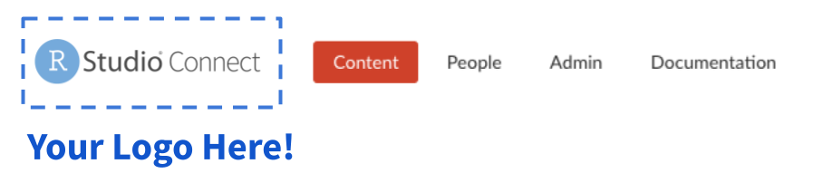
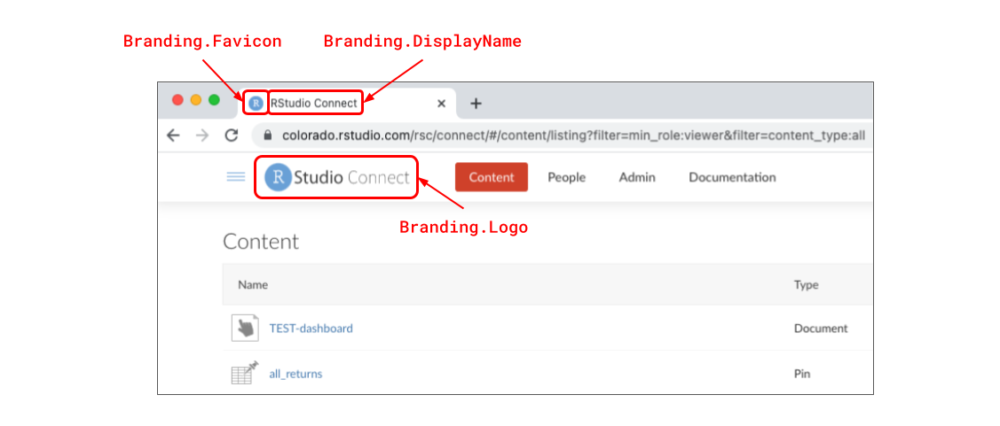
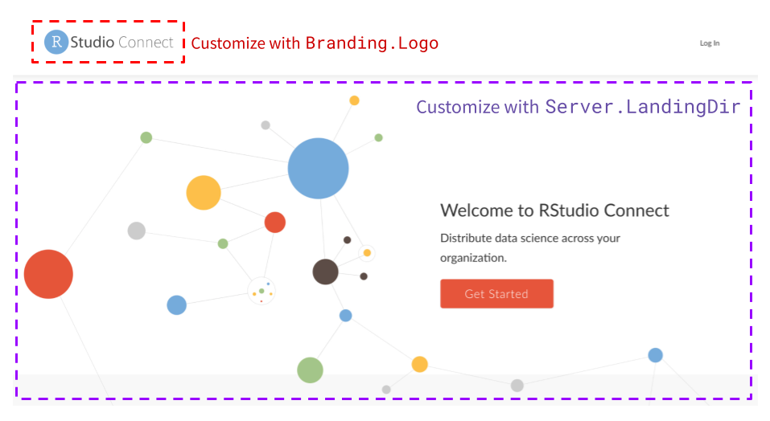
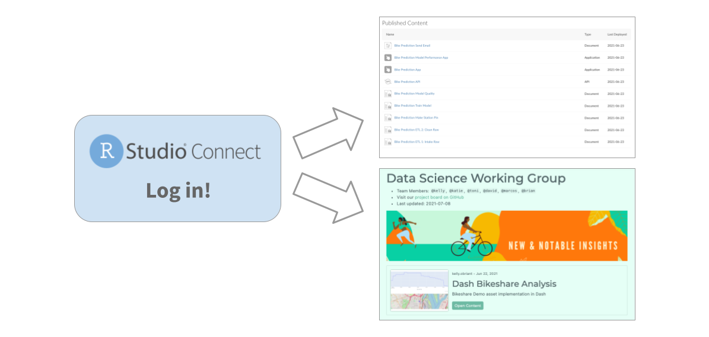
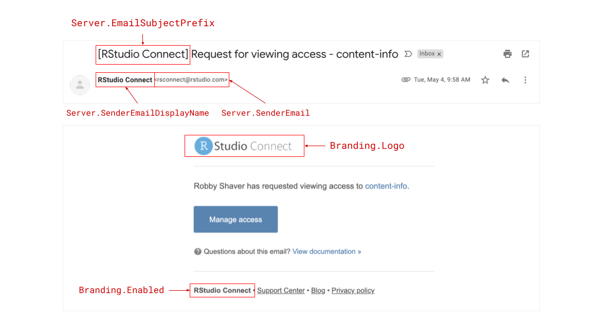

## Custom Branding

Many organizations want to align RStudio Connect with their branding strategy. Whether you use RStudio Connect to deliver R and Python content to external clients, or internal stakeholders, branding and clear, consistent presentation is important. This release introduces greater control over aspects of RStudio Connect's look and feel so that your team's work will be front-and-center.

Using the new features, you can now do things like:

-   Replace the RStudio logo and favicon with your own.
-   Organize groups of content in customized landing pages using [`connectwidgets`](https://blog.rstudio.com/2021/07/29/rstudio-connect-1-9-0/#introducing-connectwidgets).
-   Customize what anonymous and logged-out users see when they visit your server.
-   Control how RStudio Connect's automated emails appear to recipients.



> NOTE on versioning: As part of this release, we've moved to calendar-based versioning. [See this blog post](https://blog.rstudio.com/2021/08/30/calendar-versioning-for-commercial-rstudio-products/) for details.

### Custom Branding 101

The RStudio Connect custom branding features must be set up by a server administrator with access to the Connect configuration file. This release introduces support for adding a new section to the configuration file called `[Branding]`. These settings allow you to remove elements of RStudio's brand from Connect and replace them with your own.

An example `Branding` configuration might look like this:

``` ini
; /etc/rstudio-connect/rstudio-connect.gcfg

[Branding]
Enabled = true
Logo = /path/to/logo.png
Favicon = /path/to/favicon.ico
DisplayName = "SuperPowers Inc."
```

Custom branding settings include the ability to change the logo, favicon, and display name used throughout the platform.



The `DisplayName` and `Logo` customizations are also used in product dialog messages such as on log in, user role upgrade requests, content permission requests, jump start publishing instructions, content configuration settings labels, system emails, and more.

To learn more about `Branding` configuration in RStudio Connect, visit the [Admin Guide](https://docs.rstudio.com/connect/admin/appendix/branding/).

<div align="center"><a class="btn btn-primary btn-lg" href="https://rstudio.chilipiper.com/book/schedule-time-with-rstudio">See RStudio Connect in Action</a></div>

### Additional Considerations

In addition to the basic branding configuration options listed above, there are several settings (new and old) that we think could be useful for customizing the RStudio Connect user experience.

#### Customize the Front Door

The page that anonymous and logged-out users see when they visit RStudio Connect can be customized with `Server.LandingDir`. This setting takes a path to a directory containing the `index.html` page you'd like to serve in place of the "Welcome to RStudio Connect" page you see below:



Make sure you combine this feature with `Branding.Logo`, otherwise the header will still display the default RStudio Connect logo.

-   To learn more about serving a custom landing page, visit the [RStudio Connect Admin Guide](https://docs.rstudio.com/connect/admin/appendix/custom-landing/).

-   To see an example of a custom "Landing Site" demo we use internally at RStudio, visit our GitHub: <https://github.com/sol-eng/demo-landing-site>.

#### Customize the Front Entrance

What would you like users to see upon logging in to RStudio Connect?

Should they arrive at the default "Connect Content Dashboard" and be given free-range to search across all the content they have access to view, or should they be routed to a custom content showcase?



`Server.RootRedirect` can be used to divert users to a URL other than the standard RStudio Connect dashboard. To create a landing page like the one above, we recommend working with a Publisher to make a content showcase with the `connectwidgets` R package. `connectwidgets` can be used to query an RStudio Connect server for your existing content items, then organize, subset, and style them with `htmlwidgets` components in an R Markdown document or Shiny application. This document or application can itself be hosted on RStudio Connect, and the URL of that content can be what you use for `RootRedirect`. To learn more about `connectwidgets`, visit the [RStudio Connect User Guide](https://docs.rstudio.com/connect/user/curating-content/).

If you choose to customize the `RootRedirect` URL, it will be important to notify publishers and other administrators about where they can access the content dashboard view of RStudio Connect. This URL can also be customized with the `Server.DashboardPath` setting. By default, the content dashboard is available at `/connect`.

To learn more about serving a custom content showcase, visit the [RStudio Connect Admin Guide](https://docs.rstudio.com/connect/admin/appendix/branding/#logged-in-users).

#### Customize the Viewer Experience

If you serve content on RStudio Connect to external users or clients, you might also want to put some restrictions on what viewers can see and do within the platform.

-   **Documentation Visibility** Use the new [`Server.HideViewerDocumentation`](https://docs.rstudio.com/connect/admin/appendix/configuration/#Server.HideViewerDocumentation) setting to Hide the documentation tab from Viewers in the RStudio Connect dashboard.

-   **Viewer Isolation** Viewers on RStudio Connect can only see content to which they have explicitly been added. Many organizations additionally use the [`Authorization.ViewersCanOnlySeeThemselves`](https://docs.rstudio.com/connect/admin/appendix/configuration/#Authorization.ViewersCanOnlySeeThemselves) setting to ensure clients cannot discover other users on RStudio Connect.

#### Customize Emails

Two new configuration settings have been added to increase the customization options for emails sent by RStudio Connect:

-   **Sender Name Customization** The `Server.SenderEmailDisplayName` setting has been added to allow customization of the server display name (alias) that is used when sending administrative emails.

-   **From and Sender Address Headers** The `Server.EmailFromUserAddresses` setting indicates that outbound email messages sent on behalf of your users should specify both the Sender and From addresses. When enabled, the From field of an email message uses the name and email address associated with the sending user. The Sender field will be populated with the value from the `Server.SenderEmail` configuration setting. This setting is disabled by default. Not all email servers support this feature.

-   **Subject Prefix Customization** Emails sent from RStudio Connect will be prefixed with "\[RStudio Connect\]." If you wish to change this prefix use the setting `Server.EmailSubjectPrefix`.

Emails sent from RStudio Connect are now highly customizable. The example below is a "Request for viewing access" notification email sent to a content owner. Each of the areas highlighted below are values that can be controlled through configuration settings:



Note: When `Branding.Enabled = true`, the highlighted footer text is changed to "Powered by RStudio Connect". No other footer text customization options are available at this time.

Learn more about email customization options in the [Admin Guide](https://docs.rstudio.com/connect/1.9.0/admin/email/#configuring-other-email-settings).

### Upgrade to RStudio Connect 2021.08.0

Before upgrading, please review the [full release notes](http://docs.rstudio.com/connect/news). This release contains additional features described in the Python Updates [blog announcement](https://blog.rstudio.com/2021/08/30/rstudio-connect-2021-08-python-updates/).

> ##### Upgrade Planning
>
> Upgrading RStudio Connect should require less than five minutes. If you are upgrading from a version earlier than 1.9.0.1, be sure to consult the [release notes](http://docs.rstudio.com/connect/news) for the intermediate releases, as well.

To perform an RStudio Connect upgrade, download and run the installation script. The script installs a new version of Connect on top of the earlier one. Existing configuration settings are respected.

    # Download the installation script
    curl -Lo rsc-installer.sh https://cdn.rstudio.com/connect/installer/installer-v1.9.3.sh

    # Run the installation script
    sudo bash ./rsc-installer.sh 2021.08.0

<div align="center"><a class="btn btn-primary btn-lg mt-5" href="https://rstudio.com/about/subscription-management/">Sign up for RStudio Professional Product Updates</a></div>

